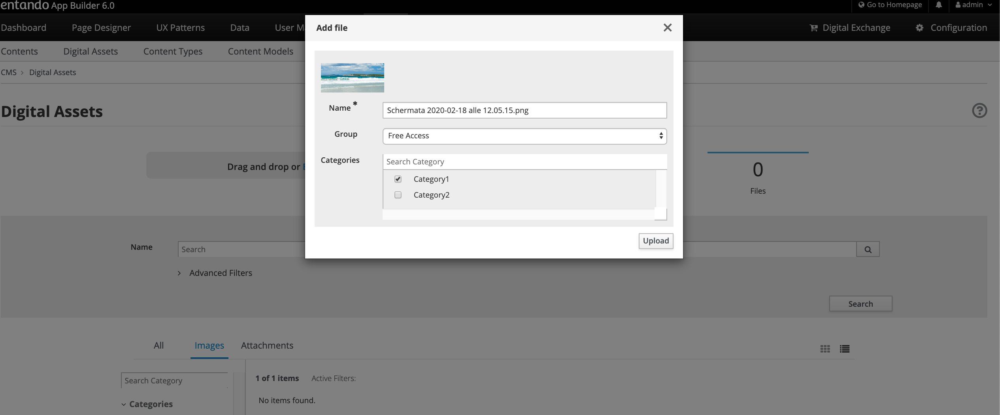

== Digital Assets

=== Objective

This document provides an overview of the Digital Assets and functionalities needed to manage images and documents.

=== Overview

The WEB CMS includes capabilities that let you manage contents and digital assets. Digital Assets are images, documents, and other media files supported in specific format.

*Default Supported document formats:* 
The Entando CMS can be configured to allow you to load or exclude any type of file extension from being loaded to your site. The default set of extensions are:

pdf,xls,doc,ppt,txt,rtf,sxw,sxc,odt,ods,odp,tar,gz,zip,rar,flv,swf,avi,wmv,ogg,mp3,wav,ogm,mov,iso,nrg,docx,docm,xlsx,xlsm,xlsb,pptx,pptm,ppsx,ppsm,sldx,sldm.

*Supported image formats*: jpg, jpeg, png

=== How to create a Digital Asset

To manage the Digital Assets through the Web CMS integrated with App Builder application

* {blank}
+

Select the CMS section and click on the Digital Assets subsection

image:extracted-media/media/DigitalAssets1.png[image,width=642,height=316]

Add a new image or a new document file

* {blank}
+

Press the *Drag and Drop or Browse your computer* button and choose, from your file system, images and documents files that you would like to upload

image:extracted-media/media/DigitalAssets2.png[image,width=642,height=310]

* {blank}
+

From the *Add file* modal window, you must choose one the available Groups and then the *Upload* button. If categories have been defined and displayed , you can join the file with the categories you want.

* {blank}
+

The image file that you just uploaded is displayed in the list; a statistical overview of the number of the uploaded resources (images and documents) is provided. The App Builder’s interface allows the users to choose grid and list view; most of the time, users prefer to use list view when they are searching with specific requirements, while they love grid view for exploring. For every resource, image, or document, the list shows the following information:

** {blank}
+

*Preview*

** {blank}
+

*Name*

** {blank}
+

*Type*

** {blank}
+

*Uploaded By*

** {blank}
+

*Uploaded At*

** {blank}
+

*Group*

** {blank}
+

*Categories*

** {blank}
+

*Actions*

Furthermore, the interface lets you perform all management actions, as:

* {blank}
+

*Edit:* update the information data related to every single resource (image and document)

* {blank}
+

*Duplicate:* copy identically the resource from the original

* {blank}
+

*Download:* transfer the resource in your local machine

* {blank}
+

*Delete:* remove the resource

image:extracted-media/media/DigitalAssets4.png[image,width=642,height=310]

You can list the contents by filtering with:

* {blank}
+

*All*: All added files are displayed, images and documents both.

* {blank}
+

*Images*: All added images are displayed

* {blank}
+

**Attachments**footnote:[The Attachments name will be updated to the Documents name; the same for the Files label.]: All added documents are displayed

image:extracted-media/media/DigitalAssets5.png[image,width=642,height=308]
