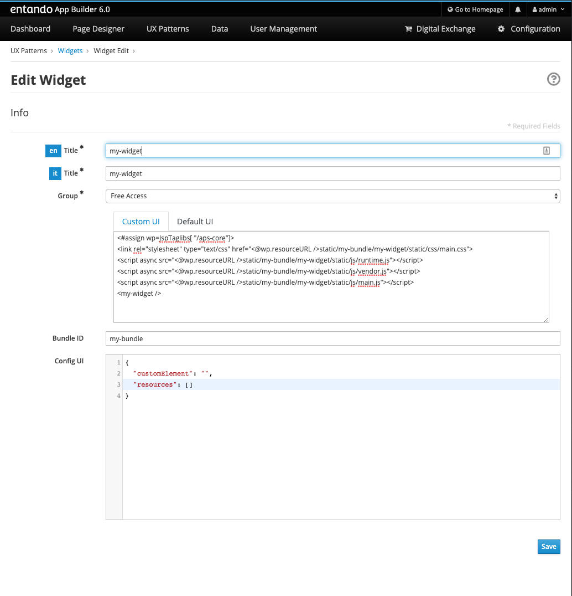

= Tutorial: Add App Builder configuration screen for an Entando 6 widget
:toc:

Entando 6 widgets can be customized through an App Builder configuration screen so the citizen developers can avoid writing ad-hoc additional code.

In Entando 6, the leading microfrontend platform for Kubernetes, even the configuration screen is a microfrontend, more precisely a web component. That means you can develop and test it in isolation, without a running Entando instance.

== Generate a React app

Let's start with the boilerplate provided by https://create-react-app.dev/[Create React App], probably the most popular one.

`npx create-react-app my-widget-config --use-npm`

----
my-widget-config
├── README.md
├── node_modules
├── package.json
├── .gitignore
├── public
│   ├── favicon.ico
│   ├── index.html
│   ├── logo192.png
│   ├── logo512.png
│   ├── manifest.json
│   └── robots.txt
└── src
    ├── App.css
    ├── App.js
    ├── App.test.js
    ├── index.css
    ├── index.js
    ├── logo.svg
    ├── serviceWorker.js
    └── setupTests.js
----

Then, type `cd my-widget-config` and `npm start` to start the app.

== Edit the root app component

Let's start with a dead simple form: only an input with a label. So, let's edit `App.js`

[source,js]
----
import React from 'react';

class App extends React.Component {
  constructor(props) {
    super(props);
    this.state = { name: ''};
  }

  handleNameChange(value) {
    this.setState(prevState => ({
      ...prevState,
      name: value,
    }));
  }

  render() {
    const { name } = this.state;
    return (
      

        <h1>Sample Entando 6 Widget Configuration</h1>
        <label for="name">Name</label>
        <input id="name" onChange={e => this.handleNameChange(e.target.value)} value={name} />
      

    );
  }
}

export default App;
----

Of course you are free to use your favourite form handling library like https://jaredpalmer.com/formik[Formik], https://redux-form.com/[redux-form] (that requirese redux) or whatever fits best for you.

About styling, since this is going to be an App Builder screen, we strongly suggest using https://www.patternfly.org/v3/[PatternFly v3] (`patternfly` and `patternfly-react` packages) to keep UX coherence.

== Wrap the react app in a web component

Now, let's add the web component that will wrap the entire React app. Let's name it `WidgetElement`

[source,js]
----

import React from 'react';
import ReactDOM from 'react-dom';
import App from './App';

class WidgetElement extends HTMLElement {
  constructor() {
    super();
    this.reactRootRef = React.createRef();
    this.mountPoint = null;
  }

  get config() {
    return this.reactRootRef.current ? this.reactRootRef.current.state : {};
  }

  set config(value) {
    return this.reactRootRef.current.setState(value);
  }

  connectedCallback() {
    this.mountPoint = document.createElement('div');
    this.appendChild(this.mountPoint);
    ReactDOM.render(<App ref={this.reactRootRef} />, this.mountPoint);
  }
}

customElements.define('my-widget-config', WidgetElement);

export default WidgetElement;
----

Its responsability is rendering the react app and syncing the react app state in a `config` property, that _must_ be named that way. This is the secret sauce of widget - App builder communication that works in three steps:

* App Builder reads `config` property when the widget config screen is rendered
* `config` property is mutated when user configures the widget
* When the user manages to save the config, App Builder retrieves it (again, from the `config` property) and persists it through Entando APIs

That means the widget developer can focus on the configuration screens without having to call Entando APIs to read or write configuration.

One more JS file to update: `index.js`. Starting from this

[source, js]
----

import React from 'react';
import ReactDOM from 'react-dom';
import './index.css';
import App from './App';
import * as serviceWorker from './serviceWorker';

ReactDOM.render(<App />, document.getElementById('root'));

// If you want your app to work offline and load faster, you can change
// unregister() to register() below. Note this comes with some pitfalls.
// Learn more about service workers: https://bit.ly/CRA-PWA
serviceWorker.unregister();
----

You only have to import `WidgetElement` plus the css, if needed. Something like

[source, js]
----
import './index.css';
import './WidgetElement';
----

We assume we don't need a service worker for the widget, so we can delete serviceWorker.js.

Now, to ensure our web component is working we have to edit `public/index.html`. Remove `

` from the `body` (we programmatically generated the react root in the `connectedCallback` method of `WidgetElement`) and add our new web component tag `<my-widget />`.

[source,html]
----
<!DOCTYPE html>
<html lang="en">
  <head>
    <meta charset="utf-8" />
    <link rel="shortcut icon" href="%PUBLIC_URL%/favicon.ico" />
    <meta name="viewport" content="width=device-width, initial-scale=1" />
    <title>React App</title>
  </head>
  <body>
    <my-widget-config />
  </body>
</html>
----

NOTE: the web component tag name (`my-widget-config` in this tutorial) _must_ match the first parameter of `customElements.define` method.

Page should auto reload and...congrats! You're running a barebones Entando 6 widget in isolation.

== Add widget config screen in App Builder

Before integrating the widget config screen, we need some widget info. Open App Builder, go to UX Patterns -> Widgets and click on the installed widgtet we're creating the configuration screen for.

You'll a screen like that

Take note of the `bundleId` value (_my-bundle_).

Now, time to build our widget before embedding it into the Entando 6 instance. From the react project root, type 

`npm run build`

and a `build/static` dir will be generated. Copy it into the Entando 6 instance under `src\main\webapp\resources\my-bundle\my-widget-config` (`my-bundle` ix exactly the value of `bundleId` field), then rename 

* a file like `js/runtime~main.c7dcdf0b.js` to `js/runtime.js` (bootstrapping logic)
* a file like `js/2.230b21ef.chunk.js` to `js/vendor.js` (third-party libraries)
* a file like `js/main.1fd3965a.chunk.js` to `js/main.js` (app)

Now, edit again the widget and update the `configUI` field.

[source,json]
----
{
  "customElement": "my-widget-config",
  "resources": [
    "static/my-bundle/my-widget/config/static/js/runtime.js",
    "static/my-bundle/my-widget/config/static/js/vendor.js",
    "static/my-bundle/my-widget/config/static/js/main.js"
  ]
}
----

NOTE: you could keep the original names in order to avoid potential caching issues, but then you will have to update the _Config UI_ field in the App Builder widget screen every time a new version of the widget is deployed.

NOTE: `configUI` is a JSON object, so pay attention to save a well-formed one (the integrated JSON editor will help you).

NOTE: value for `customElement` must match the name of custom tag in `index.html` and the one passed as parameter to `customElements.define` in `WidgetElement`.

Last step: configure a page, drag our widget into the page model slots and you'll see the configuration screen we just built.
