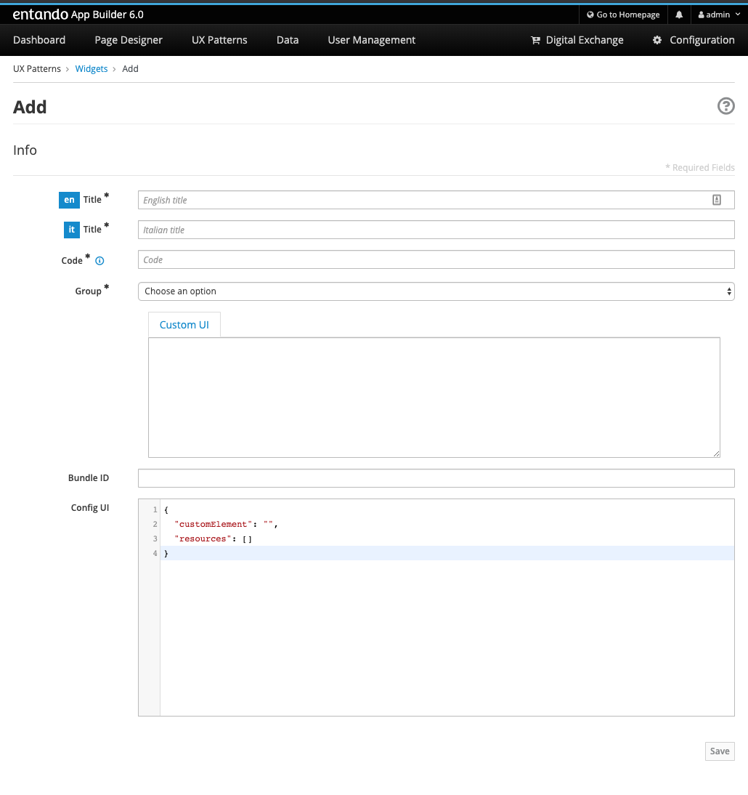

= Tutorial: create a react microfrontend widget
:toc:

== Microfontends

Microfrontends extend the concepts of micro services to the frontend world. The idea behind them is to think about a website or web app as a composition of features which are owned by independent teams.

There are no limitations on the stack that could be used to create microfrontends. Custom Elements are a great way to hide implementation details while providing a neutral interface to others, which in turn allows cross-functional teams to work on separate parts of the projects using different technologies, frameworks and libraries.

This tutorial covers microfrontend creation using React stack.

== Bootstrap a react app

We used https://create-react-app.dev/[Create React App] in this tutorial, but feel free to adopt a different boilerplate if you like.

Use last stable node version (at the time of writing *v13.8.0*). We suggest using https://github.com/nvm-sh/nvm[nvm] to handle node installations.

`npx create-react-app my-widget --use-npm`

This is the expected output:

----
my-widget
├── README.md
├── node_modules
├── package.json
├── .gitignore
├── public
│   ├── favicon.ico
│   ├── index.html
│   ├── logo192.png
│   ├── logo512.png
│   ├── manifest.json
│   └── robots.txt
└── src
    ├── App.css
    ├── App.js
    ├── App.test.js
    ├── index.css
    ├── index.js
    ├── logo.svg
    ├── serviceWorker.js
    └── setupTests.js
----

Then, type `cd my-widget` and `npm start` to start the app.

== Wrap the react app in a web component

Let's add the web component that will wrap the entire React app under the `src` folder. We can name it `WidgetElement`.

[source,js]
----
import React from 'react';
import ReactDOM from 'react-dom';
import App from './App';

class WidgetElement extends HTMLElement {
  connectedCallback() {
    this.mountPoint = document.createElement('div');
    this.appendChild(this.mountPoint);
    ReactDOM.render(<App />, this.mountPoint);
  }
}

customElements.define('my-widget', WidgetElement);

export default WidgetElement;
----

NOTE: `connectedCallback` is a lifecycle hook method of custom elements, part of the web components spec.

Then, the `index.js` file should be updated. Starting from this

[source, js]
----

import React from 'react';
import ReactDOM from 'react-dom';
import './index.css';
import App from './App';
import * as serviceWorker from './serviceWorker';

ReactDOM.render(<App />, document.getElementById('root'));

// If you want your app to work offline and load faster, you can change
// unregister() to register() below. Note this comes with some pitfalls.
// Learn more about service workers: https://bit.ly/CRA-PWA
serviceWorker.unregister();
----

You only have to import `WidgetElement` plus the css, if needed. Something like

[source, js]
----
import './index.css';
import './WidgetElement';
----

We assume we don't need a service worker for the widget, so we can delete serviceWorker.js.

Now, to ensure our web component is working we have to edit `public/index.html`. Remove `

` from the `body` (we programmatically generated the react root in the `connectedCallback` method of `WidgetElement`) and add our new web component tag `<my-widget />`.

[source,html]
----
<!DOCTYPE html>
<html lang="en">
  <head>
    <meta charset="utf-8" />
    <link rel="shortcut icon" href="%PUBLIC_URL%/favicon.ico" />
    <meta name="viewport" content="width=device-width, initial-scale=1" />
    <title>React App</title>
  </head>
  <body>
    <my-widget />
  </body>
</html>
----

NOTE: the web component tag name (`my-widget` in this tutorial) _must_ match the first parameter of `customElements.define` method, also custom element names require a dash to be used in them (kebab-case) - they can't be single words

Page should auto reload and... congrats! You're running a barebones Entando 6 widget in isolation.

== Create the Entando 6 widget in App Builder

Open the Entando App Builder, go to UX Patterns -> Widgets and click on the _New_ button.

You'll a screen like this one

Fill the form, e.g.:

* _my_widget_ as widget code (dashes are not allowed in a widget code)
* _My Widget_ as title for all the languages 
* _my-bundle_ as bundle id
* _Free access_ as group
* (ignore the _Config UI_ field)
* the following code as _Custom UI_

[source,html]
----
<#assign wp=JspTaglibs[ "/aps-core"]>

<link rel="stylesheet" type="text/css" href="<@wp.resourceURL />static/my-bundle/my-widget/static/css/main.css">

<my-widget />
----

and save the widget.

NOTE: `<#assign wp=JspTaglibs[ "/aps-core"]>` is needed for your widget code to have access to `@wp` object which provides access to a environment variables.

== Build the widget

In order to avoid path issues, we should set up a one-line `.env` file in the CRA project root:

[source,.env]
----
PUBLIC_URL=http://localhost:8080/entando/resources/static/my-bundle/my-widget
----

Where `http://localhost:8080/entando/` is the path of the Entando 6 instance containing the widget.

Ready to build now! From the react project root, type 

`npm run build`

and a `build/static` dir will be generated. Copy it into the Entando 6 instance under `src\main\webapp\resources\static\my-bundle\my-widget`, then rename 

* a file like `js/runtime~main.c7dcdf0b.js` to `js/runtime.js` (bootstrapping logic)
* a file like `js/2.230b21ef.chunk.js` to `js/vendor.js` (third-party libraries)
* a file like `js/main.1fd3965a.chunk.js` to `js/main.js` (app)
* a file like `css/main.d1b05096.chunk.js` to `css/main.css` (stylesheet)

NOTE: you could keep the original names in order to avoid potential caching issues, but then you will have to update the _Custom UI_ field in the App Builder widget screen every time a new version of the widget is deployed.

If the application server you're running hasn't hot deploy enabled, you should restart it.

Then, configure a page (let's assume it's called _my-page_) and drag the widget _mywidget_ in the page model. Publish, load the page (its url should be `http://localhost:8080/entando/en/my-page.page`) and _voilà_, here's our react app embedded as a widget. Done!
