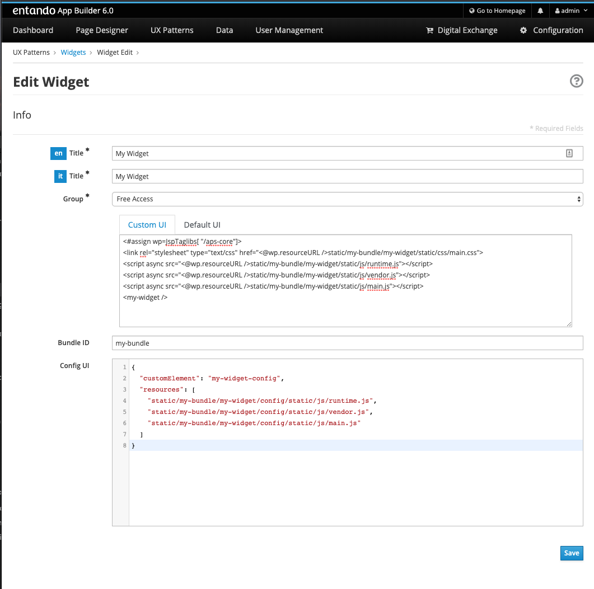

= Tutorial: display widget configuration data
:toc:

So, we already created a react microfrontend widget and configuration screen to customize a _name_ field.

In this tutorial we will display that field in our microfrontend widget.

== Add an attribute to the custom element

Edit `WidgetElement` to add attribute handling to the custom element, and make re-render our app when an attribute changes. Now, the _name_ attribute is being read from the custom element and passed as a prop to the react root component (_App_).

[source,js]
----
import React from 'react';
import ReactDOM from 'react-dom';
import App from './App';

const ATTRIBUTES = {
  name: 'name',
};

class WidgetElement extends HTMLElement {

  static get observedAttributes() {
    return Object.values(ATTRIBUTES);
  }

  attributeChangedCallback(name, oldValue, newValue) {
    if (!Object.values(ATTRIBUTES).includes(name)) {
      throw new Error(`Untracked changed attribute: ${name}`);
    }
    if (this.mountPoint && newValue !== oldValue) {
      this.render();
    }
  }

  connectedCallback() {
    this.mountPoint = document.createElement('div');
    this.appendChild(this.mountPoint);    
    this.render();
  }

  render() {
    const name = this.getAttribute(ATTRIBUTES.name);
    ReactDOM.render(<App name={name} />, this.mountPoint);
  }
}

customElements.define('my-widget', WidgetElement);

export default WidgetElement;
----

NOTE: `attributeChangedCallback` is another custom elements lifecycle hook method.

== Make react component handle the input

Edit the `App` component now, to simply make it display the `name` prop.

[source,js]
----
import React from 'react';
import './App.css';

function App({name}) {
  return (
    

      <header className="App-header">
        

          Hello, {name}!
        

      </header>
    

  );
}

export default App;
----

Now, to ensure our custom element is working we can edit `public/index.html` and set a value for the _name_ attribute of the custom element.

[source,html]
----
<!DOCTYPE html>
<html lang="en">
  <head>
    <meta charset="utf-8" />
    <link rel="shortcut icon" href="%PUBLIC_URL%/favicon.ico" />
    <meta name="viewport" content="width=device-width, initial-scale=1" />
    <title>React App</title>
  </head>
  <body>
    <my-widget name="Marco"/>
  </body>
</html>
----

After page reload, you should be able to display a simple "Hello, Marco!" message.

== Rebuild the widget

From the react project root, type 

`npm run build`

and the `build/static` dir will be (re)generated. Copy it again into the Entando 6 instance under `src\main\webapp\resources\static\my-bundle\my-widget`, then rename 

* a file like `js/runtime~main.c7dcdf0b.js` to `js/runtime.js` (bootstrapping logic)
* a file like `js/2.230b21ef.chunk.js` to `js/vendor.js` (third-party libraries)
* a file like `js/main.1fd3965a.chunk.js` to `js/main.js` (app)
* a file like `css/main.d1b05096.chunk.js` to `css/main.css` (stylesheet)

NOTE: you could keep the original names in order to avoid potential caching issues, but then you will have to update the _Custom UI_ field in the App Builder widget screen every time a new version of the widget is deployed.

If the application server you're running hasn't hot deploy enabled, you should restart it.

== Update the Entando 6 widget in App Builder

Open the Entando App Builder, go to UX Patterns -> Widgets, find the widget _My Widget_ and click to edit it.

You'll a screen like this one

Update the _Custom UI_ field from

[source,html]
----
<#assign wp=JspTaglibs[ "/aps-core"]>
<link rel="stylesheet" type="text/css" href="<@wp.resourceURL />static/my-bundle/my-widget/static/css/main.css">

<my-widget />
----

to

[source,html]
----
<#assign wp=JspTaglibs[ "/aps-core"]>
<link rel="stylesheet" type="text/css" href="<@wp.resourceURL />static/my-bundle/my-widget/static/css/main.css">

<@wp.currentWidget param="config" configParam="name" var="configName" />
<my-widget name="${configName}" />
----

We basically added a JSTL tag to extract a field (under `configParam`) from the config field of the current widget and put it in a `configName` variable, that we pass to the custom element.

Save the widget and reload the page that contains the widget: you'll see "Hello, Marco!" as expected.

