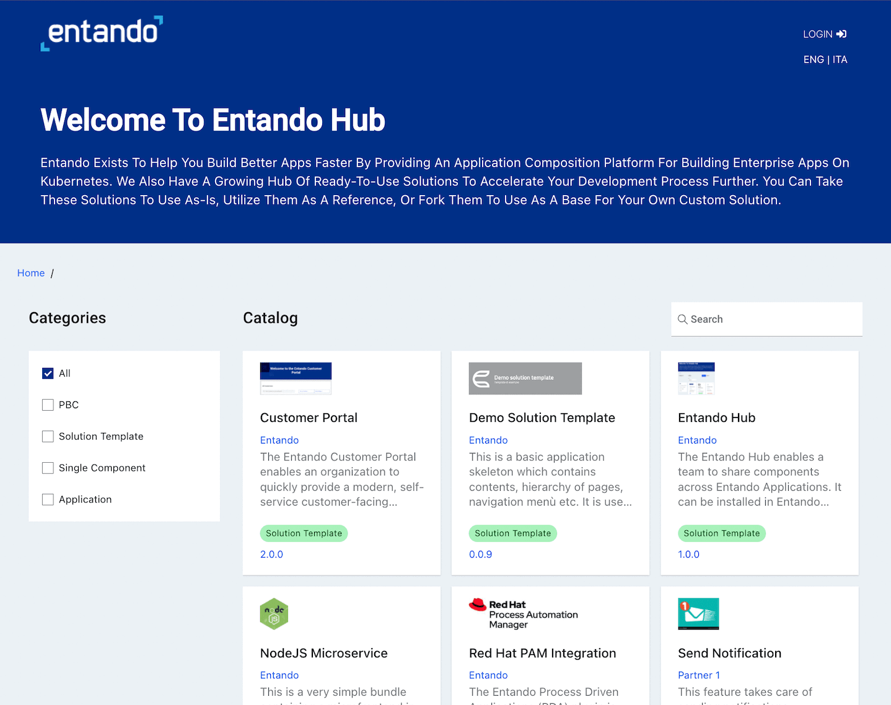

Entando is all set with its new release! Would you like to learn more about it? If yes, then this blog will give you a perfect sneak peak of everything we released with version 7.0.

Entando 7 lets us build a composable business model using composable applications. Composable business allows enterprises to rapidly adapt to market shifts and opportunities by allowing rapid recomposition of services and products. Composable applications enable composable business by allowing the applications and infrastructure required to support the business to change quickly, at low cost, and at greatly reduced risk.

Apart from this, the new Entando Hub supports code reuse for major enterprises and System Integrator (SI) partners. It also aligns pro-code development with low-code composition. The question here is, do you really know what the Entando Hub is?

The Entando Hub enables a team to share components across Entando Applications. The hub allows users to:

- Centralize components and business capabilities for use across teams, groups, or clients

- Publish, manage and communicate component features, versions and metadata

- Perform business-level assessment of component readiness

The new Entando Hub provides a repository for application modules. Modules can be individual application components, collections of components called packaged business capabilities (PBCs), or complete solutions or solution templates. The hub provides a simple interface, or marketplace, to store modules and make them discoverable across multiple development teams and applications. The hub works in conjunction with Git allowing development teams to work in the same way they do today, but with a web interface to simplify the interaction between creators of pro-code modules and application composers assembling applications from the hub. The hub also provides module curators with a location to enforce IT governance. The hub is available to developers, enterprises, and solution providers as a SaaS, or for private installation on-prem or in the cloud.

Our Partner Program is helping SIs attract new customers and revenue streams for customers adopting composable applications on Kubernetes. If you are interested in learning more about our Partner Program, drop us a line at &lt;<a href="mailto:partner@entando.com">partner@entando.com</a>&gt;.

Now, let's also take a look at the Entando Component Generator (ECG). The ECG is a JHipster blueprint that generates Entando-compatible Java applications and micro frontends. With the release of Entando 7, the ECG has now been upgraded to use JHipster 7.2!

The Entando CLI has also been improved. The ent CLI provides a set of commands that accelerate the developer experience by assisting with common tasks such as quickly installing a new copy of Entando, generating an Entando project via JHipster, deploying an Entando Bundle, etc. To learn more about the fixes and changes, take a look at our <a href="https://developer.entando.com/v7.0/docs/releases/">release notes</a>.

Many interesting features, right? Well, if you're new here, why don't you get started? You can get started through our <a href="https://developer.entando.com/v6.3.2/docs/getting-started/">documentation</a>.

While we are doing all these amazing things, we are also building a community that focuses in-depth on composability and modularity. The goal of this community is to grow an awareness and culture about composable applications. And none of this would be possible without your support, love and contribution. If you are really interested in learning more and getting started with us, join our <a href="https://discord.gg/N64a3QMd9X">discord server</a> and say hi!

Let us know your feedback on Entando 7.0!

Thank you!

 <a href="#">Back to top</a>
