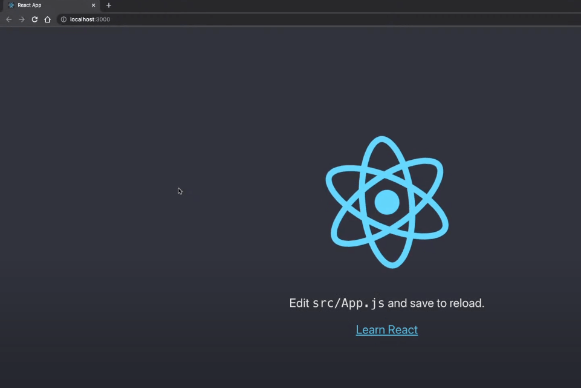
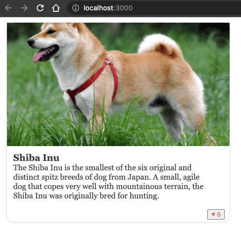
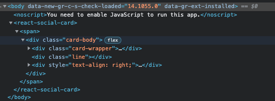

<p><em>Disclaimer: This article has been written with the help of the ModSquad Community. The related live session is available here:</em></p>
<p>
<div class=”iframe-container”><iframe width="560" height="315" src="https://www.youtube.com/embed/4sF3XYlNZC4" title="YouTube video player" frameborder="0" allow="accelerometer; autoplay; clipboard-write; encrypted-media; gyroscope; picture-in-picture" allowfullscreen></iframe></div>
</p>

## Introduction

<p>Hi, fellow developers!</p>

<p>Having discovered micro frontend creation with Angular, we jump into another world with React. Remember, I'm trying to create a micro frontend using the web component specifications for each of the following frameworks: Angular, React, and Vue.js.</p>

<p>Does React provide the best developer experience when creating a micro frontend social card? Let's try it!</p>

## Create the React app

<p>React offers a simple way to <a href="https://github.com/facebook/create-react-app">create React applications</a> using <a href="https://create-react-app.dev/docs/getting-started/">Create React App</a>.</p>

<p>As seen in the previous blog, you need to have npm installed. You can then run <code class="language-bash">npx create-react-app react-social-card</code> to create the application skeleton.</p>

<p>Once complete, you should have a new React project available in the <code class="language-bash">react-social-card</code> folder.</p>

<p>Start it using the command <code class="language-bash">npm start</code>.</p>

<p>The default React page is reachable at <a href="http://localhost:3000">http://localhost:3000</a>.</p>



## Add the social card code

<p>Before configuring the <code class="language-bash">custom-element</code>, we have to create the React social card component. After some research, here is an example of code we can use: <a href="https://codepen.io/leoraw/pen/ZjvRpL">https://codepen.io/leoraw/pen/ZjvRpL</a>. Thanks to <a href="https://codepen.io/leoraw">@leoraw</a> for sharing this example.</p>

## Create the React components

<p>The social card is split into two different React components: a button box and the card itself.</p>

<p>First, we create a new file for the button box in the <code class="language-bash">components</code> folder, name it <code class="language-bash">ButtonBox.js</code> and copy this code:</p>

```js
import React from "react";

const UiButton = props => {
   const classes = (props.isClicked) ?
     "ui-button clicked" : "ui-button";
   const number = (props.isClicked) ?
         (props.number + 1) : props.number;

   return (
     <button className={classes} id={props.text}
       onClick={() => props.onClick()}>
       <span className="ui-icon">{props.icon} </span>
       {number}
     </button>
   );
};

class ButtonBox extends React.Component {
   constructor(props) {
     super(props);
     console.log(props.likeIsClicked);
     this.state = {
       likeIsClicked: props.likeIsClicked

     };
   }

   toggle(index) {
     let state = {};
     state[index] = !this.state[index];
     this.setState(state);
   }

   render() {
     return (
       <div>
         <UiButton icon='♥' text='likes'
           number={this.props.likes}
           onClick={() =>
             this.toggle('likeIsClicked')}
           isClicked={this.state.likeIsClicked}/>
       </div>
     );
   }
}

export default ButtonBox;
```

<p>Then, in the same folder, we create the <code class="language-bash">SocialCard.js</code> file and copy the following content.</p>

<p>Please note, this new component imports and uses the previous one. Effectively, the internal architecture in the micro frontend allows us to use multiple components, and all the components are built into one custom element.</p>

``` js
import React from "react";
import ButtonBox from "./ButtonBox";

const UiCard = props => {
 let {image, title, content} = props.content;
 return (
   <div class="card-wrapper">
     <div className='card-img'>
       
     </div>
     <div className='card-content'>
       <h3>{title}</h3>
       <div>{content}</div>
     </div>
     </div>
 );
}

class SocialCard extends React.Component {
   render() {
     return (
       <div className='card-body'>
         <UiCard content={this.props.content}/>
         <div className='line'></div>
          <div style={{textAlign: 'right'}}>
             <ButtonBox
             likeIsClicked={this.props.likeIsClicked}
             likes={this.props.likes}/>
         </div>
       </div>

     );
   }
}

export default SocialCard;
```

## Use the new components in the main App.js file

<p>Once these two components are available, we can update the main <code class="language-bash">App.js</code> file and remove the old React demo code.</p>

<p>Update the <code class="language-bash">App.js</code> file by replacing the existing code with this:</p>

``` js
import React from 'react';
import './App.css';
import SocialCard from "./components/SocialCard";

const cardDetails = {
   id: 0,
   content: {
       title: 'Shiba Inu',
       image: 'https://material.angular.io/assets/img/examples/shiba2.jpg',
       content: 'The Shiba Inu is the smallest of the six original and distinct spitz breeds of dog from Japan. A small, agile dog that copes very well with mountainous terrain, the Shiba Inu was originally bred for hunting.',
   },
   likeIsClicked: true,
   likes: 5
}

function App() {
 return (
   <SocialCard
     key={cardDetails.id}
     content={cardDetails.content}
     likes={cardDetails.likes}
     likeIsClicked={cardDetails.likeIsClicked}
     />
 );
}

export default App;
```

<p>You can see that we are instantiating a new social card component and giving it some data to display.</p>

<p>Now you can restart the application or refresh the page to see our social card appear. However, this is still a raw React application and we need to define the <code class="language-bash">custom-element</code> to finish our task.</p>



## Switch the app to a custom element

<p>In the <code class="language-bash">src</code> folder, at the same level as the <code class="language-bash">components</code> folder, we create a new folder named <code class="language-bash">custom-element</code>.</p>

<p>Next, let's create a new file named <code class="language-bash">social-card-app.js</code> to define the <code class="language-bash">custom-element</code> using the related API:</p>

``` js
import ReactDOM from "react-dom"
import React from "react"
import App from '../App'

class SocialCardApp extends HTMLElement {
   connectedCallback() {
       this.mountPoint = document.createElement('span')
       this.render()
   }

   render() {
       ReactDOM.render(<React.StrictMode>
                   <App/>
           </React.StrictMode>,
           this.appendChild(this.mountPoint))
   }
}

customElements.get('react-social-card') || customElements.define("react-social-card", SocialCardApp)
```

<p>The string "react-social-card" is used to define the <code class="language-bash">custom-element</code> tag and renders the React app using <code class="language-bash">&lt;App/&gt;</code>. It's analogous to Russian dolls: <code class="language-bash">custom-element > React app > social card component > buttonbox component</code>.</p>

<p>Then, in the following <code class="language-bash">public/index.html</code> file, replace the body with this:</p>

``` html
<body>
 <noscript>You need to enable JavaScript to run this app.</noscript>
 <react-social-card></react-social-card>
</body>
```

<p>Reload your browser and check the HTML content:</p>



<p>The <code class="language-bash">react-social-card</code> custom element is used and loads the React app content.</p>

<p><strong>Congratulations! You've just created your first micro frontend using React!</strong></p>

## Resources

- The code above is available on GitHub <a href="https://github.com/avdev4j/react-social-card">here</a>.

- Watch micro frontend videos on our <a href="https://www.youtube.com/c/EntandoVideos">YouTube channel</a>.

- Join us on <a href="https://discord.gg/SdMCvyzzHm">Discord</a> to share and learn about composable apps.

</span><br><a href="#">Back to top</a></span></p>

