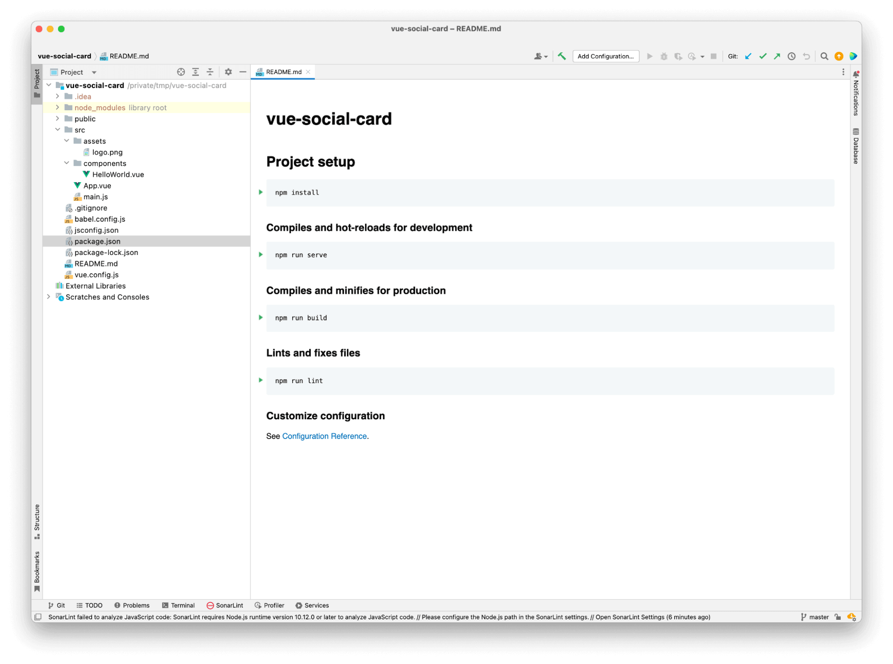
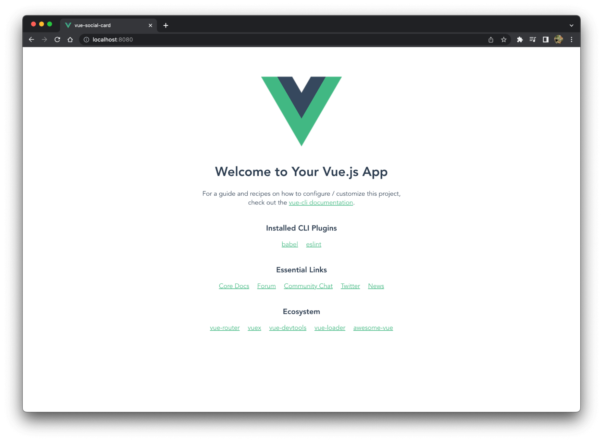
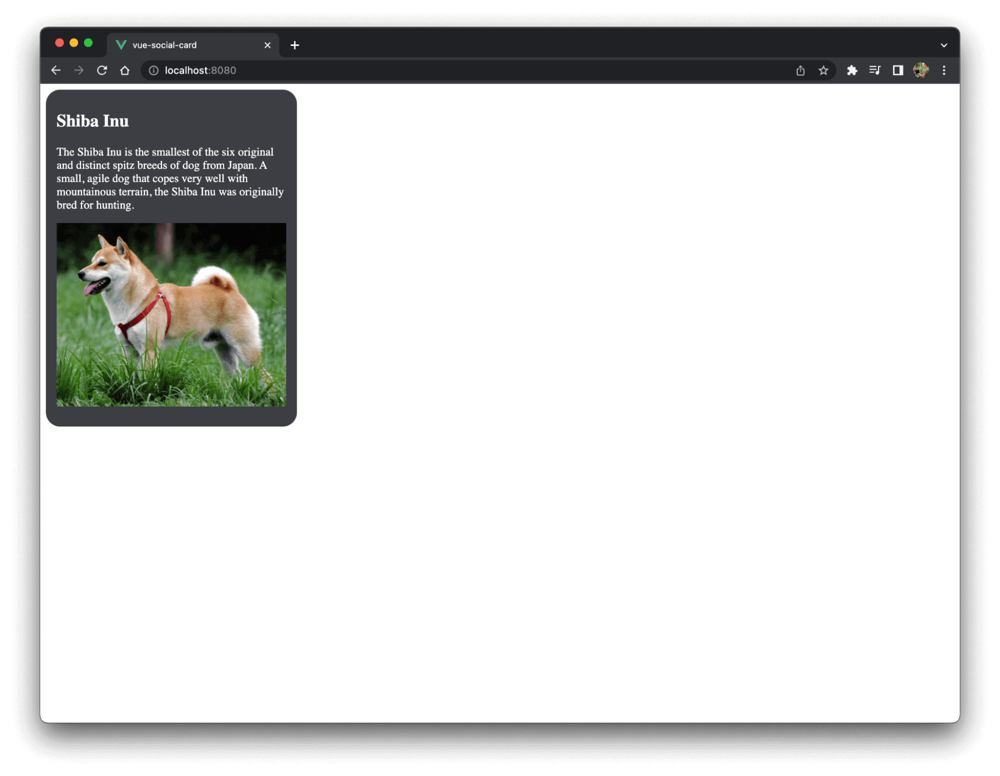

<p>
<em>Disclaimer: This article has been written with the help of the ModSquad Community. The related live session is available here:</em>
</p>
<p>
<div class=”iframe-container”><iframe width="560" height="315" src="https://www.youtube.com/embed/VDj6LVRwsEM" title="YouTube video player" frameborder="0" allow="accelerometer; autoplay; clipboard-write; encrypted-media; gyroscope; picture-in-picture" allowfullscreen></iframe></div>
</p>

## Introduction

<p>
Hi, fellow developers!
</p>
<p>
After learning how to create micro frontends with Angular and React, we’re jumping into another world with Vue.js. Remember, we’re trying to create a micro frontend using the web component specifications for each of the following frameworks: Angular, React, and Vue.js.
</p>
<p>
Does Vue provide the best developer experience when creating a micro frontend social card? Let’s try it!
</p>

## Create the Vue.js app

<p>
First, ensure that you have installed Node with npm (you can use Yarn instead) and Vue CLI: <code class="language-bash">npm install -g @vue/cli</code>
</p>


<p>
I suggest using the default option <code class="language-bash">Default ([Vue 3] babel, eslint)</code> to create the application by running the following command in your target folder: <code class="language-bash">vue create vue-social-card</code>
</p>

<p>
That should create a folder named <code class="language-bash">vue-social-card</code> that contains a fresh Vue.js project.
</p>



<p>
Please note that by default, the application is configured to include certain features, such as npm scripts to start your app and eslint to help you code.
</p>

## Discover your application

<p>
Before making any changes and creating a micro frontend, let’s run the application locally using <code class="language-bash">npm run serve</code>. Your application should then be available at the following URL: <a href="http://localhost:8080/">http://localhost:8080/</a>.
</p>



## Create the social card component

<p>
Vue.js helps you organize your code with components. That means we need to create a file to contain all the card code. You can delete the default file called <code class="language-bash">HelloWorld.vue</code>.
</p>
<p>
Once you’ve created a new file named <code class="language-bash">SocialCard.vue</code> in the components folder, copy the following code into it:
</p>

``` js
<script>
export default {
  props: {
    card: {
      type: Object,
      required: true
    }
  },
};
</script>

<template>
 <div class="card">
  <h2>{{ card.name }}</h2>
     <span>{{ card.description }}</span>
  
 </div>
</template>

<style>
.card {
width: 320px;
height: auto;
min-height: 450px;
background: rgb(60, 62, 68);
border-radius: 20px;
overflow: hidden;
padding: 10px 15px;
margin-bottom: 24px;
margin-right: 10px;
transition: all 0.2s linear;
cursor: pointer;
color: white;
}
img {
margin-top: 5%;
 max-width: 100%;
 height: auto;
}
.card:hover {
transform: scale(1.01);
box-shadow: 0 3px 12px 0 rgba(0, 0, 0, 0.2),
 0 1px 15px 0 rgba(0, 0, 0, 0.19);
}
.card > .title {
margin: 0;
}
</style>
```

<p>
Our component is just a simple piece of HTML/CSS code that requires an entry object named <code class="language-bash">card</code> and defines the following properties: <code class="language-bash">name</code>, <code class="language-bash">description</code>, <code class="language-bash">image</code>, and <code class="language-bash">image_alt</code>.
</p>
<p>
As it is, your application might be broken due to an error in the <code class="language-bash">app.vue</code> file. It’s time to update it.
</p>

## Update App.vue

<p>
The reason your app doesn’t work is that the main component still includes the default component. To fix it, replace the file contents with the following code:
</p>

``` js
<script>
import SocialCard from "@/components/SocialCard";

export default {
  components: {
    SocialCard
  },
  data() {
    return {
      shiba_card: {
        id: 1,
        name: 'Shiba Inu',
        description: 'The Shiba Inu is the smallest of the six original and distinct spitz breeds of dog from Japan.\n' +
            '      A small, agile dog that copes very well with mountainous terrain, the Shiba Inu was originally\n' +
            '      bred for hunting.',
        image: 'https://material.angular.io/assets/img/examples/shiba2.jpg',
        image_alt: 'The Shiba Inu image'
      },
    }
  }
};
</script>

<template>
  <SocialCard :card=shiba_card></SocialCard>
</template>
```

<p>
This imports our social card component, defines a card object <code class="language-bash">shiba_card</code> in the <code class="language-bash">data()</code> function to store the different properties, then passes the card object to the social card component in the <code class="language-bash">template</code> section.
</p>
<p>
The application is working again and the default Vue landing page is replaced with the Shiba Inu social card:
</p>



<p>
However, we only built a classic single page application and need to migrate it to a micro frontend. 
</p>

## Define the custom element


<p>
In order to reuse this app as a web component, we need to define a custom element, which is a typical step when using Angular and React.
</p>
<p>
Replace the contents of the <code class="language-bash">main.js</code> file with the following:
</p>


``` js
import App from './App.vue'

import { defineCustomElement } from 'vue'

const SocialCardElement = defineCustomElement(App)

customElements.define('social-card-element', SocialCardElement)
```


<p>
This code defines the <code class="language-bash">social-card-element</code> custom element and wraps the Vue app. As we saw before, this app is now rendering the card as expected.
</p>
<p>
Next, replace <code class="language-markup">&lt;<strong>div</strong> id="app">&lt;/div></code> in the <code class="language-bash">public/index.html</code> file with the custom element:


``` js
<body>
 <noscript>
   <strong>We're sorry but <%= htmlWebpackPlugin.options.title %> doesn't work properly without JavaScript enabled. Please enable it to continue.</strong>
 </noscript>
 <social-card-element></social-card-element>
 <!-- built files will be auto injected -->
</body>
```

<p>
<strong>Congratulations! You have just built a Vue.js micro frontend using a custom element.</strong>
</p>
<p>
Please note, as I’m writing this article, there is an issue with styling and custom elements that is discussed in detail <a href="https://github.com/vuejs/core/issues/4662">here</a>. Please follow this ticket to know when it will be fixed or for current workarounds.
</p>

## Resources

- The code above is available on GitHub <a href="https://github.com/avdev4j/vue-social-card">here</a>.

- Thanks to <a href="https://github.com/AlanPenaRuiz/vue-rick-and-morty">this repo</a> for the card example. 

- Are you already using Entando and looking for Vue.js components? Take a look at <a href="https://github.com/entando-samples/ent-project-template-vue">this sample</a>.

- Watch micro frontend videos on our <a href="https://www.youtube.com/c/EntandoVideos">YouTube channel</a>.

- Join us on <a href="https://discord.gg/SdMCvyzzHm">Discord</a> to share and learn about composable apps.


