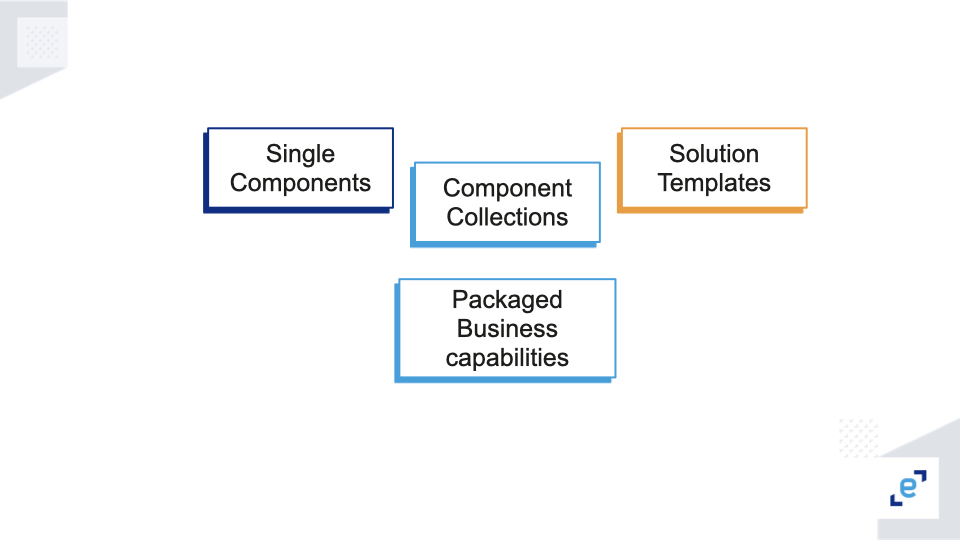
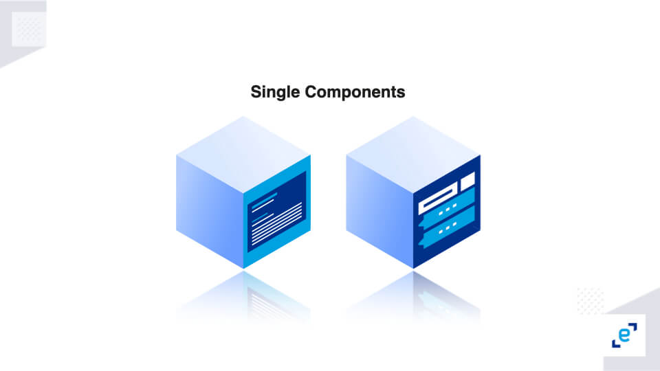
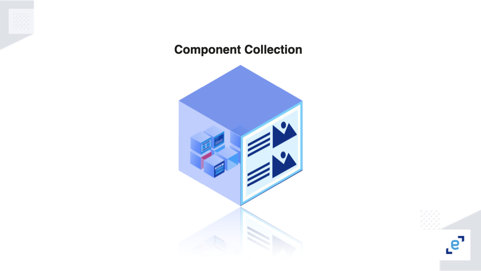
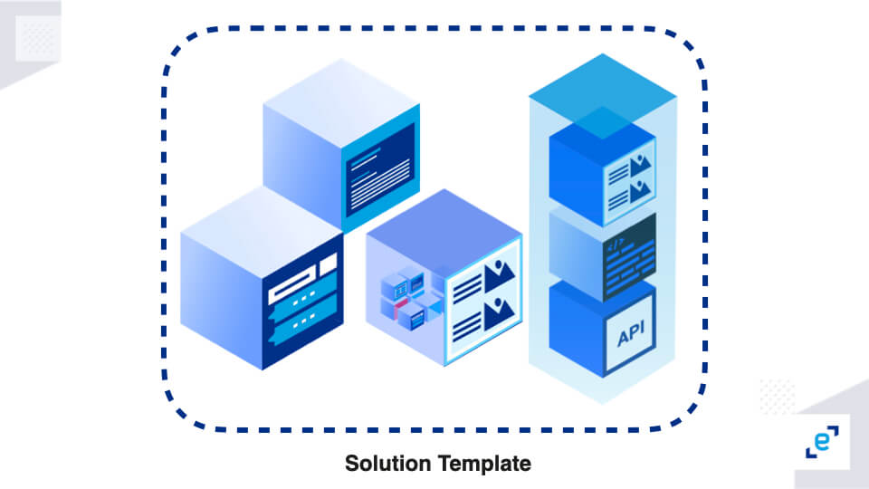
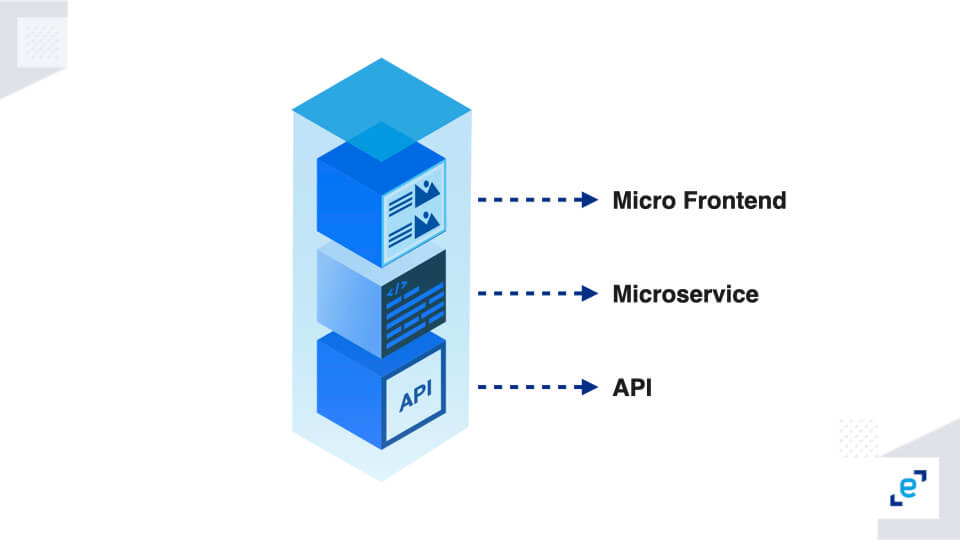
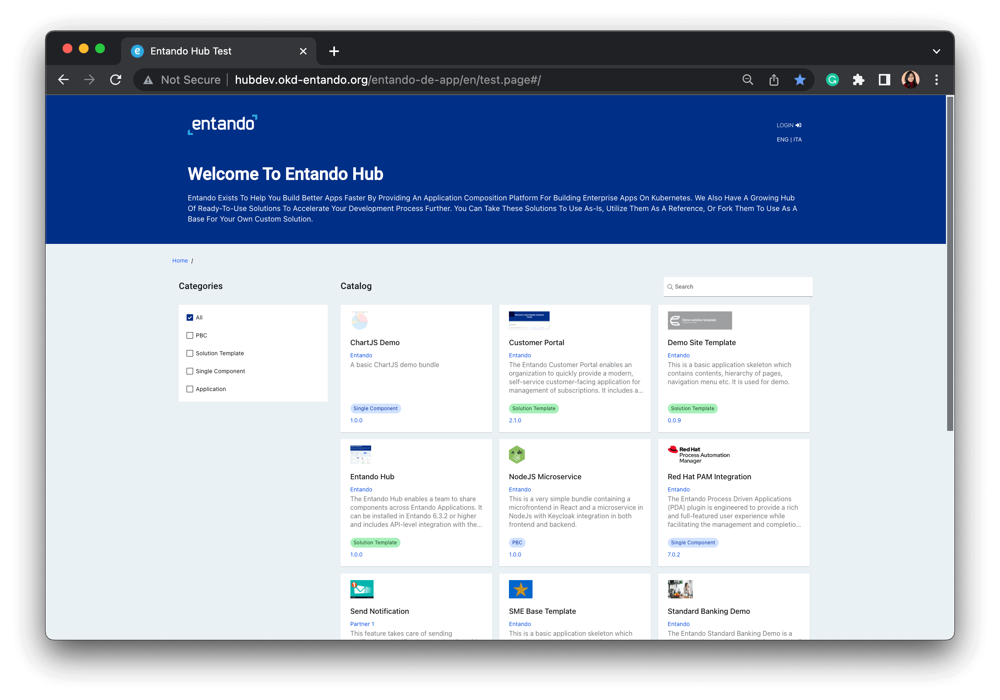

<em>What do you imagine when someone says hub?</em>&nbsp;

It's a center or place to hold a collection of things or several kinds of things. An Entando Hub is a repository (local, remote, public, or private) that contains components. To be more specific, the App Builder, which is the UI of the Entando Platform, can connect to one or more Entando Hubs.

In my recent blog on the Entando 7.0 release, I wrote a bit about the Entando Hub. You can check that out <a href="https://dev.to/entando/whats-new-with-the-entando-70-release-3gfa">here</a>. But, in this blog, I'll give a technical overview of the hub.

<em>Before I start, let's find out why we needed a hub.&nbsp;</em>

In previous blogs, we learned about the 4Cs. If you don't know about that, you can take a look at this <a href="https://dev.to/entando/part-1-what-is-entando-platform-cbb">blog</a>. From the 4 essential roles of application composition, one thing is clear: the set of components built by Creators are reusable and flexible. But, to make them easy to reuse, there was a need to create a hub, where they could reside and be available to a larger audience.&nbsp;

<em>Now, the question is, what are some of the capabilities of the hub?</em>

The hub lets you share single components, component collections, solution templates, and packaged business capabilities (PBCs) that Creators build.

A single components is a building block for apps. It can be a page template, content template, micro frontend, microservice, UX Fragment, or content type.&hellip;

Component collections are a packaged set of single components. They are assembled components that are in some way functionally unrelated but useful to a Composer (e.g. a set of Page Templates, a set of content templates or content types plus widgets and MFE, or a mix of these).

Solution templates are a pre-packaged set of PBCs, component collections, and single components providing full-featured, domain-specific solutions (e.g. Task Tracker, Supplier Portal, Customer Portal, Partner Portal, E-commerce, etc.).

PBCs are encapsulated software components that represent a well-defined business capability, recognizable as such by a business user, and packaged for programmatic access.&nbsp;

Any and all of these can be assembled in the hub, where new items and new versions are continuously made available. But to avoid errors or issues, we should follow some best practices:

<ul>
	<li>The PBCs and/or components Creators build must be appropriately sized - not too small or too big. They should be business-driven with a definite business value. There are several scenarios for this. For example, a PBC can have many components which make it large, or it can have fewer components, making the size smaller. But in the latter case, a Composer may need to install several of these smaller PBCs. It is a tradeoff between functionality and ease of use. Hence, we must judge wisely, making sure the component isn't too large or too small.&nbsp; 
	&nbsp;</li>
	<li>Our components and PBCs should be easily configurable. By this, I mean we must avoid hardcoding. It is preferable to use separate configuration files or database tables to store any value that's needed in your component. 
	&nbsp;</li>
	<li>It is best to use a package manager to help with the right dependency versioning strategy. A package manager helps us by updating all the packages and/or software frequently. These packages run tests to check security, etc., and save us a lot of time. 
	&nbsp;</li>
	<li>While we discuss these best practices, we must know that the Curator oversees the hub, managing the components available there for the organization. Hence, the Curator should do a Security Analysis. They should perform a thorough analysis of the dependencies, security alerts and/or code vulnerabilities. 
	&nbsp;</li>
	<li>Use code quality metrics to measure and determine if the code we have written for the PBC is of high quality. Certain variables are checked under this quality analysis, like code complexity, portability, reusability, etc.&nbsp; 
	&nbsp;</li>
	<li>And finally, we should add proper documentation for our PBC. It's the first thing that provides clarity about our PBC. This documentation should be created in such a manner that it is well understood by both business and technical people. Also, it is a good coding practice!</li>
</ul>

Now, it's time we take a look at the Entando Hub.

As you see here, there are many single components, component collections, solution templates, and PBCs under &ldquo;Catalog&rdquo;. After the Curator performs the validation checks, these building blocks made by Creators are published in the hub.

<em>How can we use the hub?</em>

This hub can be used with Entando 7.0. This <a href="https://developer.entando.com/v7.0/tutorials/solution/entando-hub.html">documentation</a> can help us get started, but in the upcoming blogs, I'll definitely share how it can be installed in our App Builder.&nbsp;

Is the hub open source?

The Entando Hub is under the ​​<a href="https://github.com/entando-samples/entando-hub/blob/main/LICENSE">LGPL-3.0</a> license and is open source. We can easily contribute to it by referring to this <a href="https://github.com/entando-samples/entando-hub">repository</a>.

Lastly, before we wrap up, I'd like to explain the Entando Cloud Hub.

The Entando Cloud Hub is a SaaS instance of an Entando Hub that contains a public and private collection of components.&nbsp;

Well, that's all about the hub for now. We are in the process of creating more tutorials around the hub and those will be released over the next few weeks.&nbsp;

But, for now, I would love to see you all try out the hub for yourselves and send in your feedback using the comment section below!

Lastly, we at Entando are building an exciting community that spreads awareness of composability and modular applications. We call it the Modular Squad, and we'd love to invite you to <a href="https://discord.gg/N64a3QMd9X">join us</a> and be part of this journey!

Thank you!

 <a href="#">Back to top</a>

