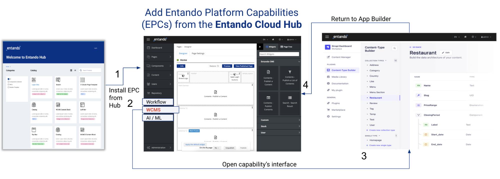
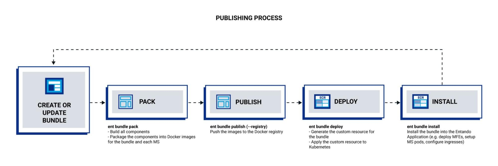

Entando's Application Composition Platform Version 7.1 is now available to support enterprises that are modernizing applications to accelerate development, reduce runtime costs, and streamline maintenance through the use of a composable application architecture. Entando brings developer joy to the creation, curation, and composition of modular enterprise applications.

<strong>Background:&nbsp;</strong>

Even before the 21st century, enterprises have been advancing infrastructure and strategies to solve business problems. From the development of web applications on-prem to their subsequent move to the cloud, and now, modularization in the cloud, each move has accelerated development, lowered cost and streamlined maintenance.

This new phase of modularity focuses on decoupling (or breaking up) both the backend code and the monolithic frontend by bundling microservices and micro frontends into <a href="#!U;https://youtu.be/RkGBpLQ-070!#">packaged business capabilities (PBCs)</a>. These PBCs can be shared across development teams and projects within an <strong>Enterprise Hub</strong> and assembled into applications via a low-code <strong>Application Builder</strong>, all within a unified <strong>Application Composition Platform</strong>. 

The updates available in Entando 7.1 are focused on the pro-code creators. It provides many new capabilities to support the development of modern composable applications, which include:

<em><strong>New: Entando Platform Capability (EPC)</strong></em>

To accelerate application development, Entando 7.1 now supports a pluggable framework to allow Creators and Composers to easily expand the functionality of the Entando App Builder and add external services. Like the PBC, an EPC is a packaged capability, and it adds functionality to the platform like menu options or an API management page. An EPC can be a headless CMS, like Strapi, that is bundled, stored in the Entando Cloud Hub, and implemented in the App Builder.

A sample configuration is shown below:

The headless system (e.g. Strapi) uses the Entando App Builder as a templating mechanism to create and manage pages, content layout, and content versioning:&nbsp;

1) An EPC can be deployed to an Entando Hub (such as the Entando Cloud Hub, the publically accessible version of the hub).&nbsp;

2) EPCs can be installed into and then accessed from the Entando App Builder. This adds a new menu item to the App Builder.&nbsp;

3) When the menu item is accessed, it opens the headless interface, where content can be managed. You can return to the App Builder at any time.

4) Users can access the external system's APIs and resources, deploying them into applications using the page designer. Many types of EPCs can be built for Entando 7.1, including a headless CMS (Strapi.io is coming soon), Workflow, AI/ML, API Mgmt, and more.&nbsp;&nbsp;

<em><strong>New: Bundle Templates</strong></em>

Entando 7.1 introduces pro-code bundle templates to&nbsp;enable developers, System Integrators, and enterprises to create new PBCs by reusing existing micro frontends and microservices, providing consistency and acceleration from a core PBC library.

<em><strong>New: Service Discovery</strong></em>

With Entando 7.1, communication between micro frontends and microservices is decoupled. Service discovery is simplified with the API claims mechanism orchestrated by the ent CLI, which eliminates the need to define and manage API endpoints, both in local development and within a running instance.

<em><strong>Updated: Create Tooling</strong></em>

&nbsp;Entando 7.1 mainly focuses on developers. The local development process was improved and now developers can easily initialize a bundle from scratch or download one from a hub. They can add components and populate the bundle descriptor with micro frontends, microservices, and platform components with the ent CLI. They can run, build, and install with only a few commands. Bundles that have worked on 7.0 will work on 7.1 as well. More details can be found here: <a href="#!U;https://developer.entando.com/v7.1/docs/getting-started/ent-bundle.html#entando-7-1-bundle-development!#">https://developer.entando.com/v7.1/docs/getting-started/ent-bundle.html#entando-7-1-bundle-development</a>

<em><strong>Updated: Docker Image Specification</strong></em>

Previously, developers used Git repositories to manage both code sources and bundle versioning. Now bundle packaging and publishing uses Docker to handle the image specifications. With this, one can still manage code sources on their preferred Git provider, but each release will be done through an image registry.&nbsp;&nbsp;

<em><strong>Updated: Entando CLI&nbsp;</strong></em>

We have enhanced the <strong>Entando CLI</strong> for Mac and Windows. The CLI can now create new bundles from templates downloaded from an Entando Hub, which provide a wider range of commands to perform various actions. Some examples:

<ul>
	<li>Create a Docker image of the bundle</li>
	<li>Docker-based bundle management commands</li>
	<li>Easily publish a bundle inside Docker Hub</li>
	<li>API management</li>
</ul>

<em><strong>Updated: Entando Hub</strong></em> 
 
The Entando Hub was introduced in Entando 7.0 and provides a repository for PBCs, solution templates, components, and/or component collections. Enterprises, development teams, System Integrators, etc., can implement an Entando Hub as a central repository from which the Entando App Builder can discover and quickly access entries. Entando Hub updates include:&nbsp;

<ul>
	<li>Docker bundle name generation update</li>
	<li>Added bundle security check</li>
	<li>Update install instructions to use `ent ecr deploy`</li>
	<li>Refined bundle retrieval to sort entries in the App Builder</li>
</ul>

<em><strong>Summary</strong></em>

To learn more about Entando 7.1, or to get started with composable applications, see:

<ul>
	<li>A complete look at the 7.1 <a href="#!U;https://developer.entando.com/next/docs/releases/#summary!#">Release Notes</a></li>
	<li><a href="#!U;https://developer.entando.com/v7.1/docs/!#">Docs</a></li>
	<li><a href="#!U;https://developer.entando.com/v7.1/docs/!#">Tutorials</a></li>
	<li><a href="#!U;https://developer.entando.com/v7.1/docs/getting-started/#install-kubernetes!#">Base install guide </a>(manual, not the one-liner until official launch)</li>
	<li><a href="#!U;https://developer.entando.com/v7.1/tutorials/#operations!#">Platform install guides</a></li>
	<li>Watch a video with industry experts
	<ul>
		<li><a href="#!U;https://www.youtube.com/watch?v=fWbLQDZBEio!#">With Massimo Pezzini, formerly VP Distinguished Analyst with Gartner</a></li>
		<li><a href="#!U;https://www.youtube.com/watch?v=_pAILlnkLck!#">With Luca Mezzalira, Serverless Solutions Specialists at Amazon Web Services</a></li>
		<li><a href="#!U;https://www.youtube.com/watch?v=Lo5rfCNLCvo!#">With James Governor Red Monk Analyst and Co-founder</a></li>
	</ul>
	</li>
	<li><a href="#!U;https://discover.entando.com/en-us/what-is-an-application-composition-platform!#">Download the &ldquo;What is an Application Composition Platform&quot; whitepaper</a></li>
	<li><a href="#!U;https://entando.com/page/en/demo!#">Book a guided demo</a></li>
</ul>

 <a href="#">Back to top</a>
