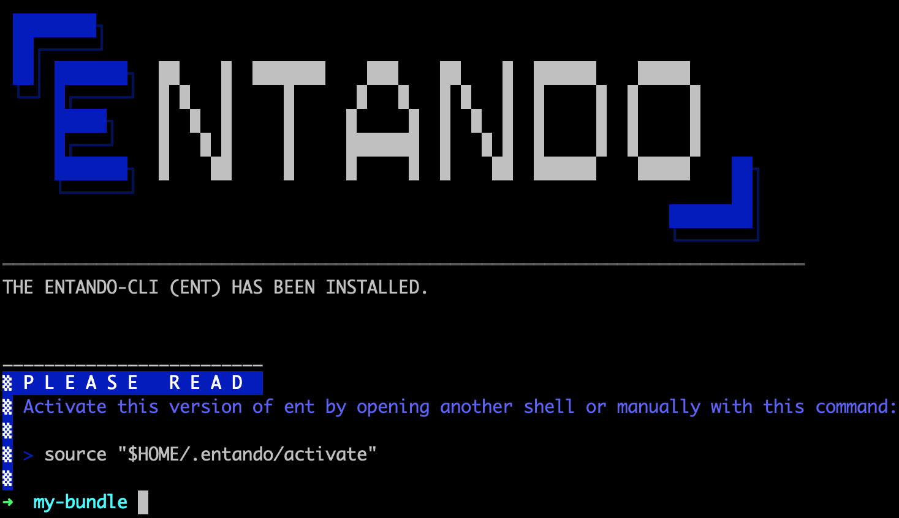
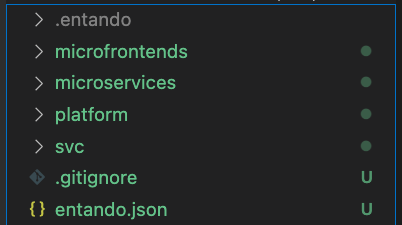
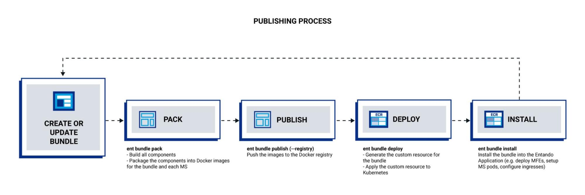
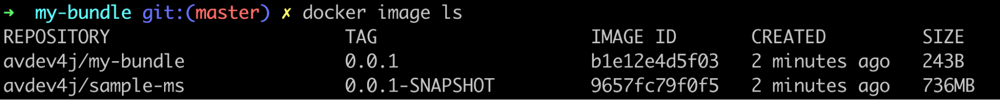
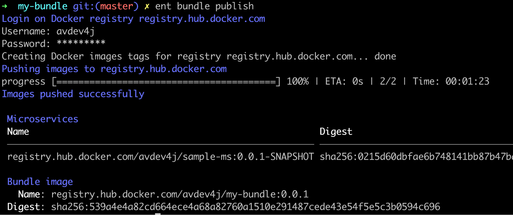
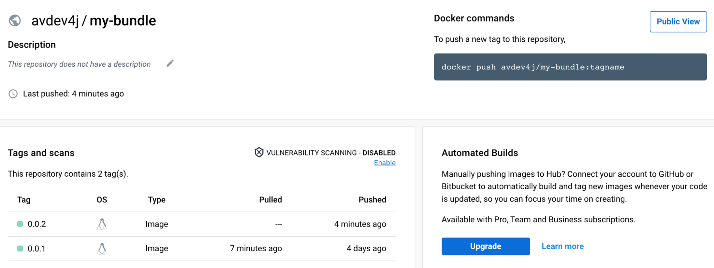
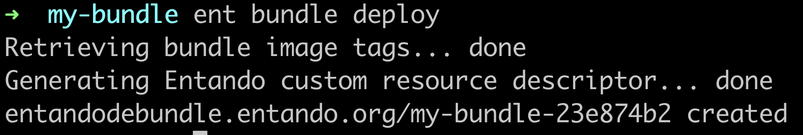
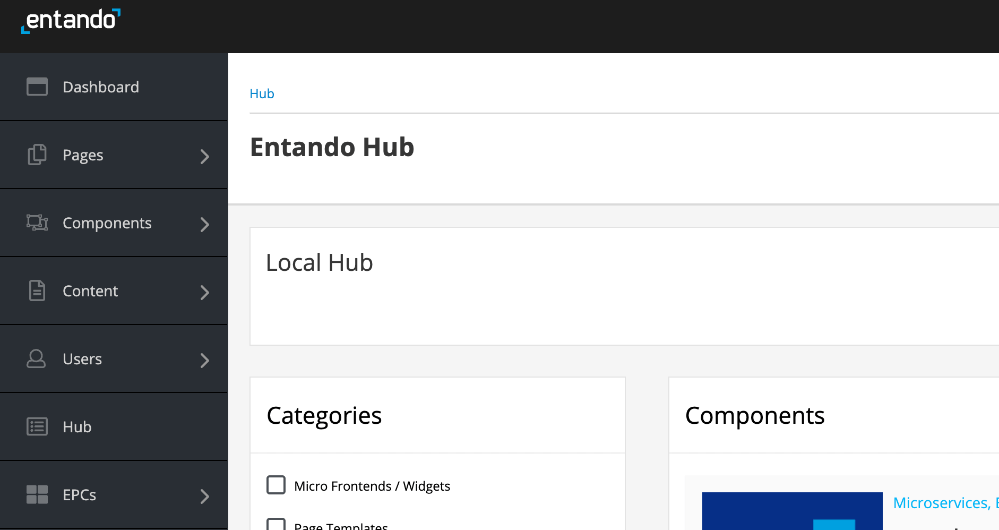
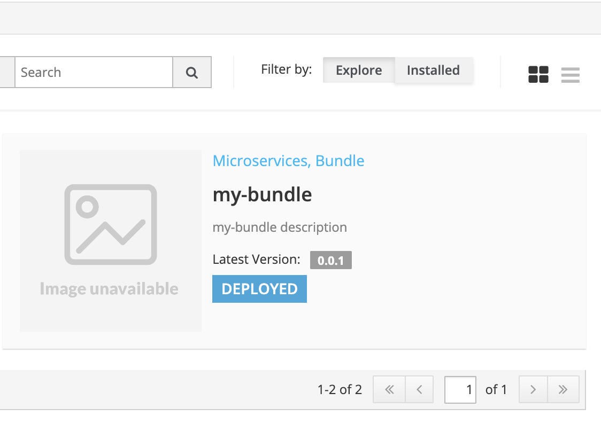
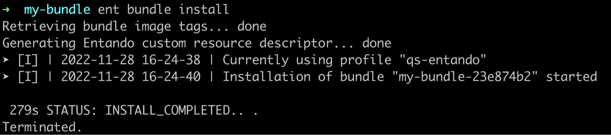

<p>At Entando, we define a bundle as a package that contains one or more components. A bundle can be a single component, component collection, PBC, or solution template, based on the level of granularity. Any bundle built with Entando is an Entando Bundle.</p>

<p>Entando 7.1 introduces a major new change - bundles with a docker-based structure. This article explores all the things you need to know about this feature.</p>

## A shift from git-based bundles

<p>If you've already built or used bundles with Entando, you should know that before Entando 7.1, the bundles were git-based. That means the source code (or project) and the build artifact (the deployable bundle) were stored in two different Git repositories.</p>

<p>Traditionally, the source code repository is used by the Creators team for coding and building components with development tooling. The coding flow is similar to what we find in any development team, pushing and merging branches to share and review the code within the team.</p>

<p>The second repository stores the result of the compiling process, the artifact, that Curators can register in a hub, and Composers can install on their Application Composition Platform.</p>

<p>The docker-based bundle is a total shift from this. The source repository is still present, but all the artifacts are now sent to a Docker registry using Docker images.</p>

## A structure modification

<p>The publishing process was improved with the tool change, so we took the opportunity to streamline the bundle structure itself.</p>

<p>We have a more readable and consistent set of folders with the docker-based bundles.</p>

<table border="1">
	<tbody>
		<tr>
			<td><strong>git-based</strong></td>
			<td><strong>docker-based</strong></td>
		</tr>
		<tr>
			<td><em>bundle/descriptor.yaml</em>
			<p>The main bundle descriptor</p>
			</td>
			<td><em>entando.json</em>
			<p>The main Entando file that contains the component definitions and metadata</p>
			</td>
		</tr>
		<tr>
			<td><em>ui/</em>
			<p>The micro frontends sources folder</p>
			</td>
			<td><em>microfrontends/</em>
			<p>Centralized micro frontends folder</p>
			</td>
		</tr>
		<tr>
			<td><em>src/</em>
			<p>The backend sources folder</p>
			</td>
			<td><em>microservices/</em>
			<p>The microservices folder, one per component</p>
			</td>
		</tr>
		<tr>
			<td><em>src/main/docker</em>
			<p>The auxiliary service folder, such as Docker compose files and the Keycloack configuration for local usages</p>
			</td>
			<td><em>svc/</em>
			<p>The auxiliary service folder, such as Docker compose files and the Keycloack configuration for local usage</p>
			</td>
		</tr>
		<tr>
			<td><em>*.sh</em>
			<p>Shell script used by the CLI to compile and build the bundle</p>
			</td>
			<td>&nbsp;</td>
		</tr>
		<tr>
			<td>&nbsp;</td>
			<td><em>platform/</em>
			<p>The folder for any Entando-related component such as pages, contents, page templates&hellip; One sub-folder per component type</p>
			</td>
		</tr>
	</tbody>
</table>

<p>If you'd like to make an in-depth comparison between these implementations, our documentation provides a table <a href="https://developer.entando.com/v7.1/docs/curate/bundle-comparison.html">here</a>.</p>

<p>The CLI and commands are now using the docker-based structure, which can be created easily.</p>

<p>Let's start a new project to discover this.</p>

## Create a new 7.1 bundle with the ent CLI

### Prerequisites

<p>Before moving forward, you have to ensure that your Entando CLI is up to date. If not, please run the following command:</p>

``` sh
(curl -sfL https://get.entando.org/cli) --update
```



<p>Don't forget to activate it with the following command:</p>

``` sh
source "$HOME/.entando/activate"
```

### Initialize the project

<p>From your favorite folder, run the following command to initialize the project:</p>

``` sh 
ent bundle init my-bundle
```

<p><em>Please note, you should replace &ldquo;my-bundle&rdquo; with your project name.</em></p>

<p>A new folder is created with this project name; open it as a project with your favorite IDE to check the new structure.</p>



<p>You can check the entando.json file content, and the metadata:</p>


``` json
{
    "microservices": [],
    "microfrontends": [],
    "svc": [],
    "name": "my-bundle",
    "version": "0.0.1",
    "description": "my bundle description",
    "type": "bundle"
}
```

### Add a microservice

<p>In the project folder, run the following command to add a new microservice:</p>

``` sh
ent bundle ms add sample-ms --stack=spring-boot
```

<p>We specify the stack because of the dedicated metadata we may need with some stack types. This command creates a new folder called "sample-ms" in the "microservices" folder and adds an entry in the entando.json.</p>

``` json
{
    "microservices": [{
        "name": "sample-ms",
        "stack": "spring-boot",
        "healthCheckPath": "/api/health"
    }],
    "microfrontends": [],
    "svc": [],
    "name": "my-bundle",
    "version": "0.0.1",
    "description": "my bundle description",
    "type": "bundle"
}
```

<p>Please note, this new folder is empty and you have to add your own code. We provide an easy way to start; let's do it with JHipster.</p>

<p>Call JHipster with the following commands:</p>

``` sh
cd microservices/sample-ms ent jhipster --blueprints=entando
```

<p>Then, select only the default values.</p>

<p>When the generation is done, the "sample-ms" folder contains all the files provided by JHipster.</p>

### Customize the bundle for JHipster

<p>You just need to tweak a couple of things to make it work properly.</p>

First, edit the entando.json and update microservices/sample-ms to set the healthCheckPath and dbms properties:

``` json
{
    "healthCheckPath": "/management/health",
    "dbms": "postgresql"
}
```

Next, move the blueprint-provided auxiliary service definitions into the svc directory in the bundle project:

``` sh
mv microservices/sample-ms/src/main/docker/* svc/
```

<p>This enables the ent CLI to start Keycloak:</p>

``` sh
ent bundle svc enable keycloak
```

<p>For advanced use cases, you can add MFEs with <a href="https://developer.entando.com/v7.1/tutorials/create/ms/generate-microservices-and-micro-frontends.html#generate-the-components">this tutorial</a>. Please note that for microservices, you have to execute some extra steps.</p>

### Discover the new publishing process

<p>This new bundle structure comes with a simpler publishing process provided by new streamlined CLI commands.</p>

<p>You can find a graphic of the different steps below. It describes the overall process and helps you to understand the details involved in every step.</p>



<p>Let's follow it for our new 7.1 bundle.</p>

#### Build

<p>From the root project folder, run the following command:</p>

``` sh
ent bundle pack
```

<p>Please note, you need to have <a href="https://maven.apache.org/install.html">Maven</a> installed for this to execute. You also need Docker installed; you can check the <a href="https://docs.docker.com/get-docker/">installation procedure</a> appropriate to your environment.</p>


<p>You can run the "docker image ls" command to see your available images.</p>



#### Publish

<p>Once it's finished, run the next command to publish the bundle to a Docker repository:</p>

``` sh 
ent bundle publish
```

<p>In this step, you need to be logged into Docker Hub. Ensure you have an account or create a new one on this website: <a href="https://hub.docker.com">https://hub.docker.com</a></p>

<p><em>Please note, you can decide to publish the images to another registry by providing the URL with the --registry parameter.</em></p>





#### Deploy

<p>This step is the same as for the previous Entando version, even if the commands have been modified to keep the consistency. Here, you need to have an available running instance of Entando. Visit <a href="https://developer.entando.com">https://developer.entando.com</a> to install a local one.</p>

<p>Please note that you need your ent CLI profile to be connected to your Entando instance. If you followed the previous steps and installed a local multipass VM, you might have to run the following command, where &ldquo;entando&rdquo; is the virtual machine name:</p>

``` sh
ent attach-vm entando
```

<p>Otherwise, it is possible to attach a kubeconfig file with this:</p>

``` sh
ent attach-kubeconfig {kubeconfig-file}
```

<p>From your bundle root folder, run the following command:</p>



<p>When the deploying process is finished, you can navigate to your Local Hub by clicking on the &ldquo;Hub&rdquo; menu.</p>



<p>Then, you should see your bundle:</p>



#### Install

<p>As you can see, the bundle is available in your Local Hub but not installed yet. That means nothing is running on your cluster from that bundle and the components are not available for composition.</p>

<p>To install them, you can use the UI and click on the "Install" button in the Local Hub, or you can run the following command from your bundle root folder:</p>

``` sh
ent bundle install
```



<p>The micro frontends are now available in the App Builder to compose new pages. The microservices are pods and you can check them with the following:</p>

``` sh
ent kubectl get pods -n entando
```

## Conclusion

<p>In this article, we discovered a few new features provided by Entando 7.1. The bundle structure has been rebuilt and they are now docker-based. The publishing process has been optimized with the ent CLI commands. The JHipster blueprint has been optimized to match this new paradigm.</p>

<p>You can find explanations of these features in our <a href="https://youtu.be/GoxX-N15ZGk">7.1 live with Sohini</a>.</p>

<p>Did you know the bundle we just created can be used like a template to create a new one? Maybe not, because that's also a new feature in 7.1 and this is the topic of the next blog post in this series. Stay tuned.</p>

</span><br><a href="#">Back to top</a></span></p>
