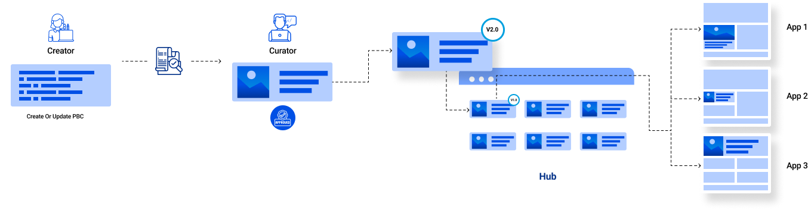
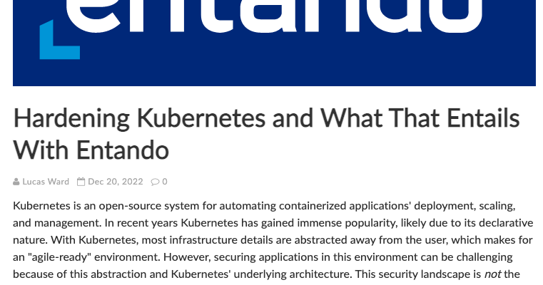

Building composable apps means understanding how they manage security and reliability. Composable apps offer a lot of advantages to streamline applications due to the modularity and reusability of packaged business capabilities (PBCs). Individual modules and PBCs help isolate problems and security designs, separate frontend and backend concerns, and allow patching at the component level. At the company level, and with a good hub policy, this turns into “patch once, secure all” because you can easily leverage security fixes if they are applied to centralized modules in a store that all your applications rely on.

However, security strategies should not be applied at the code or module level only. The infrastructure has to be fully resilient and secure. No one can imagine using a car with seatbelts within an insecure chassis. It doesn't make sense. Security is everyone’s business.

Fortunately, solutions exist to help us design at all levels with security as one of the top priorities.

"Shift security left." It is more than a buzz phrase, it's good advice according to Lucas Ward in a recent article called [Hardening Kubernetes and What That Entails With Entando](https://blog.ippon.tech/hardening-kubernetes-and-what-that-entails-with-entando/). There, Ward describes how building applications with Kubernetes is challenging.

I agree, building a fully secured application with Kubernetes is a real adventure. If there is something we can't live without, it is security. Whatever business domain we work in, security should be at the center of the design and production processes.

Delaying its implementation is risky; executing it is time consuming.

As Ward spells out, we can rely on frameworks for a smooth and dependable way to secure applications, especially with Kubernetes. He says that using a platform such as Entando provides simplicity and a solid foundation with best practices you can count on to promote security from the ground up.

From solid structures and basic setup with code generation, to a well documented CI/CD process and opinionated build pipelines, Ward asserts that "using Entando as your platform of choice covers a lot of ground in the Development, Build, and Infrastructure scape."

Saying more without spoiling it is impossible - just read it! This is my only advice.

 <a href="#">Back to top</a>
