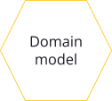
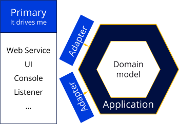
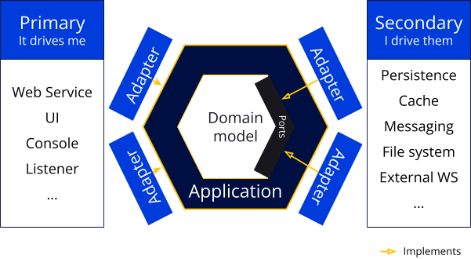

In today's digital age, organizations seek innovative solutions to keep up with the ever-evolving needs of their customers. One of the most promising approaches is to create highly modular, scalable, and adaptable applications. 

 

Composable apps and Hexagonal Architecture go hand-in-hand in achieving that goal. The goal of composable apps is to build applications as a set of loosely-coupled, independently deployable components that are combined to meet the needs of users. Hexagonal Architecture provides a framework for achieving this goal by organizing the application around its core business logic and making it agnostic to the surrounding technical infrastructure.

It would be a mistake to think a developer would naturally use one or both. First, because composable apps are quite new in IT, and then because even though Hexagonal Architecture is getting more popular, there are many things to know to be domain-centric.  

Combining both is a great choice and here we explain why.

In this blog, we will delve into the concepts of composable apps and domain-driven architecture, with a specific focus on Hexagonal Architecture. By the end of this blog, you will have a deep understanding of how Hexagonal Architecture can be leveraged to build applications that deliver fast business value for the users.

# Split by Business domain, not by tech domain

Splitting applications into autonomous parts is really challenging! Unfortunately, it is a mandatory step if your solution is meant to grow.

Most of the time, following [Conway’s Law](https://en.wikipedia.org/wiki/Conway%27s_law), applications are split around technical responsibilities. This way, it will be easier to build dedicated, specialized teams for each “component."

This approach is not really efficient since you’ll have to synchronize the development and delivery cycle for each component (this is probably not what you are looking for when splitting things).

Another approach is to split autonomous components around business capabilities; let’s dig into that.

# Modeling the Domain

First things first: we have to support enforcing the business with our application. This means we’ll need to write code really expressing our domain.

This code can be object-oriented or functional (either works) but must: 

* Have no dependency on any framework
* Have no hidden side effects
* Be really expressive

We are so used to writing code around technologies that writing this code with these requirements is the really challenging part. You don’t need to think about the persistence or the message queue at this step, you “only” need to code an answer to business problems.

To do that, you can start with type-driven development (yep, that’s another TDD…). The goal is to start expressing your domain by creating types that will disallow any state that's not supposed to exist. If it is impossible to do impossible actions, everything will be easier.

A short example of that: you are building a survey application where you want to send emails with unique links to users. The users can then click the link and answer their survey. If you have only one `Questionnaire` class, you’ll have to have an `answer(...)` method on it to get user answers. Problem is, what happens when you answer an already answered questionnaire? Another solution is to have a `QuestionnaireToAnswer` with an `answer(...)` method resulting in an `AnsweredQuestionnaire`. That way, at every step, you can ensure that your questionnaires are in valid states with dedicated and coherent methods.

Another great approach to focusing on the domain problems: test-driven development. This TDD is really easy to misunderstand! It’s not a testing methodology, it’s a very powerful design approach. It is meant to get to better design faster, but it takes a lot of practice to get to that point.

> To get a better understanding of the misunderstandings around TDD you can watch [TDD, Where Did It All Go Wrong (Ian Cooper)](https://www.youtube.com/watch?v=EZ05e7EMOLM)

Let’s go back to our previous survey example. It is really easy to write tests on the `answer(...)` method and check the resulting `AnsweredQuestionnaire`. If I want to build complicated indicators, I will really appreciate the fact that I can write blazing fast tests (talking in ms here). This really quick feedback loop will help me code a working solution and, after that, an elegant and future-proof one.

> Again, learning TDD is really hard and needs practice. A shortcut is to participate in Coding Dojo, organized by the Software Crafters community.

Finally, I can’t talk about a domain model without talking about domain-driven design - the approach that starts expressing that. Domain-driven design is an awesome toolbox to build domain-centric solutions.

If TDD is easy to learn and hard to master DDD is… hard to learn and really hard to master. But it is really worth it! Among many other things, it is giving us the key to split applications into autonomous blocks called bounded contexts (but we’ll come back to that later).

So, we talked about TypeDD, TestDD and DDD but we are still missing the most important thing to build business-oriented solutions: building them with domain experts. Domain experts here are people who really know the domain.

For my survey application, if Bob was there, sending surveys for the past 15 years, I really want to work with Bob on the new solution. Of course, he won’t be able to think of a great solution on its own, but neither will I. We need to work together to find the most suitable solution for everybody.

However, having business-facing code in a vacuum doesn't serve any purpose! We have to, somehow, make that code available to users and systems. We also need interactions with infrastructure elements (databases, queues…). Protecting the domain model while allowing those interactions is the main purpose of domain-centric code architecture.

# Domain Model Architectures

There are many domain-centric software architectures. If they all focus on domain model protection, depending on your needs, one may be more suitable than the other.

I’m mainly a Java developer. On the backend, my “default” domain-centric architecture is a peculiar flavor of [Ports and Adapters](https://alistair.cockburn.us/hexagonal-architecture/) (aka Hexagonal Architecture).

With this flavor, of course I’ll start with the domain model at the center: 

Most of the time, my goal will be to expose domain operations through web services. This is the job of the primary adapter:

This is where the flavor specificity kicks in: the application layer. This is a very thin layer mainly composed of application services that do:

* Wiring transactions management
* Wiring authorization control
* Really simple orchestration

This layer has framework dependencies so it will be really easy to add the wiring capabilities.

Since the application layer needs to interact with infrastructure we’ll need to add ports and adapters:

The ports are interfaces in the domain and the secondary adapters are implementations of these ports.

> Ports are in the domain because it is really common to inject them, ex: in domain services.

I really like this architecture because each part is only doing one thing so we can focus on doing it well:

* Primary adapters only need to make an efficient adaptation. For example, they can have great REST documentation without polluting anything else.

* The application is really thin, no real business value here

* The domain code is what really matters so we can focus on its accuracy and expression

* Secondary adapters only need to handle the infrastructure elements' adaptation. For example, we can focus on having a really performant data model for our business cases here.

> This very quick introduction is probably not enough to be able to code in this kind of architecture. You can have a look at [this live coding](https://www.youtube.com/watch?v=mEECPRZjajI) to see it in action.

<iframe width="560" height="315" src="https://www.youtube.com/embed/mEECPRZjajI" title="YouTube video player" frameborder="0" allow="accelerometer; autoplay; clipboard-write; encrypted-media; gyroscope; picture-in-picture; web-share" allowfullscreen></iframe>

If you are using OOP you should give it a try. If this doesn’t suit your needs, you might want to have a look at [Onion Architecture](https://jeffreypalermo.com/2008/07/the-onion-architecture-part-1/) or [Functional Core Imperative Shell](https://kennethlange.com/functional-core-imperative-shell/) if your domain model is in FP.

But, to be honest, this doesn’t really matter. Having a rich domain model (as opposed to an [anemic one](https://martinfowler.com/bliki/AnemicDomainModel.html)) is the important part! You can then protect this domain with the architecture you like as long as it:

* Exposes operations on your domain model without polluting it
* Allows interaction with infrastructure without impacting your domain model

In an application, you can have different architecture from one bounded context to the other. Ah, yes, there won’t be one domain model, there will be many of them, one for each bounded context!

# Bounded Context?

A bounded context is an autonomous piece of code responsible for one part of the domain logic. Autonomous doesn't mean they can’t communicate with each other!

> If you want to dig into the communication between bounded contexts you are probably looking for [Context Mapping](https://github.com/ddd-crew/context-mapping) but it is not part of this article.

So, bounded contexts are bounded… That means they can have different life cycles and be managed by different teams as long as your Team Topology sticks to code organization.

> If you want to check out how to organize teams around these Bounded Contexts, you might want to apply an inverse [Conway](https://en.wikipedia.org/wiki/Conway%27s_law) maneuver. [Team Topologies](https://teamtopologies.com/) will help in that regard but, again, not part of this article.

Bounded contexts are the parts we are looking for when trying to split a solution. Problem is, they are not really easy to find…

The first element to look at when trying to find bounded contexts is language. If you are using totally different words or the same word with a different meaning that probably means you are in different bounded contexts.

Back to our survey application. To send surveys we have templates with questions. The template notion also exists when sending emails to users. Same word, totally different meanings! This was an easy one. A trickier one is templates in the template context and templates in the questionnaire context. In the template context they are models that can be used to create a new campaign. In the questionnaire context they are the customized models just existing in a campaign. Same word, same idea, totally different usages and users.

There are a lot of hints, apart from language, to find bounded contexts, but I think that the best call is to not try too hard at first. For me, the best way to find bounded contexts is to let them appear in the code as we get deeper insights into the problem we are trying to solve.

This approach is called [MonolithFirst](https://martinfowler.com/bliki/MonolithFirst.html) and the plan is to start with all the code in the same place and extract some parts, little by little. When boundaries are not moving that much we can start splitting the monolith (if needed).

But, this can only work if our code is open to changes, and this is probably the key to splitting applications!

# PBCs and Composable Apps are Domain-Centric Approaches
*A few words from Anthony Viard*

Packaged business capabilities (PBCs) and composable apps align well with domain-centric architecture as they allow businesses to assemble and integrate components that are specifically designed to meet their unique needs.

We can say PBCs have been inspired by Hexagonal Architecture as it provides a structure for organizing business capabilities into modular and scalable components. The idea behind PBCs is to package business functionality into reusable and independent units that can be combined in various ways to meet the needs of different customers. 

This is similar to the concept of "ports" in Hexagonal Architecture, where the business logic is isolated and treated as a central component that can be connected to different interfaces (such as user interfaces, databases, or other services) without affecting its core functionality.

By leveraging the principles of Hexagonal Architecture, PBCs can be developed in a way that is decoupled from the underlying technology, making it easier to make changes to the technology stack without affecting the business capabilities. By following this architectural pattern, PBCs can be designed and developed in a way that is flexible, scalable, and easy to understand, making them a powerful tool for delivering business value.

Understanding bounded contexts helps you design the PBCs you need to use or to develop. It is funny to see that both Hexagonal Architecture and PBCs are symbolized by a hexagonal shape, as they are both centered around the core business logic, but they are conceptually applied at different levels.

On the other hand, PBC structure benefits from composable apps, which are used as bricks of business logic - independently composable, using interfaces to communicate, and offering business-oriented contracts.

Hexagonal Architecture and composable apps are following the same concepts at different levels of abstraction and use domain models as warrantors of the business core concepts.

Does that mean domain-centric architecture is mandatory to use to build PBCs? Of course not. They come into play at different stages of your application lifecycle. But, if you find composable apps useful for designing your business application, there is no reason not to study these architectures to design your business code, too. And, if you already use domain-centric practices to build your apps, using composable apps could be a good move to streamline these practices for the different layers of your business implementation.

Back to our survey application. Bob can definitely help us understand the business context, which helps to code PBCs using a domain-centric architecture and to design composable apps from a set of these PBCs. Thanks to Bob, we would be able to share that knowledge, through business components, with the company dev teams and let them reuse them.

# Built for change

Let’s admit it: we need experimentation to build great products. It is not possible to get it right on the first try (neither from a functional nor a technical perspective). So… if we have to make important changes many times, we have to build code that will welcome those changes!

Types and Tests provide a pretty decent safety net to ensure that the solution is still working “as intended.” As we gain knowledge, the intent will change. New concepts will emerge, others will disappear. Code has to keep expressing that.

With code built around a domain model, with really clear adaptations for its infrastructure, it is totally possible to refactor the whole thing without breaking anything! It is also possible to clearly extract a bounded context just by putting in a module (package in Java, namespace in C#, …).

Moving bounded contexts into modules and letting them live there for a while is a good plan since it’s way easier to do (or undo) than building a dedicated binary with its infrastructure.

This step-by-step plan is a good way to build a business-centric modular application that will be able to live and grow with your business!
