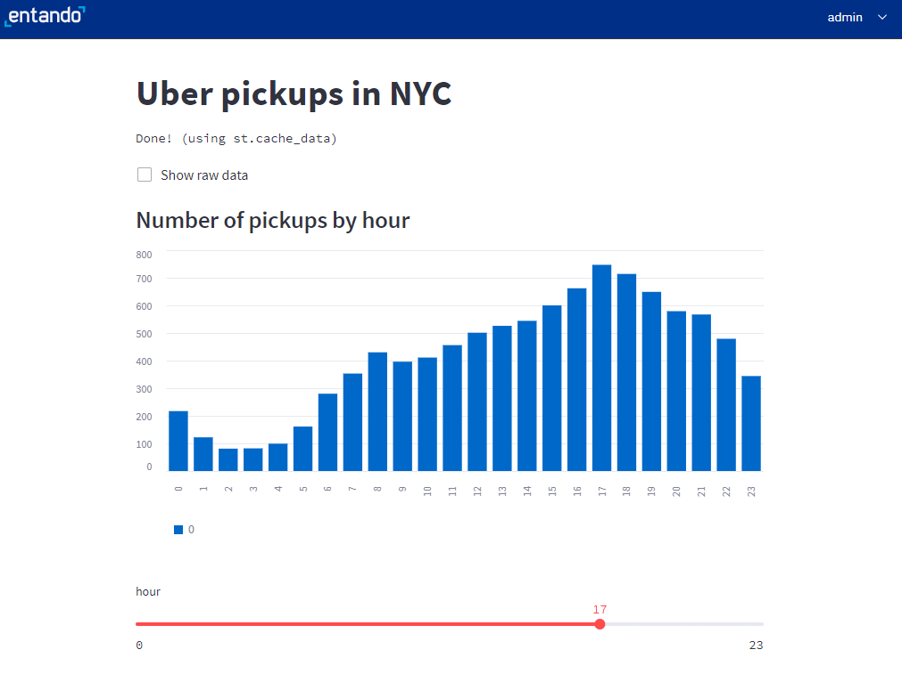

# Overview
[Streamlit](https://streamlit.io) is an open-source Python library which is very popular in the data science and machine learning community. It is useful for quickly creating and sharing beautiful data-driven web apps. There are excellent hosting options for public Streamlit apps, but in enterprise environments, there is a need for sharing such apps in a more controlled way. Entando provides a Kubernetes and cloud-friendly way to do this.

## Create the Bundle
1. Start by creating a new bundle for the `Streamlit` app:
``` bash
ent bundle init streamlit-example
```

2. Change into the bundle root folder:
``` bash
cd streamlit-example
```

3. Create a location in the bundle for the `Streamlit` app. In an Entando bundle, this means using a microservice to host the app. Use the [Entando CLI](../v7.2/docs/getting-started/entando-cli.md) to add a microservice for the Streamlit app:
``` bash
ent bundle ms add streamlit-ms --stack custom
```

4. Change into the `streamlit-ms` directory:
``` bash
cd microservices/streamlist-ms
```

## Create the Streamlit app
Use the [Streamlit install steps](https://docs.streamlit.io/library/get-started/installation) to prepare the directory for Streamlit development.

1. Add `venv` and activate it. This will keep the Python dependencies separated between projects.
> The activate path may be different depending on your OS.
``` bash
python -m venv .venv
source .venv/Scripts/activate
```

2. Use `pip` to install `streamlit`:
``` bash
pip install streamlit
```

3. Test `streamlit` to make sure it's working. Use CTRL+C to close the hello app. 
``` bash
streamlit hello
```

4. Follow the `Streamlit` tutorial to [create a simple Uber visualization app](https://docs.streamlit.io/library/get-started/create-an-app). 
> Use a completely different application if you prefer, but the following steps assume the application is found in `streamlit_app.py`.
``` python
import streamlit as st
import pandas as pd
import numpy as np

st.title('Uber pickups in NYC')

DATE_COLUMN = 'date/time'
DATA_URL = ('https://s3-us-west-2.amazonaws.com/'
            'streamlit-demo-data/uber-raw-data-sep14.csv.gz')

@st.cache_data
def load_data(nrows):
    data = pd.read_csv(DATA_URL, nrows=nrows)
    lowercase = lambda x: str(x).lower()
    data.rename(lowercase, axis='columns', inplace=True)
    data[DATE_COLUMN] = pd.to_datetime(data[DATE_COLUMN])
    return data

data_load_state = st.text('Loading data...')
data = load_data(10000)
data_load_state.text("Done! (using st.cache_data)")

if st.checkbox('Show raw data'):
    st.subheader('Raw data')
    st.write(data)

st.subheader('Number of pickups by hour')
hist_values = np.histogram(data[DATE_COLUMN].dt.hour, bins=24, range=(0,24))[0]
st.bar_chart(hist_values)

# Some number in the range 0-23
hour_to_filter = st.slider('hour', 0, 23, 17)
filtered_data = data[data[DATE_COLUMN].dt.hour == hour_to_filter]

st.subheader('Map of all pickups at %s:00' % hour_to_filter)
st.map(filtered_data)
```

5. Start the application and confirm it's working as expected:
``` bash
streamlit run streamlit_app.py
```

## Prepare the Entando Bundle
A few items need to be tweaked to run the Streamlit app in Kubernetes with Entando. Here we're following the [Streamlit Kubernetes guide](https://docs.streamlit.io/knowledge-base/tutorials/deploy/kubernetes) with a few tweaks specific to Entando.

1. Use pip to create a `requirements.txt` to help when creating the Docker image:
``` bash
pip freeze > requirements.txt
```

2. Create the `Dockerfile` for the service. This is based on the `Streamlit` example and modified to run on port 8081 under the Entando-provided `SERVER_SERVLET_CONTEXT_PATH`.
``` bash
FROM python:3.8-slim

RUN groupadd --gid 1000 appuser \
    && useradd --uid 1000 --gid 1000 -ms /bin/bash appuser

RUN pip3 install --no-cache-dir --upgrade \
    pip \ 
    virtualenv

RUN apt-get update && apt-get install -y \
    build-essential \
    software-properties-common \
    git

USER appuser
WORKDIR /home/appuser

COPY . app/

ENV VIRTUAL_ENV=/home/appuser/venv
RUN virtualenv ${VIRTUAL_ENV}
RUN . ${VIRTUAL_ENV}/bin/activate && pip install -r app/requirements.txt

# Entando settings
## Required port for microservices
EXPOSE 8081
## Context path is provided by the engine based on the bundle id
ENV SERVER_SERVLET_CONTEXT_PATH=/default

COPY run.sh /home/appuser
ENTRYPOINT ["./run.sh"]
```

3. Setup an entrypoint script `run.sh`. This script is to used to start Streamlit and also includes some minor adjustments for Entando.
``` bash
#!/bin/bash

APP_PID=
stopRunningProcess() {
    # Based on https://linuxconfig.org/how-to-propagate-a-signal-to-child-processes-from-a-bash-script
    if test ! "${APP_PID}" = '' && ps -p ${APP_PID} > /dev/null ; then
       > /proc/1/fd/1 echo "Stopping ${COMMAND_PATH} which is running with process ID ${APP_PID}"

       kill -TERM ${APP_PID}
       > /proc/1/fd/1 echo "Waiting for ${COMMAND_PATH} to process SIGTERM signal"

        wait ${APP_PID}
        > /proc/1/fd/1 echo "All processes have stopped running"
    else
        > /proc/1/fd/1 echo "${COMMAND_PATH} was not started when the signal was sent or it has already been stopped"
    fi
}

trap stopRunningProcess EXIT TERM

source ${VIRTUAL_ENV}/bin/activate

BASEURLPATH=
if [ -z "$SERVER_SERVLET_CONTEXT_PATH" ]
then 
   echo "Context path not set"
else  
   BASEURLPATH=" --server.baseUrlPath=$SERVER_SERVLET_CONTEXT_PATH"
fi
echo "BASEURLPATH: $BASEURLPATH"

streamlit run ${HOME}/app/streamlit_app.py --server.port=8081 --logger.level=debug --browser.gatherUsageStats=False $BASEURLPATH & APP_ID=${!}

wait ${APP_ID}
```

4. Add a `.dockerignore` file with one line, so the .venv files are not included in the eventual Docker image. 
> Add a similar line to your top-level `.gitignore` to avoid committing those files
```
.venv
```

5. Update the health check and custom commands in the `entando.json`:
``` json
"healthCheckPath": "/_stcore/health",
"commands": {
    "build": "echo 'no build required'",
    "run": "streamlit run streamlit_app.py",
    "pack": "docker build -t streamlit-ms ."
}
```

6. Change back to the bundle root directory and check that the run command works:
``` bash
ent bundle run streamlit-ms
```

## Deploy the Bundle to Entando
You should now be able to [build, deploy, and install the bundle](../v7.2/tutorials/create/pb/publish-project-bundle.md) using the standard steps.

<EntandoInstallBundle/>

::: warning
### *Warning* Workaround Territory
In Entando 7.2.2, the Streamlit service will start successfully but the health check built into the Component Manager will NOT recognize that it's healthy since Streamlit returns an HTML rather than a JSON response. Streamlit does not provide an option to customize the health check or provide a custom JSON endpoint, so short of using a reverse proxy, two manual steps are required after the bundle is installed. A fix for this is planned in a future release of Entando.

> The bundle IDs in the following steps will vary if you cloned the project source.

1. When the health check fails, Entando will rollback the install but it will only shutdown the Streamlit pod. Restart the Streamlit pod:
``` bash
kubectl scale deploy pn-3d37ebd9-2d0e3ade-nathanshaw-streamlit-ms-deployment --replicas=1
```

2. Entando will also remove the ingress path for the `streamlit-ms` service. Add this manually into the Entando default ingress.
``` yaml
- backend:
          service:
            name: pn-3d37ebd9-2d0e3ade-nathanshaw-streamlit-ms-service
            port:
              number: 8081
        path: /streamlit-example-3d37ebd9/streamlit-ms
        pathType: Prefix
```  

3. Verify the service is working by accessing YOUR-HOST/SERVER_SERVLET_CONTEXT_PATH. The default path should show the Streamlit application. 

4. Adding `/_stcore/health` to the URL should show `ok` from the Streamlit health check.
:::

## Create a Streamlit widget
Now that the service is working, you can create a simple Entando widget to display the Streamlit app embedded on a page. See the [Simple Widget Tutorial](../v7.2/tutorials/compose/widgets-fragments.md/) for the basic steps and the [Streamlit Embed documentation](
https://docs.streamlit.io/streamlit-community-cloud/share-your-app/embed-your-app) for options to customize the embedded display.

1. Go to `Components` → `Widgets` to create a simple widget. Make sure to update the path to match your service.
``` html
<iframe
  src="/streamlit-example-3d37ebd9/streamlit-ms?embed=true"
  height="800"
  style="width:100%;border:none;"
></iframe>
```

2. Create a page and place the widget on that page:


## Reference
* The [source code for this example](https://github.com/nshaw/202308-streamlit-example) can be found in GitHub.

