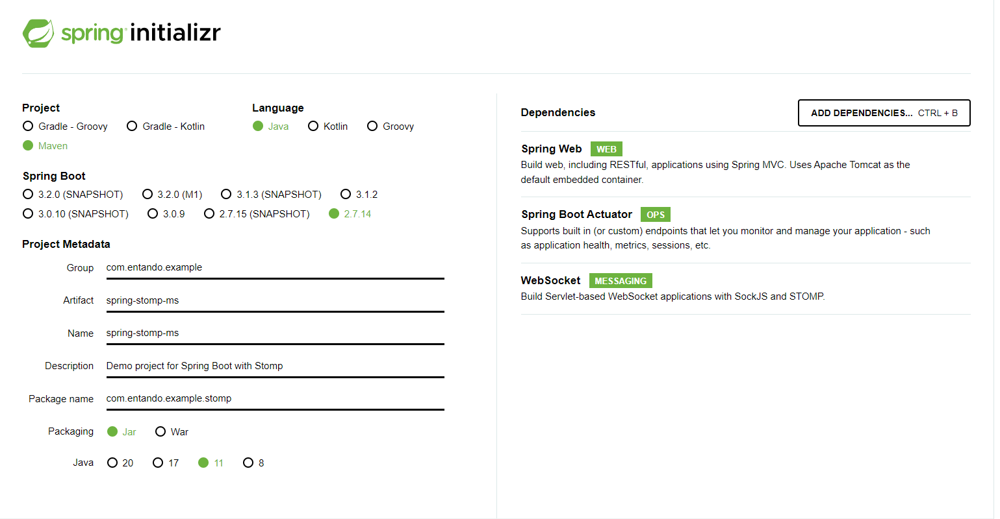
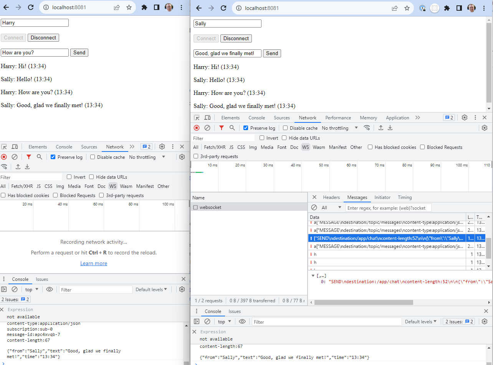

I recently had an Entando user ask about [WebSocket](https://en.wikipedia.org/wiki/WebSocket) support in the Platform. WebSockets can be very useful for real time system updates, especially those involving one-to-many communications with many recipients.

My stock answer to this kind of question is that it's a development detail and *should* work, but it's up to each team to implement and support it fully. WebSockets run on TCP so it's a safe answer but I was curious if there would be any issue when using WebSockets in an Entando-managed microservice. Short story, there isn't - but I figured I'd jot down some notes on the implementation. In this case I worked up a quick STOMP example so you'll see that reflected in the naming below.
> *Note:* This post is more of an outline of the procedure, not a step-by-step tutorial, but the source code is linked at the bottom.

## Setup the Entando Bundle
1. Start by setting up an Entando bundle with a microservice stubbed out:
``` bash
ent bundle init stomp-example
cd stomp-example
ent bundle ms add spring-stomp-ms
```

2. Next I used the [Spring initializr](https://start.spring.io/) to create the microservice with Maven, Spring Boot 2.7.14, and Java 11. This is similar to the steps in our basic [Spring Boot tutorial](../v7.2/tutorials/create/ms/spring-boot-ms.md) with the addition of the WebSocket dependency.

```
	Project=Maven
	Language=Java
	Spring Boot version=2.7.14
	Group=com.entando.example
	Artifact=spring-stomp-ms 
	Name=spring-ms 
	Description=Demo project for Spring Boot with Stomp
	Package name=com.entando.example.stomp
	Packaging=Jar
	Java=11
	Dependencies:
	  #under WEB: Spring Web 
	  #under OPS: Spring Boot Actuator
      #under MESSAGING: WebSocket
```


3. Generate the service and unzip the output into the `microservices/spring-stomp-ms` directory.

## Implement the STOMP service
Next we need to implement the service endpoints. Here I used Baeldung's [Intro to WebSockets with Spring](https://www.baeldung.com/websockets-spring) tutorial for guidance, so refer to this page for additional details.

1. Add dependencies to the `pom.xml`:
``` xml
		<dependency>
    		<groupId>org.springframework</groupId>
    		<artifactId>spring-websocket</artifactId>
		</dependency>

		<dependency>
    		<groupId>org.springframework</groupId>
    		<artifactId>spring-messaging</artifactId>
		</dependency>

		<dependency>
			<groupId>com.fasterxml.jackson.core</groupId>
    		<artifactId>jackson-core</artifactId>
		</dependency>

		<dependency>
    		<groupId>com.fasterxml.jackson.core</groupId>
    		<artifactId>jackson-databind</artifactId> 
		</dependency>
```

2. Create `configuration/WebSocketConfig.java` to enable the broker and endpoints. In this case I've also added a CORS config (the setAllowedOrigins call) for test purposes, but this should be disabled in a production deployment, typically using appropriate application profiles. 
``` java
@Configuration
@EnableWebSocketMessageBroker
public class WebSocketConfig implements WebSocketMessageBrokerConfigurer {

    @Override
    public void configureMessageBroker(MessageBrokerRegistry config) {
        config.enableSimpleBroker("/topic");
        config.setApplicationDestinationPrefixes("/app");
    }

    @Override
    public void registerStompEndpoints(StompEndpointRegistry registry) {
         registry.addEndpoint("/chat")
                //NOTE: this is not recommended for production use and should be replaced by dev/prod profiles
                .setAllowedOrigins("http://localhost:8081")
                .withSockJS();
    }
}
```

3. Create `entity/Message.java` and `entity/OutputMessage.java` for the incoming and outgoing messages, respectively:
``` java
public class Message {

    private String from;
    private String text;

    public String getText() {
        return text;
    }

    public String getFrom() {
        return from;
    }
}
```

``` java
package com.entando.example.stomp.entity;

public class OutputMessage {

    private String from;
    private String text;
    private String time;

    public OutputMessage(final String from, final String text, final String time) {

        this.from = from;
        this.text = text;
        this.time = time;
    }

    public String getText() {
        return text;
    }

    public String getTime() {
        return time;
    }

    public String getFrom() {
        return from;
    }
}
```

4. Add `controller/ChatController.java` to map the chat messages to the message broker: 
``` java
@Controller
public class ChatController {

    @MessageMapping("/chat")
    @SendTo("/topic/messages")
    public OutputMessage send(final Message message) throws Exception {

        final String time = new SimpleDateFormat("HH:mm").format(new Date());
        return new OutputMessage(message.getFrom(), message.getText(), time);
    }
}
```

5. Add the following two lines to `src/main/java/resources/application.properties` so the service will: 1) run on the conventional Entando port, and 2) use the standard healthcheck path.
```
server.port=8081
management.endpoints.web.base-path=/api
```

6. From the bundle directory, start the service:
``` bash
ent bundle run spring-stomp-ms
```

7. Confirm the service is working as expected with two basic checks:
* Access `http://localhost:8081/chat` which should show the text `Welcome to SockJS!`
* Access `http://localhost:8081/api/health` which should respond with `{"status":"UP"}`.

## Add an HTML page to test the service
Here I followed the Baeldung tutorial and created a simple HTML page for testing the basic STOMP chat client.
> *Note:* In a real implementation, the sockjs library can be included in a micro frontend (e.g., React, Angular, etc.), or an existing STOMP component can be reused (e.g., [react-stomp](https://www.npmjs.com/package/react-stomp)), but that is left as an exercise for the reader.

1. Create `main/webapp/index.html`:
``` html
<html>
    <head>
        <title>Chat WebSocket</title>
        <script src="https://cdn.jsdelivr.net/npm/sockjs-client@1/dist/sockjs.min.js"></script>
        <script src="stomp.js"></script>
        <script type="text/javascript">
            var stompClient = null;
            
            function setConnected(connected) {
                document.getElementById('connect').disabled = connected;
                document.getElementById('disconnect').disabled = !connected;
                document.getElementById('conversationDiv').style.visibility 
                  = connected ? 'visible' : 'hidden';
                document.getElementById('response').innerHTML = '';
            }
            
            function connect() {
                var serverUrl = 'http://localhost:8081/chat';
                var socket = new SockJS(serverUrl);
                stompClient = Stomp.over(socket);  
                stompClient.connect({}, function(frame) {
                    setConnected(true);
                    console.log('Connected: ' + frame);
                    stompClient.subscribe('/topic/messages', function(messageOutput) {
                        showMessageOutput(JSON.parse(messageOutput.body));
                    });
                });
            }
            
            function disconnect() {
                if(stompClient != null) {
                    stompClient.disconnect();
                }
                setConnected(false);
                console.log("Disconnected");
            }
            
            function sendMessage() {
                var from = document.getElementById('from').value;
                var text = document.getElementById('text').value;
                stompClient.send("/app/chat", {}, 
                  JSON.stringify({'from':from, 'text':text}));
            }
            
            function showMessageOutput(messageOutput) {
                var response = document.getElementById('response');
                var p = document.createElement('p');
                p.style.wordWrap = 'break-word';
                p.appendChild(document.createTextNode(messageOutput.from + ": " 
                  + messageOutput.text + " (" + messageOutput.time + ")"));
                response.appendChild(p);
            }
        </script>
    </head>
    <body onload="disconnect()">
        <div>
            <div>
                <input type="text" id="from" placeholder="Choose a nickname"/>
            </div>
            <br />
            <div>
                <button id="connect" onclick="connect();">Connect</button>
                <button id="disconnect" disabled="disabled" onclick="disconnect();">
                    Disconnect
                </button>
            </div>
            <br />
            <div id="conversationDiv">
                <input type="text" id="text" placeholder="Write a message..."/>
                <button id="sendMessage" onclick="sendMessage();">Send</button>
                <p id="response"></p>
            </div>
        </div>

    </body>
</html>
```

2. Go to `http://localhost:8081` to see a basic chat interface with options to connect to the service and send messages.

3. Open two (or more) browser windows and observe the publish/subscribe behavior in action. 
> The browser console can be used to see the different STOMP messages due to console logging included in `stomp.js`. In Chrome, the network traffic can be observed by filtering on WS, selecting the WebSocket resource, and viewing the Messages pane for that socket.



## Deploy the bundle to Entando
You should now be able to [build, deploy, and install the bundle](../v7.2/tutorials/create/pb/publish-project-bundle.md) using the standard steps.

<EntandoInstallBundle/>

## Test the live service
1. Once the bundle is deployed, examine the ingress paths and check that the service is working correctly. The ingress path looks something like this:
```
http://YOUR-HOST/stomp-example-f9335a57/spring-stomp-ms/chat
```

2. Copy the `webapp/index.html` to a new file (e.g., `prod.html`) and update the serverUrl to point to your endpoint:
``` javascript
var serverUrl = 'https://YOUR-HOST/stomp-example-f9335a57/spring-stomp-ms/chat';
```

3. Access the new file at `http://localhost:8081/prod.html` and confirm the chat service is working.
> *Note:* A CORS error will break the page if you did not include the WebConfig rule to allow access from `localhost:8081`.

> *Note#2:* This step requires having the local service running to serve the HTML file but any web server will do, e.g., `serve -l 8081 microservices/spring-stomp-ms/src/main/webapp/` 

## Observations
Implementing a basic chat client using Spring Boot 2, WebSockets, and Entando 7.2 was straightforward and fairly self-explanatory. Please feel free to [join the community](https://join.slack.com/t/entandocommunity/shared_invite/zt-g609owdv-2K~YRh8zrI6lqlWo4aFWUw) and ask questions if your experience is different!


## Reference
* [Source code](https://github.com/nshaw/202308-spring-stomp-example)
* [Intro to WebSockets with Spring](https://www.baeldung.com/websockets-spring)
* [What's the difference between STOMP and WebSockets](https://stackoverflow.com/questions/40988030/what-is-the-difference-between-websocket-and-stomp-protocols)