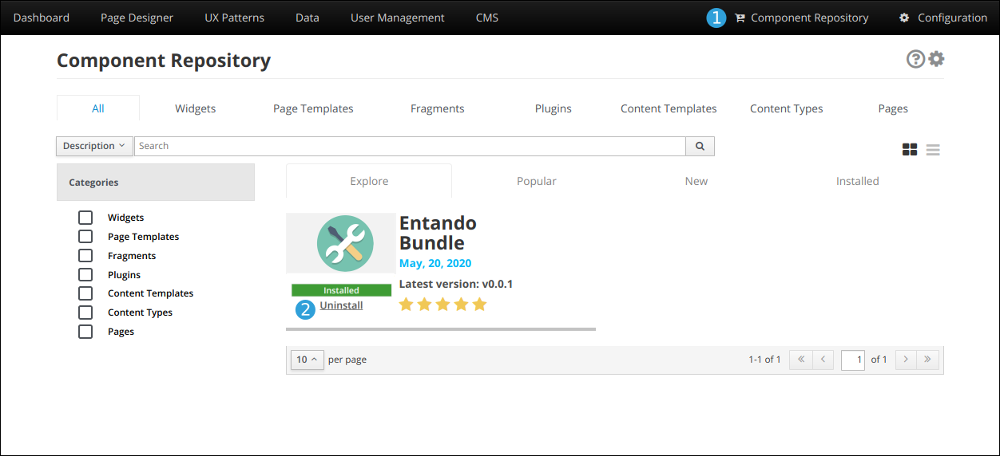

# Bundle uninstall

## Uninstall process
To uninstall a bundle that was previously installed on an Entando App Engine, from Entando App builder UI go to the **Component Repository** tab and select the bundle you want to uninstall

A first check is made to verify none of the bundle components are in use. If any of the components preventing the successful removal of the bundle is used on the system, a popup is going to alert you. Note that you can't force the removal a bundle if it's component are in use.

Once the removal process start

- Bundle resources are going to be deleted from the Entando App Engine
- Components part of the bundle are removed from the Entando App Engine
- Plugins are unlinked

## Troubleshooting
If any error happens during the uninstall process and you don't know what to do, check out the [Troubleshooting guide](./ecr-troubleshooting-guide.md) for informations and hint on how to fix your problem or checkout the [Entando's forum](https://forum.entando.com)

