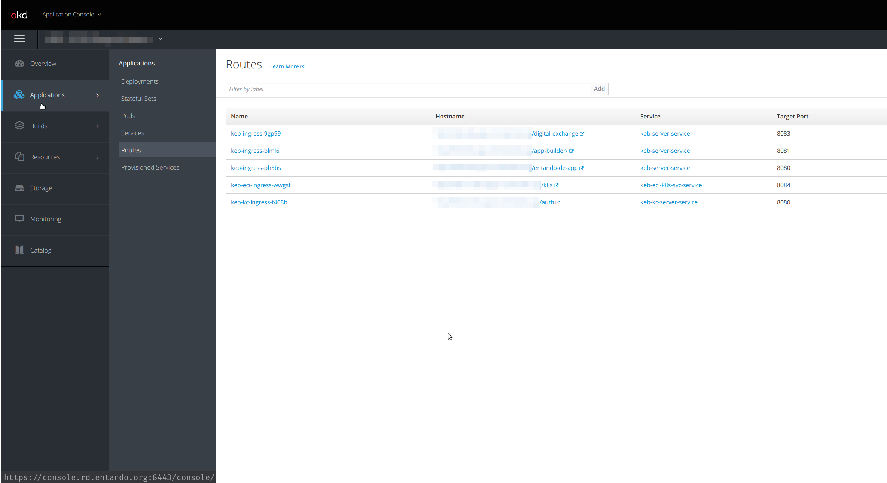

# Ingress

## What is an ingress 

An Ingress is a Kuberntes resource which purpose is to expose HTTP and HTTPS routes from outside the cluster to services within the cluster. Traffic routing is controlled by rules defined on the Ingress resource.

## How ingresses are used in an Entando Cluster

When deploying an Entando Cluster, ingresses are generated for the resources that requires to be exposed to the outside world. The process of creating an ingress, setup the correct routes and the certificates is done by the via the Entando Operator and the entando custom resource controllers.

### Keycloak ingress
An dedicated ingress is created for keycloak to expose the authentication and authorization functionalities. Having a dedicated ingress is required to guarantee that both token issuing and token validation work correctly, even when the services using the keycloak instance are on different namespaces.

### Cluster infrastructure ingress
Another ingress is created for the cluster infrastructure services in order to expose the api endpoint to interact with the cluster correctly

### Entando App ingress
Another ingress is automatically created to expose App builder, App engine and the Entando component manager, a service part of the ECR. 
The three containers are served under the same domain, and this is beneficial as they are able to interact without cross-origin issues.

The Entando App ingress is also used when linking an Entando Plugin with and Entando App, operation that usually happens when a bundle containing an Entando Plugin is installed via the ECR in an Entando App. Check out the dedicated section for details.

###  Entando Plugin ingress
Also Entando Plugins are automatically exposed via an ingress when deployed in an Entando Cluster. 

## Default Ingress HTTP Routes

In this table you can see what are the default routes that are exposed for each ingress
<table>
<colgroup>
<col width="50%" />
<col width="50%" />
</colgroup>
<thead>
<tr class="header">
<th align="left">Ingress</th>
<th align="left">Ingress Http route</th>
<th align="left">Application</th>
</tr>
</thead>
<tbody>
<tr class="odd">
<td align="left"><p>Keycloak ingress</p></td>
<td align="left"><p><code>/auth</code></p></td>
<td align="left"><p>Keycloak</p></td>
</tr>
<tr class="even">
<td align="left"><p>Entando cluster infrastructure ingress</p></td>
<td align="left"><p><code>/k8s</code></p></td>
<td align="left"><p>Entando K8S service</p></td>
</tr>
<tr class="odd">
<td align="left" rowspan="4"><p>Entando App ingress</p></td>
<td align="left"><p><code>/entando-de-app</code></p></td>
<td align="left"><p>App engine</p></td>
</tr>
<tr class="even">
<td align="left"><p><code>/app-builder/</code></p></td>
<td align="left"><p>App builder</p></td>
</tr>
<tr class="odd">
<td align="left"><p><code>/digital-exchange</code></p></td>
<td align="left"><p>Entando component manager</p></td>
</tr>
<tr class="even">
<td align="left"><p><code>/&lt;plugin-ingressPath&gt;</code></p></td>
<td align="left"><p>Entando plugin linked to the app</p></td>
</tr>
<tr class="odd">
<td align="left"><p>Entando plugin ingress</p></td>
<td align="left"><p><code>/&lt;plugin-ingressPath&gt;</code></p></td>
<td align="left"><p>Entando plugin</p></td>
</tr>
</tbody>
</table>

**Note**: The Entando plugin `ingressPath` variable is defined in the Entando Plugin custom resource under the `spec` element. The plugin ingress path is also used to expose the plugin under the Entando App domain

## Exposing plugins in the EntandoApp domain
The process of exposing an Entando Plugin under the same domain (ingress) of the Entando App is made possible from the creation of an `EntandoAppPluginLink` custom resource and the corresponding controller.

Once the link between the Entando App and the Entando Plugin is created, the controller reads the specification of such link and automatically creates the HTTP routes in the Entando App so that the plugin is exposed on the same domain as the App builder, App engine and Component manager.

This allows the Microfrontend developers that need to access the plugin to not worry about CORS policy or knowing what is the full path where the plugin is exposed. The plugin is referencable using relative urls.

## How to check ingresses in my cluster

### Using the Openshift dashboard

On the Openshift dashboard, Ingresses are not exposed directly as pods and deployments. The dashbaord provides direct access to the Ingress Routes (or simply routes) under the `Applications > Routes` menu. 



To see the ingress resources, you need to access them from the `Resources > Other resources` menu. From the dropdown you should select the `Ingress` resource and therefore you should be able to see the ingress available on that specific project/namespace


### Using kubectl from the command line

From the command line, getting the ingress is very easy. Once you know the namespace(s) where your Entando Cluster is deployed, you simply need to use the 

```
kubect get ingresses.extensions -n <namespace>
```

Here an example of the result in a test namespace
```
> kubectl get ingresses.extensions -n local

NAME               CLASS    HOSTS                               ADDRESS     PORTS   AGE
qst-eci-ingress   <none>   qst-eci-local.192.168.1.9.nip.io   127.0.0.1   80      2d1h
qst-ingress       <none>   qst-local.192.168.1.9.nip.io       127.0.0.1   80      2d1h
qst-kc-ingress    <none>   qst-kc-local.192.168.1.9.nip.io    127.0.0.1   80      2d1h
```

To get more details about a specific ingress, you can use the `get` command specifing the ingress name you want to check and the `yaml` output format

```
> kubectl get ingresses.extensions -n local qst-ingress -o yaml

apiVersion: extensions/v1beta1
kind: Ingress
metadata:
  creationTimestamp: "2020-05-13T15:27:08Z"
  generation: 1
  labels:
    EntandoApp: qst
  managedFields:
  - apiVersion: extensions/v1beta1
    fieldsType: FieldsV1
    fieldsV1:
      f:status:
        f:loadBalancer:
          f:ingress: {}
    manager: nginx-ingress-controller
    operation: Update
    time: "2020-05-13T15:27:08Z"
  name: qst-ingress
  namespace: local
  ownerReferences:
  - apiVersion: entando.org/v1
    blockOwnerDeletion: true
    controller: true
    kind: EntandoApp
    name: qst
    uid: aa7053e1-fd8b-419f-bdee-df3018c013fa
  resourceVersion: "16802097"
  selfLink: /apis/extensions/v1beta1/namespaces/local/ingresses/qst-ingress
  uid: e9b6f027-369a-4b84-b4b1-736a6e49f180
spec:
  rules:
  - host: qst-local.192.168.1.9.nip.io
    http:
      paths:
      - backend:
          serviceName: qst-server-service
          servicePort: 8080
        path: /entando-de-app
        pathType: ImplementationSpecific
      - backend:
          serviceName: qst-server-service
          servicePort: 8083
        path: /digital-exchange
        pathType: ImplementationSpecific
      - backend:
          serviceName: qst-server-service
          servicePort: 8081
        path: /app-builder/
        pathType: ImplementationSpecific
status:
  loadBalancer:
    ingress:
    - ip: 127.0.0.1
```

## Learn more

For more details about ingress concept in Kubernetes please refer to the official documentation:
- [Kubernetes Ingress documentation](https://kubernetes.io/docs/concepts/services-networking/ingress/)
- [Openshift Routes documentation](https://docs.openshift.com/container-platform/3.11/architecture/networking/routes.html)