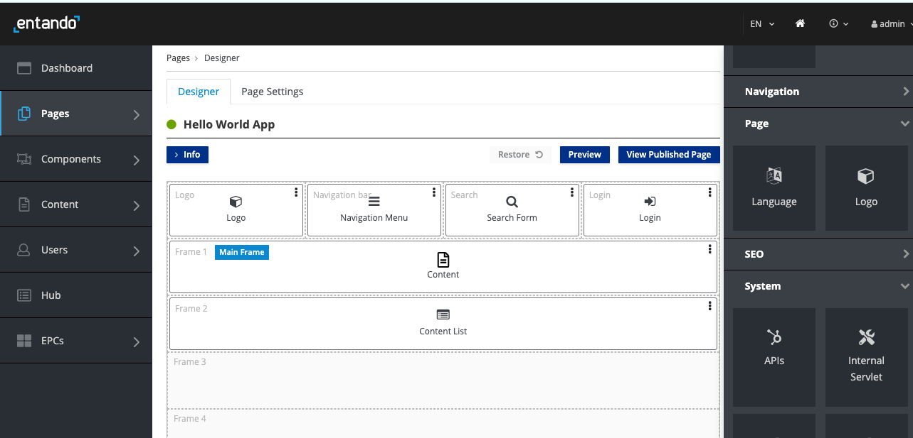

# Entando App Builder

The Entando App Builder plays a key role in the composition of Entando Applications. It is a feature-rich, low-code user interface to customize and manage components. It also offers a Dashboard and a modular CMS to streamline the design and build process. 

The App Builder allows you to create pages and content, configure widgets and plugins, and interact with the [Local Hub](local-hub-overview.md). It also interfaces with the [Entando Cloud Hub](https://hub.entando.com), where you can share components and collaborate. 

Pages are designed and embedded with functionality via drag-and-drop:

In the default deployment, the App Builder is a React JS application served by Node. In a quickstart environment, the App Builder is deployed as a container. It is the frontend of the core application and uses REST APIs to communicate with the core instance and [Entando Component Manager (ECM)](ecm-overview.md). The App Builder can query the ECM to fetch information on Entando Bundles available to the ECR.

### Key Features:

* Install component bundles from the Local Hub

* Deploy standalone packaged business capabilities

* Preview page design and functionality

* Append or update applications

* Deliver standardized UX design with page and content templates 

* Use micro frontends to build pages from modular, editable content

### Next Steps:

* To begin, [install Entando](../getting-started/README.md#automatic-install)

* [Welcome Wizard](./welcome-wizard.md)

* [Create a new page](../../tutorials/compose/page-management.md)

* Try out components or packaged business capabilities from the [Entando Hub](https://hub.entando.com)
