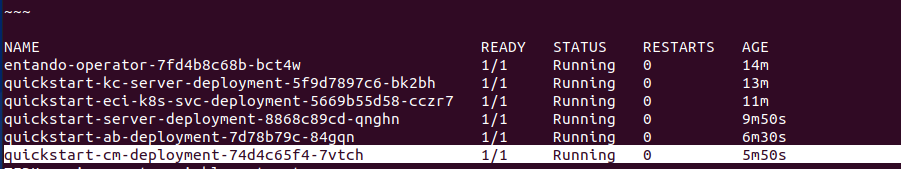
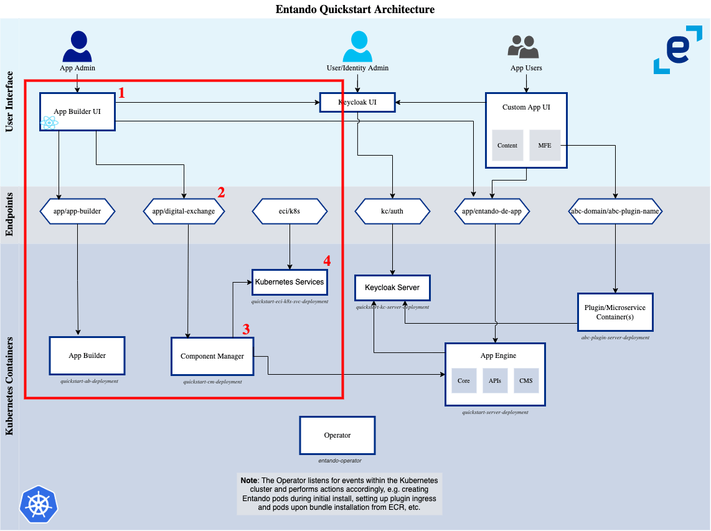

# Entando Component Manager

​​An Entando Application is composed of the [Entando App Builder](app-builder.md), [Entando App Engine](../getting-started/concepts-overview.md#entando-app-engine), and Entando Component Manager. The Entando Component Manager (ECM) provides functionality to build and organize micro frontends and widgets from within the App Builder. It also manages the connections between an application and the installed plugins.

The Component Manager is a service that links the [Local Hub](local-hub-overview.md) of the App Builder to the core application instance. It appears as `quickstart-cm-deployment` in the Kubernetes pod list:

 

The ECM communicates with the Kubernetes service to populate the Local Hub with the bundles available as [Custom Resources](../reference/custom-resources.md) in the Entando namespace. These bundles can be installed in the application and managed from within the Local Hub.

In the flow pictured above:
1. A user visits the Hub page in the App Builder
2. The Hub makes a REST call to the `digital-exchange` endpoint
3. The Component Manager receives the `digital-exchange` request
4. The Component Manager calls the `k8s-service` to return the list of available `EntandoDeBundles` in the namespace

A similar process occurs when bundles are installed or uninstalled. The [Entando Operator](../consume/operator-intro.md) performs actions based on lifecycle events for affected Entando Custom Resources.

### Key Features:

* Manages the installation and removal of bundles

* Makes bundles available in the App Builder through the Local Hub

* Offers the option to install only those bundles for development, production or both using Docker tags: 
    * The environment variable `ENTANDO_BUNDLE_TAGS_TYPES` in the Entando Component Manager can be used to select for development (`dev`), production (`prod`), or both (`prod,dev`) type of bundles to be installed to the Local Hub. The default is to install bundles with production tags only.  
    
    * For individual bundles, generate the bundle custom resource, with the Entando CLI specifying the desired tag type(s), to be installed to the Local Hub. For more details see the [Bundle Management page](../getting-started/ent-bundle.md#generate-cr)

* To see a full list of Entando Component Manager environment variables, see this [README](https://github.com/entando-k8s/entando-component-manager#readme).