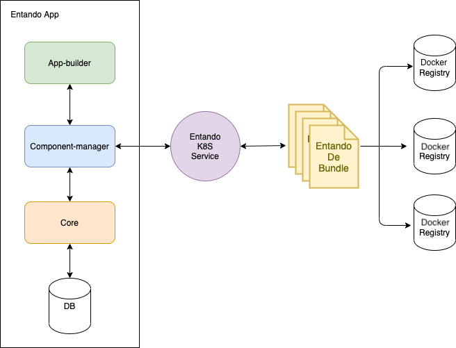

# Entando Component Repository

## Introduction

The Entando Component Repository (ECR) is a repository where 
reusable components can be shared across applications and enterprises.

The following examines some of the nuts and bolts of the ECR.

### Component

An Entando component - simply referred to as component - is an identifiable resource or block of
code that can be used in an Entando widget, page or
application. Examples of components are widgets, micro frontends,
content types, labels, plugins, and static resources.

### ECR Bundle

An ECR bundle is a package containing one or more components and a
descriptor.yaml file providing information about the bundle. The
bundle is published in a Git registry and shared with an Entando
Application using the EntandoDeBundle custom resource.

### EntandoDeBundle Custom Resource

The EntandoDeBundle custom resource is a Kubernetes resource
readable by the Entando Operator. It provides information
about an ECR bundle and makes the bundle available in Kubernetes for the
Entando Component Manager.

### Entando Component Manager (ECM)

The Entando Component Manager is part of the
EntandoApp and communicates with both the `entando-core` and Kubernetes cluster via the `entando-k8s-service`. The ECM reads the bundles from the cluster and exposes them with an API accessible from the App Builder. It is
also responsible for the installation and removal of components from the `entando-core`. 

### Entando-K8s-Service

The `entando-k8S-service` is part of the platform infrastructure and is
responsible for the low-level communication with the K8s cluster API.

## Architecture

From an architectural point of view, the ECR is composed of: 
1. The `EntandoDeBundles` which contain the metadata associated with a bundle
2. The `entando-k8s-service` which reads the bundles from the
cluster/namspace(s) and serves them via a consumable API 
3. The ECM which creates the connection between the EntandoApp
and the K8s service.

### Example Flow

1.  From the Repository page in the App Builder, the user finds the
    list of bundles shared in that EntandoApp

2.  App Builder requests a list of available bundles from the ECM 

3.  ECM queries the K8s service to retrieve a list of
    bundles

4.  The `entando-k8s-service` queries the cluster/namespace(s) 
    for available bundles and returns the list to the ECM

5.  ECM sends the list to App Builder

6.  The user is able to see and install the available bundles
