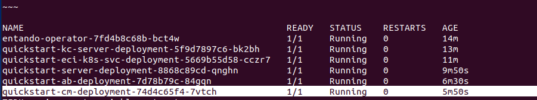

# Entando Component Manager

​​One of the key features of the Entando Platform is the Entando Component Manager (ECM). It provides access to all components, the building blocks needed to assemble applications such as static resources, micro frontends, bundles, and PBCs, organizing them in the App Builder. The ECM also manages the connections between an application and the installed microservices.

The Component Manager is a service that links the [Local Hub](local-hub-overview.md) within the App Builder to the core application instance. It appears as `quickstart-cm-deployment` in the Kubernetes pod list:

 

The ECM communicates with the Kubernetes service to populate the Local Hub with the components available as [Custom Resources](../reference/custom-resources.md) in the Entando namespace. These bundles can be installed in any application and updated directly from the App Builder when new versions are released.

In the flow pictured above:
1. A user visits the Local Hub page in the App Builder
2. The Hub makes a REST call to the `digital-exchange` endpoint
3. The Component Manager receives the `digital-exchange` request
4. The Component Manager calls the `k8s-service` to return the list of available `EntandoDeBundles` in the namespace

A similar process occurs when bundles are installed or uninstalled. The [Entando Operator](../consume/operator-intro.md) performs actions based on lifecycle events for the pertinent Entando Custom Resources.

### Key Features:

* Manages the installation and removal of bundles and PBCs

* Makes bundles available in the App Builder through the Local Hub and any other Entando Hub such as a private enterprise Hub or the Entando PBCs Marketplace.

* Offers the option to install only specified bundles for development, production or both using Docker tags: 
    * The environment variable `ENTANDO_BUNDLE_TAGS_TYPES` in the Entando Component Manager can be used to select for development (`dev`), production (`prod`), or both (`prod,dev`) types of bundles to be installed to the Local Hub. The default installs bundles with the production tags only.  
    
    * For individual bundles, generate the bundle custom resource with the Entando CLI specifying the desired tag type(s) to be installed to the Local Hub. For more details, see the [Bundle Management page](../getting-started/ent-bundle.md#generate-cr).

* To see a full list of Entando Component Manager environment variables, see this [README](https://github.com/entando-k8s/entando-component-manager#readme).