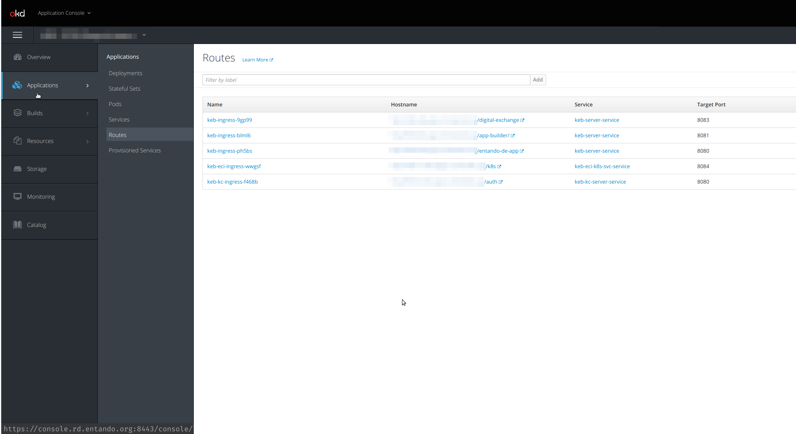
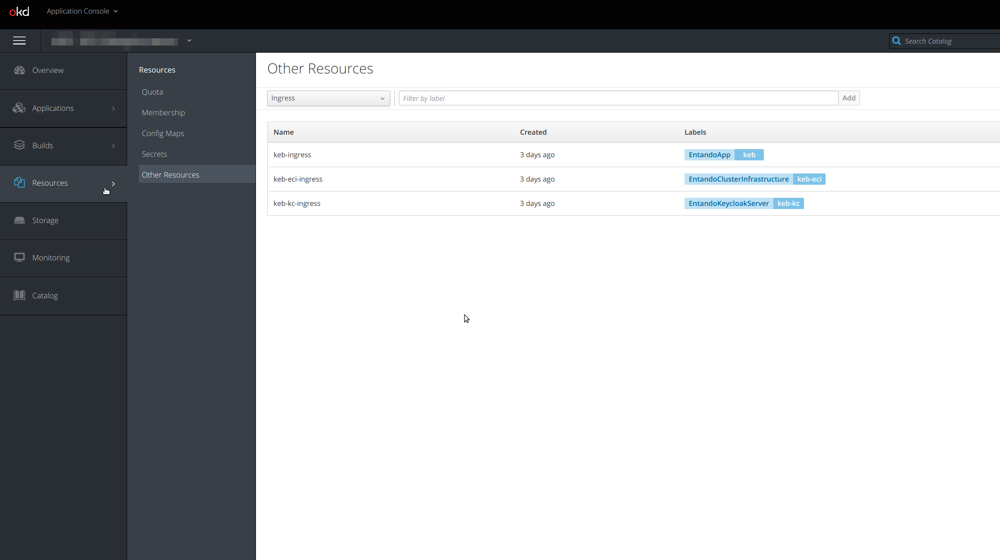

# Overview
A portal, website, web app, or mobile app built with Entando is called an Entando application. 
An Entando application is an assembly of out of the box and/or custom built components running on the 
Entando Platform. Components can be widgets, micro frontends, microservices, page templates, 
WCMS content or WCMS content types. 

## Entando App Engine
The Entando App Engine is the heart of the Entando Platform by providing the primary out-of-the-box services for 
developing applications. Key features:
* Expose the APIs the Entando App Builder uses to provide the page and content management interface for your application.
* Handle the work of assembling micro frontends and microservices and combining them on specific pages as defined by the Entando App Builder. 
* Provide the data access layer to persist the page and application design.
* Manage the cluster infrastructure.
  
See also: [APIs tutorial](../reference/entando-apis.md)

## Entando App Builder
The Entando App Builder is the feature-rich management interface used to design and build pages for Entando applications.

See also: [Widget Tutorial](../../tutorials/customize-the-platform/app-builder/hello-world)

## Entando Component Generator
The Entando Component Generator is Entando's implementation of [JHipster](https://www.jhipster.tech/) that allows users to 
quickly and efficiently generate the skeleton of an Entando Component. The Entando Component Generator provides advanced 
data modeling capabilities including object relational mapping and automatic generation of micro frontends and microservices. 
The generated skeleton serves as a starting point to help a development team swiftly meet the needs of the business. 

See also: [Entando JHipster Blueprint](../../tutorials/backend-developers/generate-microservices-and-micro-frontends.md)
    
## Entando Component Repository
The Entando Component Repository (ECR) is used to store and retrieve shareable components so they can be used in multiple 
Entando applications across the enterprise.

See also: [ECR Overview](../../tutorials/ecr/ecr-overview.md)

## Entando Identity Management
Entando Identity Management is the [Keycloak](https://www.keycloak.org/)-based token-based authentication mechanism used by the 
Entando platform. It provides the ability to add Single Sign On capabilities across multiple domains and to connect service 
providers with identity providers.

See also: [Entando Authentication](../../tutorials/micro-frontends/authentication/)

## Entando WCMS
The Entando Web Content Management System (WCMS) is a lightweight content and digital asset management system with support
for headless operation. It allows management of widgets and html fragments so they can be placed within an Entando application.

See also: [Content Types](../../tutorials/cms/content-types-tutorial) or [Content Templates](../../tutorials/cms/content-models-tutorial) 

## Entando Cluster Citizens

The purpose of this guide is to give an overview of the members of an Entando cluster and their role.

### Architecture diagram

Let’s start with a picture of an Entando6 cluster and how the various
members interact with each other.


### Members of the cluster

An Entando 6 cluster is composed of various citizens which interact with
each other. Most of these citizens have a Custom Resource Definition
file associated with them and are deployable on Kubernetes using the
Entando operator and controllers.

#### Entando app

An Entando app is composed of three parts:

1.  **App Builder**: the replacement for the Admin Console and entry
    point to customize and build an Entando application, as well as
    providing a method to interact with the Entando Component
    Repository.

2.  **Entando core**: the backend APIs providing access to Entando
    services.

3.  **Entando component manager**: the service providing the Entando
    Component Repository functionality, e.g. listing the available
    bundles, install/uninstall a bundle, etc. Check the [dedicated
    section](#ecm-section) for more details

The interaction between these three components (and the rest of the
Entando cluster) use the authorization/authentication features provided
by Keycloak.

#### Entando Component Manager

As briefly introduced before, the Entando component manager is able to
list the EntandoDeBundles accessible from the EntandoApp and provide the
install/uninstall services to install a bundle on an Entando App. All of
these services are made possible by the communication with the Entando
Kubernetes service, the only service of the entando ecosystem (other
than the operator itself) able to interact with the cluster and some of
the Entando custom resources.

#### Entando Kubernetes Service

The Entando Kubernetes Service is part of the Entando cluster
infrastructure custom resource, and provides an access point to some of
the custom resources defined by Entando, in particular:

-   Entando applications

-   Entando plugins

-   Entando links

-   Entando Component Repository bundles

Some of the main services provided by the Entando Kubernetes Service
are:

-   Provide a list of the available EntandoDeBundles to the
    component-manager

-   Deploy a plugin during the installation of a bundle or discovery of
    an already available plugin and expose that to an app

-   Create a link between an EntandoApp and an EntandoPlugin to expose
    the plugin’s APIs to the EntandoApp and the micro frontends (MFEs)

#### Entando Component Repository bundles

An EntandoDeBundle - or Component Repository bundle - is a package with
a set of Entando components and resources. The Entando component manager
is able to read these kind of packages and install the components to
extend the functionalities of an EntandoApp. For more details on the
EntandoDeBundle and the Entando Component Repository, check the
[component repository overview](../../tutorials/ecr/ecr-overview.md)
documentation

#### Entando plugin

An Entando plugin is a microservice that exposes APIs reusable by one or
more Entando apps. Usually the plugin services are exposed to the
Entando developer and the end users via micro frontends. Check the
[micro frontends](../../tutorials/micro-frontends/react) tutorials for more details. You can
quickly generate an Entando plugin using the [Entando JHipster Blueprint](../../tutorials/micro-frontends/generate-micro-frontends-from-a-database-entity/). The generated project
will be ready to work in an Entando environment providing the
integration with Keycloak, generating a set of default micro frontends
and exposing the plugin’s logic via an EntandoDeBundle (check the
references for details).

#### Keycloak

Keycloak in Entando 6 is responsible for authorization and
authentication All the members of an Entando 6 cluster interact with
keycloak to verify user/service authorization to perform any specific
task. Check out the references below for more details on keycloak.

## Entando Ingresses

### What is an ingress 

An Ingress is a Kubernetes resource which purpose is to expose HTTP and HTTPS routes from outside the cluster to services within the cluster. Traffic routing is controlled by rules defined on the Ingress resource.

### How ingresses are used in an Entando Cluster

When deploying an Entando Cluster, ingresses are generated for the resources that requires to be exposed to the outside world. The process of creating an ingress, setup the correct routes and the certificates is done by the via the Entando Operator and the entando custom resource controllers.

#### Keycloak ingress
An dedicated ingress is created for keycloak to expose the authentication and authorization functionalities. Having a dedicated ingress is required to guarantee that both token issuing and token validation work correctly, even when the services using the keycloak instance are on different namespaces.

#### Cluster infrastructure ingress
Another ingress is created for the cluster infrastructure services in order to expose the api endpoint to interact with the cluster correctly

#### Entando App ingress
Another ingress is automatically created to expose App builder, App engine and the Entando component manager, a service part of the ECR. 
The three containers are served under the same domain, and this is beneficial as they are able to interact without cross-origin issues.

The Entando App ingress is also used when linking an Entando Plugin with and Entando App, operation that usually happens when a bundle containing an Entando Plugin is installed via the ECR in an Entando App. Check out the dedicated section for details.

####  Entando Plugin ingress
Also Entando Plugins are automatically exposed via an ingress when deployed in an Entando Cluster. 

### Default Ingress HTTP Routes

In this table you can see what are the default routes that are exposed for each ingress
<table>
<colgroup>
<col width="50%" />
<col width="50%" />
</colgroup>
<thead>
<tr class="header">
<th align="left">Ingress</th>
<th align="left">Ingress Http route</th>
<th align="left">Application</th>
</tr>
</thead>
<tbody>
<tr class="odd">
<td align="left"><p>Keycloak ingress</p></td>
<td align="left"><p><code>/auth</code></p></td>
<td align="left"><p>Keycloak</p></td>
</tr>
<tr class="even">
<td align="left"><p>Entando cluster infrastructure ingress</p></td>
<td align="left"><p><code>/k8s</code></p></td>
<td align="left"><p>Entando K8S service</p></td>
</tr>
<tr class="odd">
<td align="left" rowspan="4"><p>Entando App ingress</p></td>
<td align="left"><p><code>/entando-de-app</code></p></td>
<td align="left"><p>App engine</p></td>
</tr>
<tr class="even">
<td align="left"><p><code>/app-builder/</code></p></td>
<td align="left"><p>App builder</p></td>
</tr>
<tr class="odd">
<td align="left"><p><code>/digital-exchange</code></p></td>
<td align="left"><p>Entando component manager</p></td>
</tr>
<tr class="even">
<td align="left"><p><code>/&lt;plugin-ingressPath&gt;</code></p></td>
<td align="left"><p>Entando plugin linked to the app</p></td>
</tr>
<tr class="odd">
<td align="left"><p>Entando plugin ingress</p></td>
<td align="left"><p><code>/&lt;plugin-ingressPath&gt;</code></p></td>
<td align="left"><p>Entando plugin</p></td>
</tr>
</tbody>
</table>

**Note**: The Entando plugin `ingressPath` variable is defined in the Entando Plugin custom resource under the `spec` element. The plugin ingress path is also used to expose the plugin under the Entando App domain

### Exposing plugins in the EntandoApp domain
The process of exposing an Entando Plugin under the same domain (ingress) of the Entando App is made possible from the creation of an `EntandoAppPluginLink` custom resource and the corresponding controller.

Once the link between the Entando App and the Entando Plugin is created, the controller reads the specification of such link and automatically creates the HTTP routes in the Entando App so that the plugin is exposed on the same domain as the App builder, App engine and Component manager.

This allows the Microfrontend developers that need to access the plugin to not worry about CORS policy or knowing what is the full path where the plugin is exposed. The plugin is referencable using relative urls.

### How to check ingresses in my cluster

#### Using the Openshift dashboard

On the Openshift dashboard, Ingresses are not exposed directly as pods and deployments. The dashbaord provides direct access to the Ingress Routes (or simply routes) under the `Applications > Routes` menu. 



To see the ingress resources, you need to access them from the `Resources > Other resources` menu. From the dropdown you should select the `Ingress` resource and therefore you should be able to see the ingress available on that specific project/namespace




#### Using kubectl from the command line

From the command line, getting the ingress is very easy. Once you know the namespace(s) where your Entando Cluster is deployed, you simply need to use the 

```
kubect get ingresses.extensions -n <namespace>
```

Here an example of the result in a test namespace
```
> kubectl get ingresses.extensions -n local

NAME               CLASS    HOSTS                               ADDRESS     PORTS   AGE
qst-eci-ingress   <none>   qst-eci-local.192.168.1.9.nip.io   127.0.0.1   80      2d1h
qst-ingress       <none>   qst-local.192.168.1.9.nip.io       127.0.0.1   80      2d1h
qst-kc-ingress    <none>   qst-kc-local.192.168.1.9.nip.io    127.0.0.1   80      2d1h
```

To get more details about a specific ingress, you can use the `get` command specifing the ingress name you want to check and the `yaml` output format

```
> kubectl get ingresses.extensions -n local qst-ingress -o yaml

apiVersion: extensions/v1beta1
kind: Ingress
metadata:
  creationTimestamp: "2020-05-13T15:27:08Z"
  generation: 1
  labels:
    EntandoApp: qst
  managedFields:
  - apiVersion: extensions/v1beta1
    fieldsType: FieldsV1
    fieldsV1:
      f:status:
        f:loadBalancer:
          f:ingress: {}
    manager: nginx-ingress-controller
    operation: Update
    time: "2020-05-13T15:27:08Z"
  name: qst-ingress
  namespace: local
  ownerReferences:
  - apiVersion: entando.org/v1
    blockOwnerDeletion: true
    controller: true
    kind: EntandoApp
    name: qst
    uid: aa7053e1-fd8b-419f-bdee-df3018c013fa
  resourceVersion: "16802097"
  selfLink: /apis/extensions/v1beta1/namespaces/local/ingresses/qst-ingress
  uid: e9b6f027-369a-4b84-b4b1-736a6e49f180
spec:
  rules:
  - host: qst-local.192.168.1.9.nip.io
    http:
      paths:
      - backend:
          serviceName: qst-server-service
          servicePort: 8080
        path: /entando-de-app
        pathType: ImplementationSpecific
      - backend:
          serviceName: qst-server-service
          servicePort: 8083
        path: /digital-exchange
        pathType: ImplementationSpecific
      - backend:
          serviceName: qst-server-service
          servicePort: 8081
        path: /app-builder/
        pathType: ImplementationSpecific
status:
  loadBalancer:
    ingress:
    - ip: 127.0.0.1
```

### Learn more

For more details about ingress concept in Kubernetes please refer to the official documentation:
- [Kubernetes Ingress documentation](https://kubernetes.io/docs/concepts/services-networking/ingress/)
- [Openshift Routes documentation](https://docs.openshift.com/container-platform/3.11/architecture/networking/routes.html)
