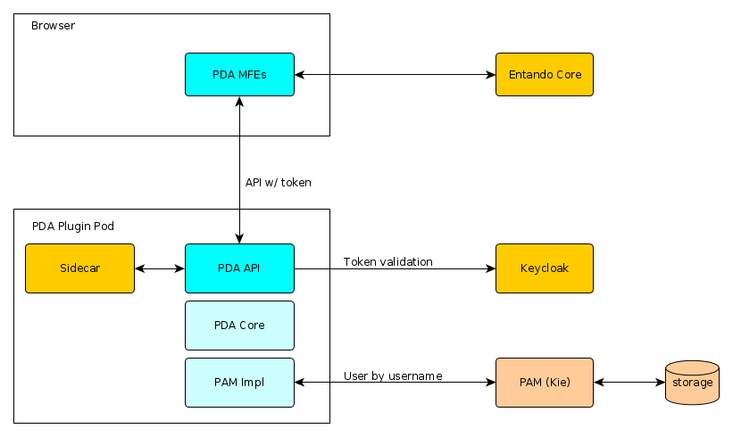

# PDA Architecture

This document describes the components that comprise the Process Driven Applications (PDA) plugin architecture with respect to
deployment, as well as how they interact with each other.

The image below shows the high level components.

## PDA MFEs

The PDA micro frontends run on the browser, rendering the custom UI
components the user interacts with. These components are written in React and fetch data from the PDA API, passing the Keycloak token for authentication.

The MFEs also make calls to the Entando Core API to retrieve the
settings required for the UI configuration. These components are available to assist with page creation after the PDA plugin bundle is installed.

The source code for this component:
<https://github.com/entando/entando-process-driven-plugin/tree/master/widgets>

## PDA API

The PDA API is a Spring Boot application that communicates with the Entando engine, and engine data is made available in a Rest API. Subject to deployment configuration, the PDA API interacts with Keycloak to validate the token, and with the sidecar to retrieve the connection and sensitive data. Instead of calling specific engine classes directly, the application calls the abstractions defined in the PDA Core library. 

Engine implementation is determined at runtime based on the connection details
provided. It is important to note that the PDA API does not have a database and is therefore stateless. All data available in the API are retrieved
from the BPM engine. After bundle installation, the API is deployed as a
microservice in the Kubernetes infrastructure. An Ingress is also created to
make the API available to the MFEs, as described by the Entando Plugin custom
resource.

The source code for this component:
<https://github.com/entando/entando-process-driven-plugin>

## Sidecar

The sidecar is another application (Docker container) deployed in the same Pod
as the PDA API. It exposes services to manage connection details, which are
stored as Secrets in Kubernetes. The PDA API communicates with the sidecar to
manage BPM engine connection details.

The source code for this component:
<https://github.com/entando/entando-plugin-sidecar>

## PDA Core

The PDA Core is the library that defines the interface and abstraction implementations that interact with specific BPM engines. It allows multiple engine implementations to exist simultaneously.

The source code for this component:
<https://github.com/entando/pda-core-engine>

## PAM Impl

The PAM Impl is the Red Hat PAM implementation for the PDA Core library. If the connection maps
to a PAM engine, these are the classes that are executed when the
PDA API requests engine operations. This implementation communicates with
the Kie Server, which executes the defined process operations.

The source code for this component:
<https://github.com/entando/pda-redhatpam-engine>

