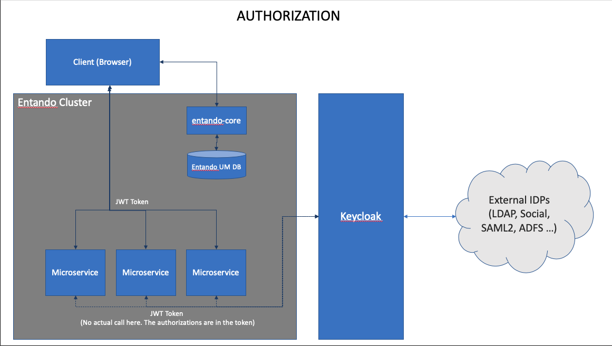
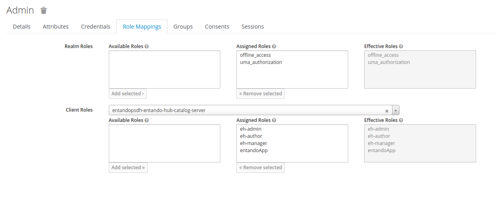

# Entando Identity Management -- Keycloak

Entando Identity Management is based on open source Keycloak. Entando Applications rely on a Keycloak instance that is either[externally installed](../../tutorials/devops/external-id-management) or specific to an application. The architecture and requirements to customize your Keycloak instance are described below.

## Logging into your Keycloak Instance

Keycloak is protected by a Secret deployed to your Entando Kubernetes instance. You can query Kubernetes for the Secret's default admin credentials, substituting your environment's namespace and Secret name:

```
ent kubectl get secret quickstart-kc-admin-secret -n entando -o go-template="{{println}}Username: {{.data.username | base64decode}}{{println}}Password: {{.data.password | base64decode}}{{println}}{{println}}"
```

 To find the Secret name, run
```
kubectl get secrets -n <namespace>
```
and search for the Secret that ends in `kc-admin-secret`.

## Authentication
Beginning with Entando 6, all authentication is powered by Keycloak. This ensures that a micro frontend can call a microservice with a token available to the client.



The Entando architecture implements Keycloak as a central point of authentication. A single, unified view of identity increases Entando's portability. Entando can also integrate into other IDPs without modifying the source, because Keycloak acts as an abstraction to the underlying IDP.

## Authorization

### Plugins/Microservices
Keycloak authorizes microservices using clients and roles. Authorizations are stored in a JWT token and available to services when invoked.

To setup permissions to configure the service:

1. Login to your Keycloak instance as an admin. You can query Kubernetes for the default admin credentials, substituting your environment's namespace and Secret name:

```
ent kubectl get secret quickstart-kc-admin-secret -n entando -o go-template="{{println}}Username: {{.data.username | base64decode}}{{println}}Password: {{.data.password | base64decode}}{{println}}{{println}}"
```

2. From the left menu, select `Users`. Search for "admin" and click on the admin ID.


3. Click on the `Role Mappings` tab. Specify the service client via the `Client Roles` drop-down menu. Select from the client's `Available Roles`.


4. Use the `Add Selected` button to move desired roles to `Assigned Roles`. These will subsequently appear under `Effective Roles`.


### Core
When a user is authenticated to the `entando-core` via Keycloak, a copy of that user is added to the `entando-core` user management database to enable WCMS functionality. Within the App Builder, WCMS roles and groups can be assigned to a user for access to App Builder functions or `portal-ui` content in the runtime application.

The code that copies the user into the `entando-core` can be customized per implementation to automatically create groups and roles. See the [entando-keycloak-plugin](https://github.com/entando/entando-keycloak-plugin) for details of the code that copies users and data to the WCMS database. The README in that project includes properties that are available to your Entando Application.

See [KeycloakAuthorizationManager.java](https://github.com/entando/entando-keycloak-plugin/blob/master/src/main/java/org/entando/entando/keycloak/services/KeycloakAuthorizationManager.java) for an example of adding attributes programatically. In particular, refer to the [processNewUser](https://github.com/entando/entando-keycloak-plugin/blob/master/src/main/java/org/entando/entando/keycloak/services/KeycloakAuthorizationManager.java#L43) method.

## Social Login

Keycloak allows Entando to provide social login as an out-of-the-box capability. [Keycloak Social Identity Providers](https://www.keycloak.org/docs/11.0/server_admin/#social-identity-providers) documents how to enable and configure social logins in your Entando Applications.

## One Time Passwords

Keycloak enables One Time Passwords (OTP) login to Entando Applications. See [Keycloak OTP Policies](https://www.keycloak.org/docs/11.0/server_admin/#otp-policies) to configure and enable OTP in your application.

## Themes, Look and Feel

Developers can customize the look and feel of the login page, as well as the identity management system that ships with Entando. The [Keycloak Theme Documentation](https://www.keycloak.org/docs/11.0/server_admin/#_themes) provides instructions for creating your own theme. Alternatively, you can modify the [Entando Theme](https://github.com/entando/entando-keycloak/tree/master/themes/entando).
