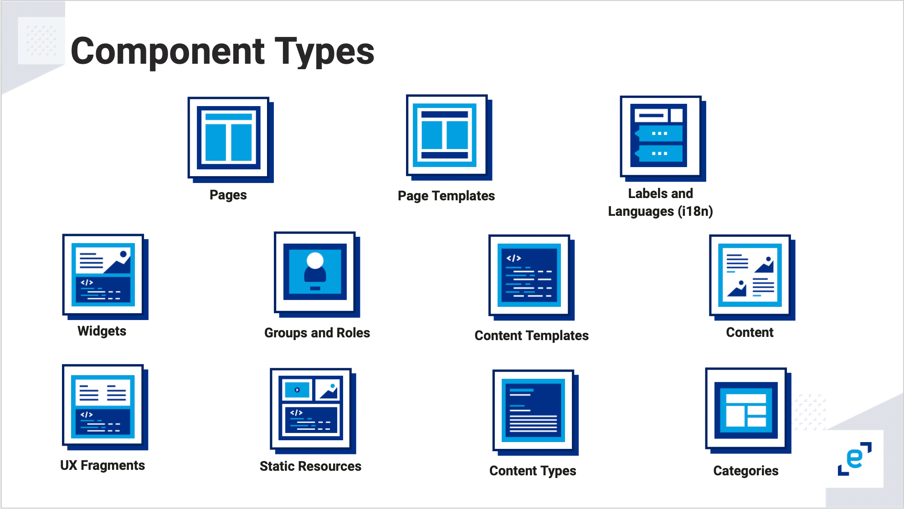

# Bundle and Component Descriptors 

The Entando Component Manager reads the `descriptor.yaml` file from the root of the bundle package and uses it to install any components and resources included in the bundle. 

The different component types are shown below:

Here is the basic bundle structure:

    .
    ├ descriptor.yaml
    ├ resources/
    │ └ ...
    └ ... (folders reported in descriptor.yaml file)

### Bundle Conventions

1.  The bundle descriptor file must be named `descriptor.yaml` or the bundle will not be recognized.

2.  Static resources should be placed in a `resources` folder. They are not explicitly referenced in the `descriptor.yaml` file itself.

### Bundle Descriptor

The bundle descriptor YAML file aggregates all included components and has the structure shown below. Note that the Page Template feature is `pageModels` and the Content Template feature is `contentModels`. 

> **Warning**
>
> The bundle descriptor file must be named `descriptor.yaml`

**descriptor.yaml**

    code: survey_bundle # The bundle ID
    description: This is the survey bundle # The description of the bundle

    components: # All components are listed here.

      # Optional. Use if the component requires deployment
      plugins:
        - folder/you/want/your_plugin_descriptor.yaml
        - folder/you/want/another_plugin_descriptor.yaml

      # To create Widgets, add references to the descriptor files 
      widgets:
        - widgets/your_widget_descriptor.yaml
        - widgets/another_widget_descriptor.yaml

      # To create Fragments, add references to the descriptor files 
      fragments:
        - fragments/your_fragment.yaml

      # To create Page Templates, add references to the descriptor files 
      pageModels:
        - pageModels/your_page_model_descriptor.yaml
        - pageModels/another_page_model_descriptor.yaml

      # To create and publish Pages, add references to the descriptor files 
      pages:
        - page/your_page_descriptor.yaml
        - page/another_page_descriptor.yaml

      # To create a CMS Asset, add a reference to the descriptor file in the same location 
      # as the image or file you want to upload
      assets:
        - assets/your-asset/your_asset_descriptor.yaml
        - assets/your-asset/your_image.jpg

      # To create Content Types, add references to the descriptor files
      contentTypes:
        - contentTypes/your_content_type_descriptor.yaml

      # To create Content Templates, add references to the descriptor files
      contentModels:
        - contentModels/your_content_model_descriptor.yaml
        - contentModels/another_content_model_descriptor.yaml

      # To create and publish Contents, add references to the descriptor files
      contents:
        - contents/your_content_descriptor.yaml
        - contents/another_content_descriptor.yaml
        
      # To create Categories, add references to the descriptor files
      categories:
        - categories/your_categories.yaml
        
      # To create Groups, add references to the descriptor files
      groups:
        - groups/your_groups.yaml
        
      # To create Labels, add references to the descriptor files
      labels:
        - labels/your_labels.yaml
      
      # To enable Languages, add references to the descriptor files
      languages:
        - languages/languages.yaml

## Plugin

Here is an example of a plugin descriptor:

**Plugin descriptor.yaml**

    
    # Descriptor version field added in v3 and later. 
    # To take advantage of the environment variables below, v4 will need to be specified.
    descriptorVersion: "v4" 

    # The Docker image used to create the plugin
    image: "entando/your-image:1.0.0" 

    # The base name to assign to pods that have to be created in Kubernetes
    deploymentBaseName: "yourplugin" 
    
    # The DBMS the plugin will use
    dbms: "postgresql" 

    # The roles the plugin will expose in Keycloak
    roles: 
      - "task-list"
      - "task-get"
      - "connection-list"
      - "connection-get"
      - "connection-create"
      - "connection-delete"
      - "connection-edit"

    # The health check path that Kubernetes will use to check the status 
    # of the plugin deployment  
    healthCheckPath: "/actuator/health" 
    
    # The ingress path to assign to the plugin deployment 
    ingressPath: "/your-plugin-path"

    # A list of Keycloak clientIds/roles to bind to one another
    permissions: 
      - clientId: realm-management
        role: manage-users
      - clientId: realm-management
        role: view-users

    # A set of environment variables that can be set inline or 
    # referenced as Secrets in the namespace. Supported as of descriptorVersion v4.
    environmentVariables:
      - name: SIMPLE_VAR  # directly injects the value
        value: yourSimpleValue
      - name: SECRET_VAR  # leverages a secret value
        valueFrom:
          secretKeyRef:
            name: YOUR-BUNDLE-ID-your-secret
            key: yourSecretKey
 
::: tip  
 Entando uses the `healthCheckPath` to monitor the health of the plugin. A plugin in an Entando Bundle can use any technology, as long as it provides a health check service configured via the `healthCheckPath`. This path must be specified in the descriptor file and return an HTTP 200 or success status. This can be implemented by a Java service included with the Entando Blueprint in the Spring Boot application. You can also [use a Node.js service as shown here](https://github.com/entando-samples/ent-project-template-node-ms/blob/main/src/main/node/controller/health-controller.js). 
:::

::: tip
See the [Plugin Environment Variables](../../tutorials/devops/plugin-environment-variables.md) tutorial to setup environment variables, either inline or based on Kubernetes Secrets.
:::

### Permissions

The `permissions` property specifies a list of coupled `clientIds` and roles that will be bound in Keycloak. To find them, open the Keycloak console and navigate to `clients` → `awesomeplugin-server` → `Service Account Roles`.
## Widget

Here is an example of a Widget descriptor:

**Widget descriptor.yaml**

    code: another_todomvc_widget # The Widget identification

    titles: # Widget's Titles
      en: TODO MVC Widget # Title in English
      it: TODO MVC Widget # Title in Italian

    group: free # The owner group of the Widget

    # Optional. The UI Path, where the widget.ftl file will have the customUi content
    customUiPath: widget.ftl

    # Optional. The Custom UI
    customUi: >-
        <h1>Your Custom Widget UI</h1>

    # Optional. The ConfigUI
    configUi:
      customElement: todomvc-config # The name of the custom element used to render the configUI
      resources:
        - <bundleid>/static/js/main.js # The resources necessary for the custom element to render the configUI, like the code

## Fragment

Here is an example of a Fragment descriptor:

**Fragment descriptor.yaml**

    code: your_fragment # The unique ID

    # Optional. The Fragment content
    guiCode: >-
      "
Here is the content
"

    # Optional. A path to a FreeMarker file containing the Fragment content
    guiCodePath: fragment.ftl

## Page Template

Here is an example of a Page Template descriptor:

**Page Template descriptor.yaml**

    code: todomvc_page_template # The Page Template identification
    description: TODO MVC basic page template # The Page Template description

    titles: # Page Template's Titles
      en: TODO MVC PageTemplate # Title in English
      it: TODO MVC PageTemplate # Title in Italian

    # The Page Template configuration
    configuration:
      frames: # All frames
        - pos: 0 # Frame position
          description: Header # Frame description
          sketch: # Frame sketch configuration
            x1: 0
            y1: 0
            x2: 11
            y2: 1
          defaultWidget:
            code: your-widget # the Widget code to apply when using the button "apply default widgets" in the page configuration UI

        # A simplified way to define a Frame
        - pos: 1
          description: Breadcrumb
          sketch: { x1: 0, y1: 0, x2: 11, y2: 1 }

    # Optional. Define the Page Template in a separate file or inside the descriptor file with `template`
    templatePath: page.ftl

    # Optional. Define the Page Template as below or in a separate file with `templatePath`
    template: >-
      <#assign wp=JspTaglibs[\"/aps-core\"]>
      <!DOCTYPE HTML PUBLIC \"-//W3C//DTD HTML 4.0 Transitional//EN\">
      <html>
          <head>
              <title><@wp.currentPage param=\"title\" /></title>
          </head>
          <body>
              <h1><@wp.currentPage param=\"title\" /></h1>
              <a href=\"<@wp.url page=\"homepage\"/>\">Home</a> 
              

                  <h1>Bundle 1 Page Template</h1>
                  <@wp.show frame=0 />
              

          </body>
      </html>

## Page
This descriptor enables a page to be created and published via a bundle. Page status can be `published` or `draft`. The Widget section can be used to fully configure a page layout. 

Groups in a page descriptor are configured by `ownerGroup` and `joinGroups`. The `ownerGroup` property specifies the group of users who can manage the entity in the AppBuilder. The `joinGroups` property specifies who can view or access the page. For example, setting `ownerGroup` to "free" means anyone with access to the AppBuilder can manage the page, whereas setting `joinGroup` to "free" means any end user can view the page in the application. 

**Page descriptor.yaml**

    code: dashboard
    parentCode: homepage
    titles:
      en: your dashboard
      it: La mia Dashboard
    pageModel: dashboard
    ownerGroup: free
    joinGroups: []
    displayedInMenu: true
    seo: false
    charset: utf-8

    # Local Hub will publish the page according to this property
    status: published|draft

    # Page Configuration
    widgets:
      - code: Brand-Logo
        config: null
        pos: 0
      - code: Login_buttons
        config: null
        pos: 2
      - code: seeds_card
        config:
          cardname: creditcard
        pos: 6
      - code: list_item
        config:
          icon: managealerts
          count: '0'
          title: Alerts
        pos: 7
      - code: list_item
        config:
          icon: viewstatements
          count: '0'
          title: View Statements
        pos: 11
      - code: seedscard-transaction-table
        config: null
        pos: 13

## CMS Asset

This descriptor contains the metadata required for uploading and updating a CMS Asset.

**Asset descriptor.yaml**

    correlationCode: 'your-reference-code'
    type: image
    # This file should be placed in the same folder as the descriptor.yaml
    name: 113f4437cac3b3f3d4db7229f12287a4_d3.png
    description: 113f4437cac3b3f3d4db7229f12287a4_d3.png
    group: free
    categories: []

## Content Template

Here is an example of a Content Template descriptor:

**Content-template descriptor.yaml**

    id: 8880003
    contentType: CNG
    description: Demo Content Template

    # Optional. Define the Content Template Shape in a separate file or inside the descriptor file with `contentShape`
    contentShapePath:

    # Optional. Define the Content Template Shape as below or in a separate file with `contentShapePath`
    contentShape: >-
      <article>
        <h1>$content.Title.text</h1>
        <h2>Demo content template</h2>
        #if ( $content.MainBody.text != "" )
        $content.MainBody.text
        #end
      </article>

    widgets:
      - code: Brand-Logo
        config: null
        pos: 0
      - code: Login_buttons
        config: null
        pos: 2
      - code: seeds_card
        config:
          cardname: creditcard
        pos: 6
      - code: list_item
        config:
          icon: managealerts
          count: '0'
          title: Alerts
        pos: 7
      - code: list_item
        config:
          icon: viewstatements
          count: '0'
          title: View Statements
        pos: 11
      - code: seedscard-transaction-table
        config: null
        pos: 13

## Content Type

For more details on Content Type properties, refer to the [Content Type documentation](../../tutorials/compose/content-types-tutorial.md).

**Content-type descriptor.yaml**

    code: CNG
    name: Demo
    status: 0

    attributes:
      - code: title
        type: Text
        name: Title
        roles:
          - code: jacms:title
            descr: The main title of a Content
        disablingCodes: []
        mandatory: true
        listFilter: false
        indexable: false

        enumeratorStaticItems: string
        enumeratorStaticItemsSeparator: string
        enumeratorExtractorBean: string

        validationRules:
          minLength: 0
          maxLength: 100
          regex: string
          rangeStartString: string
          rangeEndString: string
          rangeStartStringAttribute: string
          rangeEndStringAttribute: string
          equalString: string
          equalStringAttribute: string
          rangeStartDate: string
          rangeEndDate: string
          rangeStartDateAttribute: string
          rangeEndDateAttribute: string
          equalDate: string
          equalDateAttribute: string
          rangeStartNumber: 0
          rangeStartNumberAttribute: string
          rangeEndNumber: 0
          rangeEndNumberAttribute: string
          equalNumber: 0
          equalNumberAttribute:
          ognlValidation:
            applyOnlyToFilledAttr: false
            errorMessage: Something
            keyForErrorMessage: some
            keyForHelpMessage: thing
            ognlExpression: string

## Content
This descriptor enables content to be created and optionally published via a bundle, according to the `status` property. The content ID is optional and enables linking from other components, like Content Widget. It can be autogenerated or explicitly declared.

Groups in a content descriptor are configured by the owner group `mainGroup` and the join group `groups`. The owner group consists of users who can manage the content within AppBuilder, while the join group consists of users who can view the content.

**Content descriptor.yaml**

    id: NWS650
    typeCode: NWS
    description: Dealing with a financial emergency
    mainGroup: free
    groups:
      - free
    status: PUBLIC
    attributes:
      - code: date
        value: '2020-04-23 00:00:00' # the date should be in ISO-8601 format
      - code: title
        values:
          en: Dealing with a financial emergency
      - code: subtitle
        values:
          en: |
            
How to tackle financial stress

      - code: body
        values:
          en: |
            
For many Americans, financial concerns are their number-one stress point. Here are 6 ways to help reduce your money stress and get motivated to take control of your finances.

      - code: img
        values:
          en:
            correlationCode: '651'
            name: bank_750xx684385064_d0.jpg
      - code: links
        elements:
          - code: links
            value:
              symbolicDestination: '#!U;http://www.yoursite.com/!#'
              destType: 1
              urlDest: 'http://www.yoursite.com/'
              pageDest: null
              contentDest: null
              resourceDest: null
            values:
              en: vostro sito
          - code: links
            value:
              symbolicDestination: '#!U;http://www.yoursite.com/!#'
              destType: 1
              urlDest: 'http://www.yoursite.com/'
            values:
              en: vostro sito 2
      - code: attaches
        elements:
          - code: attaches
            values:
              en:
                correlationCode: '205'
                name: Entando_Admin_Console_Overview_4.3.3_EN.pdf

      
## Categories

This descriptor contains a list of Categories:

**Category descriptor.yaml**

    - code: new-category # Identifies the Category
      parentCode: home # The parent Category; home is the base category
      titles:
        it: "Una nuova categoria" # Category name in Italian
        en: "New category" # Category name in English

## Groups
This descriptor contains a list of Groups:

**Group descriptor.yaml**

    - code: your_group # Identifies the Group
      name: "Your group" # The name of the Group

## Labels
This descriptor contains a list of Labels:

**Label descriptor.yaml**

    - key: YOUR-FIRST-LABEL # Identifies the Label
      titles: # The titles on the Label
        it: Vostro Titolo # The title in Italian
        en: Your Title # The title in English

## Languages
This descriptor contains a list of Languages to enable during the installation process:

**Language descriptor.yaml**

    - code: en
      description: English
    - code: it
      description: Italian

## Static Resources

In order to upload static files, you will need to create a folder called `resources`. All files inside this folder will be uploaded into Entando with the same folder structure.

    resources/
    ├ css/
    │ └ styles.css
    ├ js/
    │ └ script.js
    ├ images/
    │ ├ favicon.ico
    │ └ logo.png
    └ page.html

Using the structure above, the resultant files in the Entando architecture will be:

    your-bundle-id/
    ├ css/
    │ └ styles.css
    ├ js/
    │ └ script.js
    ├ images/
    │ ├ favicon.ico
    │ └ logo.png
    └ page.html

> **Important**
>
> The `code` property `your-bundle-id` is inside `descriptor.yaml`.

To use static files in a Widget or Page Template, use the FTL tag `<@wp.resourceURL />`:

    your-bundle-id/images/logo.png">
    <link rel="stylesheet" href="<@wp.resourceURL />your-bundle-id/css/styles.css">
    <link rel="shortcut icon" href="<@wp.resourceURL />your-bundle-id/images/favicon.ico" type="image/x-icon"/>
    
