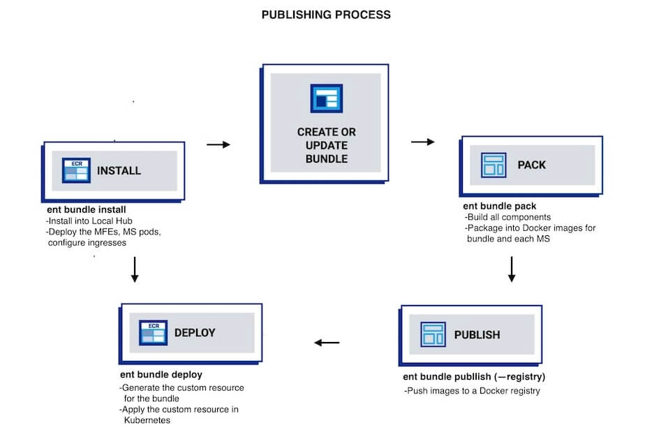

# Entando Bundle

The structure of an Entando Bundle leverages composable development methods, decoupling microservices, micro frontends, API management, and services such as databases.  The **ent bundle CLI** module administers the process, using the descriptor `entando.json`. This single bundle descriptor defines all the components and resources of the docker-based bundle. The following page describes the descriptor, the structure, its conventions, and the building process. 

The docker-based approach is an improvement on the previous Entando Bundle structure and to see the differences, refer to the [Bundle Evolution](../reference/bundle-comparison.md) page.

## Entando Bundle Conventions

* There is a single bundle descriptor, `entando.json`, initialized and managed by the [ent bundle CLI](../getting-started/ent-bundle.md). 
* Microservices and micro frontends can be built independently, each with their own folders.
* The `platform` directory is dedicated to platform specific components such as fragments, pages, and static resources. For more information on component types and descriptors, see the [Bundle Component Details](bundle-component-details.md) page.
* The `svc` directory is allocated for auxiliary services and the docker-compose configuration files that define them. The ent bundle module enables, starts and stops the services. MySQL, PostgreSQL, and Keycloak services are available with Entando out of the box, and for more details, go to the [ent CLI Services page](../getting-started/ent-svc.md).
* Optionally, a thumbnail for your bundle can be set by adding a JPG or PNG image file to the bundle root folder. The file must be named "thumbnail" and be 100kb or less, e.g. thumbnail.png.

## Project Structure 
```sh
   bundle-project/
  .git/
  .entando/  <= An internal working folder for caches, logs, and build artifacts
    config.json    
    output/
      descriptors/
    logs/
      microservices/
      microfrontends/
  microservices/   <= Source and build output for each microservice
    ms1/    
    ms2/   
    ms3/       
  microfrontends/  <= Source and build output for each microfrontend
    mfe1/   
    mfe2/   
    mfe3/   
    mfe3-config        
platform/     <= platform specific components    
    pageTemplates/
      page-template.yaml
    pages/  
  svc/     <= auxiliary services for local development 
    keycloak.yaml
    ...         
  entando.json    <= project bundle descriptor
  thumbnail.jpg   <= bundle thumbnail
```
>Note: For a full list of platform components, see the [Bundle Component Descriptors](bundle-component-details.md) page. 

## Bundle Development Process


The ent bundle CLI module manages the building and publishing of an Entando Bundle. From initialization to installation, from adding MFEs and MSs to calling for services such as Keycloak and making API claims, the ent bundle commands streamline the development process. 

At initialization, the project scaffolding is built. A project can be started from scratch with this structure or retrieved interactively from an Entando Hub as a starting point for new bundles. Microservices, micro frontends, components, services, and API claims can then be added. At this stage, components can be run locally and independently with the ent bundle commands.

The next steps build and pack the project using the bundle descriptor. The specifics depend on the component type and stack. The build phase constructs the microservices and micro frontends while the pack command generates the artifacts and Docker images. Images are built for the bundle and for each microservice.

In the publish step, images are pushed to a Docker registry and tagged according to the bundle configuration. A custom registry can also be used.



Finally, the bundle is deployed into the Local Hub of a running Entando instance where it can then be installed. Any improvements to the bundle can be made by repeating the **four steps: pack, publish, deploy and install**. Alternatively, the install step can be done in the App Builder UI by the composer designing the application.

At every phase of the process, options are available to fine-tune the process, and to see more information, go to the [ent bundle CLI](../getting-started/ent-bundle.md) documentation. 

## Bundle Descriptor entando.json
The following is a list of specifications for the bundle descriptor and its component parts.

### Bundle Descriptor Specifications
|Name|Type|Required|Description|
|:-|:-|:-|:-----------------------|
|`name^`|String|Yes|The bundle project name used as the default Docker image name|
|`description`|String|No|A description of the bundle project shown in the App Builder|
|`version`|String|Yes|The bundle version used as the default Docker image tag|
|`displayName`|String|No|A descriptive label used in the UI in place of a name|
|`global`|[Global[]](#global-specification)|No|Global bundle configuration items|
|`microservices`|[Microservices](#microservices-specifications)|No|Bundle microservices|
|`microfrontends`|[Micro Frontends](#micro-frontends-specifications)|No|Bundle micro frontends|

^ Bundle Name: A bundle name may only contain lowercase letters, numbers, periods(.), and dashes(-). They cannot start or end with periods or dashes.
```json
{
  "name": "my-bundle-name",
  "description": "my bundle description",
  "type" : "bundle",
  "version": "0.0.1",
  "svc": [
        "keycloak"
    ]
}
```

### Microservices Specifications
|Name|Type|Required|Possible Values |Description|
|:-|:-|:-|:-|:------------------------|
|`name`|String|Yes||Microservice name|
|`stack`|Enum|Yes|*spring-boot<br/>*node<br/>*custom|Microservice stack |
|`dbms`|Enum|No|*none^  *embedded  *postgresql  *mysql  |DBMS required by the MS to provide services|
|`healthCheckPath`|String|No||Endpoint for a health check|
|`ingressPath`|String|No||Custom ingress path for health check|
|`deploymentBaseName`|String|No||Used to define custom pod names|
|`permissions`|[Permission[]](#permission-specification)|No| | List of permissions to grant to the microservice |
|`roles`|String[]|No||Exposed security roles|
|`env`|[EnvironmentVariable[]](#environmentvariables-specification)|No||Required environment variables|
| |[Microservices Environment Variables](#microservices-environment-variables)|No||Entando-provided env variables for MS |
|`commands`|[Command[]](#command-specification)|No||Custom command(s) definitions|
|`version`|String|Required only for a custom stack||Microservice version override|
> ^ dbms none: See microservices Details below. Also, checkout [External DBSM for Bundles](../../tutorials/devops/external-db-ms.md).

#### Microservices Sample Code
```json
"microservices": [
    {
      "name": "my-ms",
      "stack": "spring-boot",
      "dbms": "mysql",
      "healthCheckPath": "/management/health",
      "ingressPath": "/ingress",
      "roles": ["admin"],
      "env": [
        { "name": "SIMPLE_VAR",
          "value": "mySimpleValue" 
        },
        { "name": "SECRET_VAR",
          "secretKeyRef": {
              "name": "YOUR-BUNDLE-ID-my-secret", 
              "key": "mySecretKey"
          }
        }
      ]
    }
  ]
```
#### Microservices Details
 - Entando recommends that REST APIs be added to microservices.
 
 - To utilize **environment variables**, inline or based on Kubernetes Secrets, see the [Plugin Environment Variables](../../tutorials/devops/plugin-environment-variables.md) tutorial.

 - Entando uses the `healthCheckPath` to monitor the health of the microservice. A plugin in an Entando Bundle can use any technology, as long as it provides a health check service configured via the `healthCheckPath`. This path must be specified in the descriptor file and return an HTTP 200 or success status. This can be implemented by a Java service included with the Entando Blueprint in the Spring Boot application. You can also [use a Node.js service as shown here](https://github.com/entando-samples/ent-project-template-node-ms/blob/main/src/main/node/controller/health-controller.js). 

- **External DBMS, Oracle, and other DBMS types** for microservices are not supported for automatic deployment in an Entando Bundle. Environment variables should be used to configure the connection and for more information, see the [External DBSM for Bundles](../../tutorials/devops/external-db-ms.md) tutorial.

### Micro Frontends Specifications
|Name|Type|Required|Possible Values|Description|
|:-|:-|:-|:-|:------------------------|
|`name`|String|Yes||Micro frontend name|
|`stack`|Enum|Yes|*react<br/>*angular<br/>*custom|MFE stack|
|`type`|Enum|Yes|*widget  *widget-config  *app-builder|Type of MFE|
|`category`|String|No|Default is `User`|For `widget` type only, any custom name ([See below](#custom-category))|
|`slot`|Enum|Yes for `type=app-builder`|*primary-header  *primary-menu  *content|Named reference to an App Builder embedded position in a specific layout|
|`paths`|String[]|Yes for `type=app-builder` and `slot=content`||App Builder activation paths|
|`titles`|String[]|Yes for `type=widget`||Localized widget labels|
|`group`|String|Yes||Visibility group name|
|`publicFolder`|String|No|Default is `public`|MFE public folder (typically where index.html is located)|
|`apiClaims`|String[]|No||See [API Claim spec](#api-claim-specification) below|
|`nav`|[MenuEntry[]](#menuentry-specification)|No||Bundle menu global links|
|`commands`|[Command[]](#command-specification)|No||Custom commands definitions|
|`buildFolder`|String|No|Default is `build`|Corresponds to the MFE build folder |
|`configMfe`|String|No||The custom element for the corresponding widget-config MFE|
|`params`| [MfeParam[]](#mfeparam-specification)  |Yes| | User configuration for executing a widget|
|`contextParams`|String[]| Yes | | Information extracted from the application context |
|`version`|String|Required only for custom stack MFE||Microfrontend version override|

#### Configure a Path for Static Assets
To configure your micro frontend with access to static assets, Entando provides two paths, one for widgets and another for EPCs.  

* For widgets: `window.entando?.widgets['YOUR-MFE']?.basePath;`

* For EPCs: `window.entando?.epc['YOUR-EPC']?.basePath;`

[See the instructions for setting the path in a React MFE](../../tutorials/create/mfe/react.md#configure-the-custom-element). 

#### Custom Category
A custom `category` provides an organizing classification for `Widgets`, to appear as a separate grouping in the App Builder Page Designer. A custom `category` can only be used with MFEs of the type `widget`. All widgets or MFEs will appear under `User` Widgets unless a custom `category` is specified.   

#### Micro Frontends Sample Code 
```json
 "microfrontends": [
    {
      "name": "my-mfe",
      "stack": "react",
      "titles": { "en": "My MFE Title", "it": "Il Mio Titolo MFE" },
      "type": "app-builder",
      "category" : "My custom category",
      "slot": "content",
      "paths": ["/path1"],
      "group" : "free",
      "apiClaims": [...]
    },
    {
      "name": "my-mfe2",
      "stack": "custom",
      "type": "widget",
      "publicFolder": "public",
      "titles": { "en": "My MFE2 Title", "it": "Il Mio Titolo MFE2" },
      "group": "free",
      "commands": {
          "build": "echo 'Please edit this command to customize the build phase' && exit 1",
          "run": "echo 'Please edit this command to customize the run phase' && exit 1",
          "pack": "echo 'Please edit this command to customize the pack phase' && exit 1"
      },
      "version": "0.0.1"
    }
   ]
```

### API Claim Specification
|Name|Type|Required|Possible Value|Description|
|:-|:-|:-|:-|:------------------------|
|`name`|String|Yes||Name|
|`type`|Enum|Yes|*internal  *external| Category of claim, either inside the same bundle (internal) or same namespace (external) |
|`serviceName`|String|Yes||The name of the microservice|
|`serviceUrl`| String| No ||The URL of the microservice deployed in the local environment|
|`bundle`|String|Yes only for `type=external`||Bundle Docker URL|

#### API Claim Spec Sample
 ```json
  "apiClaims": [
    {
      "name": "int-api-claim",
      "type": "internal",
      "serviceName": "my-ms"
    },
    {
      "name": "ext-api-claim",
      "type": "external",
      "serviceName": "my-ext-bundle-ms",
      "bundle": "registry.hub.docker.com/my-organization/my-ext-bundle-ms"
    }
  ]
```
For more information, go to the [API Management](../getting-started/ent-api.md) page.

### Command Specification
|Name|Type|Required| Description|
|:-|:-|:-|:------------------------|
|`build`|String|No| Custom build command|
|`run`|String|No| Custom run command|
|`pack`|String|No| Custom pack command|

#### Command Spec Sample Code
```json
  "commands": {
    "run": "mvn -Dspring-boot.run.arguments=\"--server.port=8082\" spring-boot:run"
  }
```
Depending on the stack type, default values are:
- build: mvn test, npm run test
- run: mvn spring-boot:run, npm run start
- pack: mvn package, npm run build

### EnvironmentVariables Specification
|Name|Type|Required|Description|
|:-|:-|:-|:------------------------|
|`name`|String|Yes|Name of the env variable to inject|
|`value`|String|No|Value to give to the env variable|
|`secretKeyRef`|[SecretKeyRef[]](#secretkeyref-specification)|No|A reference to a secret

### Microservices Environment Variables
The following are platform-provided runtime variables.
|Name| Type | Description| 
|:-|:---|:----------------------------------|
|`KEYCLOAK_REALM`| string | Keycloak or Red Hat Single Sign-On (RH-SSO) realm to be used by the MS. | 
|`KEYCLOAK_AUTH_URL` | string | Keycloak/RH-SSO URL to be used by the MS.| 
|`KEYCLOAK_CLIENT_SECRET`| `secretKeyRef[]`| Keycloak/RH-SSO autogenerated clientSecret to be used by the MS. | 
| `KEYCLOAK_CLIENT_ID`| `secretKeyRef[]`| Keycloak/RH-SSO autogenerated clientId to be used by the MS. |
|`SERVER_SERVLET_CONTEXT_PATH` | string | Context path used to access the MS. Automatically handled by a Spring Boot MS, but can be manually set for other `stack` types.|  
| `SPRING_PROFILES_ACTIVE`| string | Application profile to use when the MS runs on Entando, differentiating dev vs prod at runtime. Automatically handled by a Spring Boot MS but can be manually managed if using another technology `stack`. | 
| `SPRING_DATASOURCE_URL`| string| Provisioned database JDBC connection URL. Automatically handled by a Spring Boot MS but can be manually managed if using another technology `stack`. | 
| `SPRING_DATASOURCE_USERNAME` | string|  Provisioned database username. Automatically handled for a Spring Boot MS, but can be manually managed if using another technology `stack`.| 
| `SPRING_DATASOURCE_PASSWORD` | string|  Provisioned database password. Automatically handled for a Spring Boot MS, but can be manually managed if using another technology `stack`.| 


### Global Specification
|Name|Type|Required|Possible Values|Description|
|:-|:-|:-|:-|:------------------------|
|`nav`|MenuEntry[]|No||Bundle menu global links|

### MenuEntry Specification
|Name|Type|Required|Possible Values|Description|
|:-|:-|:-|:-|:------------------------|
|`label`|String[]|Yes||Localized entry in the PBC menu|
|`target`|Enum|Yes|*internal  *external|Where to open the menu link|
|`url`|String|||Address of the page to open when the menu is clicked|

### MfeParam Specification
|Name|Type|Required|Description|
|:-|:-|:-|:------------------------|
|name|String|Yes|Name of the parameter|
|description|String|No|Description of the parameter|

```json
  "params": [
      {
        "name": "username",
        "description": "username of user"
      },
      {
        "name": "description",
        "description": "description of user"
      }
  ],
  "contextParams": [
      "page_code"
  ]
```

### Permission Specification
|Name|Type|Required|Description|
|:-|:-|:-|:------------------------|
|clientId|string| Yes | The clientId of the other MS this MS needs access to |
|role| string | Yes| The role required on the OIDC client of the service that the MS needs access to |

### SecretKeyRef Specification
|Name|Type|Required|Description|
|:-|:-|:-|:------------------------|
|`name`|String|Yes|The secret name|
|`key`|String|Yes|The secret key inside the secret object|


