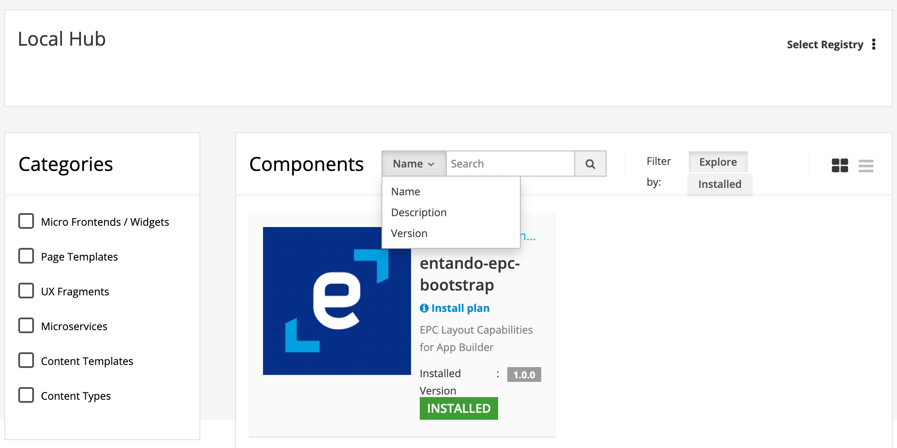

# Filtering Bundles

Entando Bundles can be filtered by its status, component part, or textual search from the App Builder user interface.



## Filtering Bundles by Component

To filter a bundle by component, its custom resource in the Entando Cluster must contain appropriate labels. Valid labels are: widget, plugin, fragment, pageTemplate, contentType and contentTemplate. To correctly define a label in a K8s resource requires both a key and value, but Entando uses only the key when filtering. Although the value is arbitrary, we recommend a setting of `"true"` for clarity and simplicity.

### Supported Labels Keys

<table>
<colgroup>
<col width="50%" />
<col width="50%" />
</colgroup>
<thead>
<tr class="header">
<th align="left">Label entry</th>
<th align="left">Description</th>
</tr>
</thead>
<tbody>
<tr class="odd">
<td align="left"><p><code>widget: "true"</code></p></td>
<td align="left"><p>The bundle contains one or more microfrontends (widgets) </p></td>
</tr>
<tr class="even">
<td align="left"><p><code>plugin: "true"</code></p></td>
<td align="left"><p>The bundle contains one or more microservices (plugins)</p></td>
</tr>
<tr class="odd">
<td align="left"><p><code>fragment: "true"</code></p></td>
<td align="left"><p>The bundle contains one or more fragments</p></td>
</tr>
<tr class="odd">
<td align="left"><p><code>pageTemplate: "true"</code></p></td>
<td align="left"><p>The bundle contains one or more page templates</p></td>
</tr>
<tr class="even">
<td align="left"><p><code>contentType: "true"</code></p></td>
<td align="left"><p>The bundle contains one or more content types</p></td>
</tr>
<tr class="odd">
<td align="left"><p><code>contentTemplate: "true"</code></p></td>
<td align="left"><p>The bundle contains one or more content templates</p></td>
</tr>
</tbody>
</table>

### Example
Here is an example of the metadata for an Entando Bundle containg micro frontends, microservices and page templates:

```
apiVersion: entando.org/v1
kind: EntandoDeBundle
metadata:
  name: demo-bundle
  labels:
    widget: "true"
    plugin: "true"
    pageTemplate: "true"
spec:
  details:
  ...
```

## Filtering Bundles by Status

Entando Bundles are filterable by availability and install status. Select the `Explore` tab to see the full list of bundles available in the Kubernetes cluster. Select the `Installed` tab to see the list of currently installed bundles in the Local Hub of the App Builder.


## Filtering Bundles by Textual Search

Use the textual search to return bundles that contain certain keywords in their name, description or version. When creating a new bundle, bear in mind that a textual search is performed against data extracted from the bundle custom resource definition.

## Mixing Search Criteria

Filtering can be refined by combining component, status and textual search criterias. For example, you could search for all available bundles (filter by status), that contain `Page Templates` (filter by component), with the word `Login` in the name (filter by textual search).
