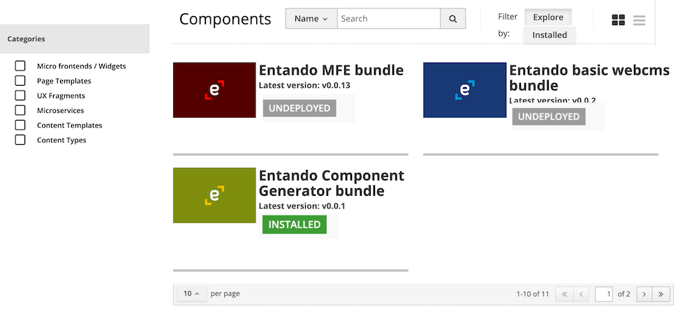

# How to customize bundle info shown in Entando App Builder



In the image above you can see an example of a bundle as is displayed in the Local Hub user interface inside the Entando App Builder.

The corresponding custom-resource file on Kubernetes is similar to this:

```
apiVersion: entando.org/v1
kind: EntandoDeBundle
metadata:
  name: simple-entando-bundle
spec:
  details:
    name: "Entando Bundle"
    description: An example of an Entando bundle
    dist-tags:
      latest: v0.0.1
    time:
      created: '2020-05-20T15:59:21.946Z'
      modified: '2020-05-20T15:59:21.946Z'
      v0.0.1: '2020-05-20T15:59:21.946Z'
    versions:
      - v0.0.1
    keywords:
      - entando6
    author: Entando
    thumbnail: >-
      data:image/jpeg;base64,....
  tags:
    # ....
```

In order to change the UI elements, you need to update the custom-resource in accordance with this table

| Field                           | UI Element                                                                | 
|---------------------------------|---------------------------------------------------------------------------|
| `spec.details.name`             | Set the bundle title                                                      |
| `spec.details.description`      | Set the bundle description (only visible in the list presentation format) |
| `spec.details.thumbnail`        | Set the bundle thumbnail, expressed as a base64 encoded string            |
| `spec.details.dist-tags.latest` | Set what's the latest version of the bundle                               |