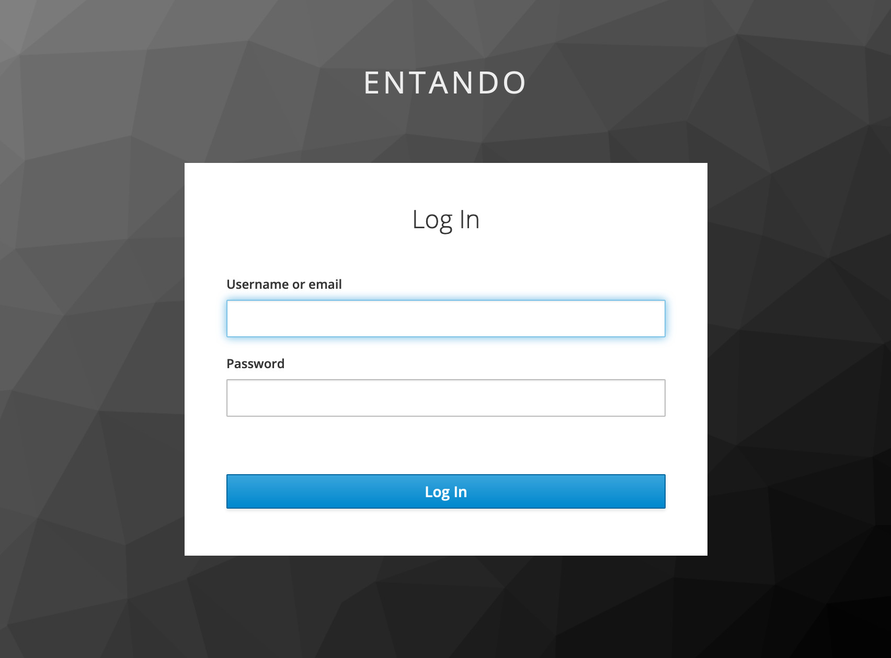
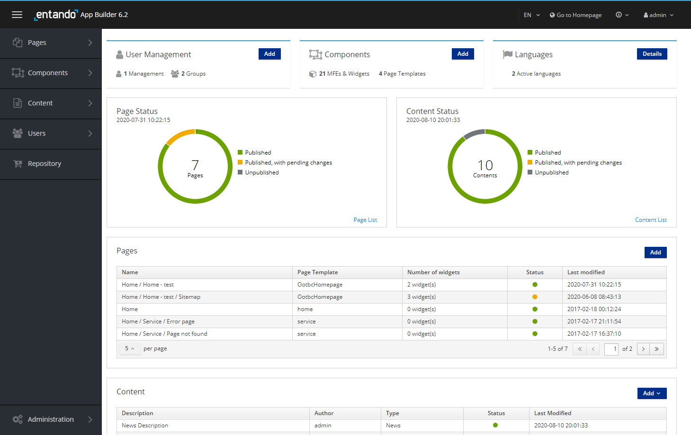

# Get Started with Entando

## Overview

You have two options for getting started with Entando.
1. [Automatically install Entando via the Entando command-line interface (CLI)](#automatic-install). This is the fastest way to start up an Entando application in Kubernetes.
2. [Manually install Entando step by step](#manual-install). This is useful if you're preparing a shared cluster rather than a local developer environment, the CLI defaults don't meet your specific needs, or if you want to customize the deploy itself. 


## Automatic Install
The following steps will launch an Ubuntu VM via Multipass, install Kubernetes, and then deploy Entando to it. 

1. Install [Multipass](https://multipass.run/#install)
``` http request
https://multipass.run/#install
```
2. Install Entando via the CLI

```sh
curl -sfL https://get.entando.org | bash
```

3. The progress of the install will be displayed on the console and can take 10 minutes or so depending on the time needed to download the Docker images. The sequence of steps matches the manual steps below. It can be useful to review those steps to help understand what the CLI is doing. 
4. Once complete, the installer will give you the URL to access the `Entando App Builder`. 
5. Login with username:`admin` and password: `adminadmin`. See the [Log in to Entando](#log-in-to-entando) section for more information and next steps.

## Manual Install

This in-depth guide takes a learn-as-you-go approach, and will give you a working knowledge of Kubernetes as you get Entando up and running in a local environment.

1. [Install Kubernetes](#install-kubernetes)
2. [Prepare Kubernetes Environment](#prepare-kubernetes)
3. [Deploy Entando](#deploy-entando)

Note: For advanced or long-time Entando users, check out our [Quick Reference](quick-reference) install guide with just the steps.

Since Entando is designed to run on Kubernetes, let's get started by installing our own instance of Kubernetes locally.

We've tested a variety of Kubernetes implementations including Minikube, Minishift, CodeReady Containers, K3s, and Microk8s to find the best combination of low cpu/memory usage, fast startup times, and minimal configuration so we can get started quickly. After downloading the necessary files, we'll have our own instance of Kubernetes up and running in < 60 seconds.

::: tip What's Needed to Run Kubernetes
Kubernetes is a container orchestrator designed to manage a server cluster. It requires at least one master node running a Linux OS. We'll be using Multipass to create a lightweight Ubuntu VM in seconds that runs on a bare metal hypervisor for speed and performance.
:::

### Install Kubernetes

#### Enable Hypervisor
::: tip
Hypervisors allow you to create and run virtual machines. Virtualization software that run on top of your operating system like VirtualBox or VMWare Workstation are Type 2 hypervisors. Type 1 hypervisors run on bare metal.
:::

Let's install a bare metal hypervisor for optimal performance.

**Mac:** Install `hyperkit`.

``` bash
brew install hyperkit
```

**Windows:** [Install Hyper-V](https://docs.microsoft.com/en-us/virtualization/hyper-v-on-windows/quick-start/enable-hyper-v?redirectedfrom=MSDN)

---

<details><summary>What if my machine doesn't support hyperkit or Hyper-V?</summary>

Use a Type 2 hypervisor that runs on top of your operating system:

- Install Virtual Box:
[Mac](https://multipass.run/docs/installing-on-macos)
[Windows](https://multipass.run/docs/installing-on-windows)

</details>

---

<br>

#### Launch Ubuntu VM

::: tip
Multipass is a tool developed by the publishers of Ubuntu to create lightweight Ubuntu VMs in seconds.
:::

1. Install [Multipass](https://multipass.run/#install)

2. Launch VM

``` bash
multipass launch --name ubuntu-lts --cpus 4 --mem 8G --disk 20G
```

3. Open a shell

``` bash
multipass shell ubuntu-lts
```

#### Run Kubernetes

::: tip
K3s is a certified Kubernetes distribution designed for production workloads in resource-constrained environments.

It's packaged as a single <40MB binary that reduces the dependencies and steps needed to install, run and auto-update a production Kubernetes cluster.
:::

1. Install `k3s`

``` bash
curl -sfL https://get.k3s.io | sh -
```

2. Check for `Ready` `STATUS`.

``` bash
sudo kubectl get node
```

---

<details><summary>What's running out of the box?</summary>

``` bash
sudo kubectl get pods -A
```

</details>

---

::: tip Congratulations!
You now have a local instance of Kubernetes up and running.
:::

### Prepare Kubernetes

To install Entando, we'll add `Custom Resources`, create a `Namespace`, download a `Helm` chart, and configure external access to our cluster.

#### Add Custom Resources

::: tip
Standard resources in Kubernetes include things like `Pods`, which are a group of one or more containers, `Services`, the way to call or access your pods, and `Ingresses`, for managing external access to your cluster.

[Custom resources let you store and retrieve structured data.](https://kubernetes.io/docs/concepts/extend-kubernetes/api-extension/custom-resources/) Combining a custom resource with a custom controller allows you to define a desired state to automate the running of your applications or services in a Kubernetes cluster.
:::

Examples of custom resources in Entando are:

- `Entando App Engine`
- `Entando Identity Management System`

From your Ubuntu shell:

1. Download custom resource definitions.

``` bash
wget -c https://raw.githubusercontent.com/entando/entando-releases/v6.2.0/dist/qs/custom-resources.tar.gz -O - | tar -xz
```

2. Create custom resources

``` bash
sudo kubectl create -f dist/crd
```

#### Create Namespace

::: tip
[Kubernetes supports multiple virtual clusters backed by the same physical cluster. These virtual clusters are called namespaces.](https://kubernetes.io/docs/concepts/overview/working-with-objects/namespaces/)

You can use namespaces to allocate resources and set cpu/memory limits for individual projects or teams. They can also encapsulate projects from one another.
:::

``` bash
sudo kubectl create namespace entando
```

#### Download Helm Chart

::: tip
Helm is a package manager for Kubernetes that helps you define, install, and upgrade Kubernetes applications.
This _Getting Started_ guide uses a Helm-generated file with a number of default values to help get you started faster,
e.g. use embedded databases, don't include OpenShift support, don't include PDA widgets, etc. If you want to
change any of those defaults please see <https://github.com/entando-k8s/entando-helm-quickstart>.
:::

``` bash
curl -L -C - -O https://raw.githubusercontent.com/entando/entando-releases/v6.2.0/dist/qs/entando.yaml
```

#### EntandoCompositeApp

To quickly deploy an application, Entando uses a Kubernetes Custom Resource named `EntandoCompositeApp`. It's composed of 3 parts:

- `EntandoKeycloakServer` (authentication manager)
- `EntandoClusterInfrastructure` (interface between Entando app and Kubernetes)
- `EntandoApp` (core logic application)

To speed up the _Getting Started_ environment, embedded databases are used by default for these components.
See [this tutorial](../../tutorials/devops/default-database.md) for more information on how to change your
database connection.

#### Configure Access to Your Cluster

::: tip
Entando sets up `Ingresses` in Kubernetes to access services from outside your server cluster.
We'll use this to access Entando from a local browser. 

If you run into network issues during startup or if you are using Windows for your local development instance, please see [the tips](../../tutorials/devops/local-tips-and-tricks.md#network-issues). Symptoms can include having Entando fail to completely start the first time or a working Entando installation may fail to restart later. 
:::

To set up external access to your cluster, you'll need to replace the value of
`ENTANDO_DEFAULT_ROUTING_SUFFIX` with your Ubuntu IP. You can look up your Ubuntu IP, and edit the
YAML file manaully, but running the below commands will automatically update the IP address for you.

``` bash
IP=$(hostname -I | awk '{print $1}')
```

``` bash
sed -i "s/192.168.64.25/$IP/" entando.yaml
```

### Deploy Entando

Deploying the Helm chart will deploy all of the Kubernetes resources required for Entando to run.

``` bash
sudo kubectl create -f entando.yaml
```

``` bash
sudo kubectl get pods -n entando --watch
```

---

<details><summary>What does a successful startup look like?</summary>

- First, you'll see the Entando operator: `ContainerCreating` > `Running`
- Next, the Entando composite app deployer: `Pending` > `ContainerCreating` > `Running`
- Then, Keycloak: `kc-deployer` > `kc-db-deployment`

**Jobs / Deployments**
- Jobs, like `kc-db-preparation-job` run once, and are `Completed`: `0/1`
- Database deployments, like `kc-db-deployment`, should end up as `Running`: `1/1`
- The Keycloak server deployment `kc-server-deployment`, should end up as `Running`: `1/1`
- The `quickstart-server-deployment` should end up as `3/3`

**Lifecycle Events**
- Each line represents an event: `Pending`, `ContainerCreating`, `Running` or `Completed`
- Restarts should ideally be `0`; otherwise, there was a problem with your cluster, and Kubernetes is trying to self-heal

``` shell-session
ubuntu@test-vm:~$ sudo kubectl get pods -n entando --watch
NAME                                   READY   STATUS              RESTARTS   AGE
quickstart-operator-8556c9c6f8-9ghwg   0/1     ContainerCreating   0          3s
quickstart-operator-8556c9c6f8-9ghwg   0/1     Running             0          49s
quickstart-composite-app-deployer-picaju7bf0   0/1     Pending             0          0s
quickstart-composite-app-deployer-picaju7bf0   0/1     Pending             0          0s
quickstart-composite-app-deployer-picaju7bf0   0/1     ContainerCreating   0          0s
quickstart-composite-app-deployer-picaju7bf0   1/1     Running             0          20s
quickstart-kc-deployer-mx7ms3sc2l              0/1     Pending             0          0s
quickstart-kc-deployer-mx7ms3sc2l              0/1     Pending             0          0s
quickstart-kc-deployer-mx7ms3sc2l              0/1     ContainerCreating   0          0s
quickstart-operator-8556c9c6f8-9ghwg           1/1     Running             0          88s
quickstart-kc-deployer-mx7ms3sc2l              1/1     Running             0          19s
quickstart-kc-db-deployment-c57f75d7f-wxmqr    0/1     Pending             0          0s
quickstart-kc-db-deployment-c57f75d7f-wxmqr    0/1     Pending             0          7s
quickstart-kc-db-deployment-c57f75d7f-wxmqr    0/1     ContainerCreating   0          7s
quickstart-kc-db-deployment-c57f75d7f-wxmqr    0/1     Running             0          77s
quickstart-kc-db-deployment-c57f75d7f-wxmqr    1/1     Running             0          87s
quickstart-kc-db-preparation-job-1d6ab9b6-7    0/1     Pending             0          0s
quickstart-kc-db-preparation-job-1d6ab9b6-7    0/1     Pending             0          0s
quickstart-kc-db-preparation-job-1d6ab9b6-7    0/1     Init:0/1            0          0s
quickstart-kc-db-preparation-job-1d6ab9b6-7    0/1     Init:0/1            0          13s
quickstart-kc-db-preparation-job-1d6ab9b6-7    0/1     PodInitializing     0          15s
quickstart-kc-db-preparation-job-1d6ab9b6-7    0/1     Completed           0          17s
quickstart-kc-server-deployment-66484d596d-qr78q   0/1     Pending             0          0s
quickstart-kc-server-deployment-66484d596d-qr78q   0/1     Pending             0          0s
quickstart-kc-server-deployment-66484d596d-qr78q   0/1     ContainerCreating   0          0s
quickstart-kc-server-deployment-66484d596d-qr78q   0/1     Running             0          3m
quickstart-kc-server-deployment-66484d596d-qr78q   1/1     Running             0          4m36s
quickstart-kc-deployer-mx7ms3sc2l                  0/1     Completed           0          6m50s
quickstart-eci-deployer-kx9nhop22g                 0/1     Pending             0          0s
quickstart-eci-deployer-kx9nhop22g                 0/1     Pending             0          0s
quickstart-eci-deployer-kx9nhop22g                 0/1     ContainerCreating   0          0s
quickstart-eci-deployer-kx9nhop22g                 1/1     Running             0          5s
quickstart-eci-k8s-svc-deployment-7c58c78b55-z52xj   0/1     Pending             0          0s
quickstart-eci-k8s-svc-deployment-7c58c78b55-z52xj   0/1     Pending             0          0s
quickstart-eci-k8s-svc-deployment-7c58c78b55-z52xj   0/1     ContainerCreating   0          0s
quickstart-eci-k8s-svc-deployment-7c58c78b55-z52xj   0/1     Running             0          97s
quickstart-eci-k8s-svc-deployment-7c58c78b55-z52xj   1/1     Running             0          2m7s
quickstart-eci-deployer-kx9nhop22g                   0/1     Completed           0          2m15s
quickstart-deployer-os19rw3eto                       0/1     Pending             0          0s
quickstart-deployer-os19rw3eto                       0/1     Pending             0          0s
quickstart-deployer-os19rw3eto                       0/1     ContainerCreating   0          1s
quickstart-deployer-os19rw3eto                       1/1     Running             0          6s
quickstart-db-deployment-7fff4c8479-qf469            0/1     Pending             0          0s
quickstart-db-deployment-7fff4c8479-qf469            0/1     Pending             0          4s
quickstart-db-deployment-7fff4c8479-qf469            0/1     ContainerCreating   0          4s
quickstart-db-deployment-7fff4c8479-qf469            0/1     Running             0          7s
quickstart-db-deployment-7fff4c8479-qf469            1/1     Running             0          19s
quickstart-db-preparation-job-5a55b267-6             0/1     Pending             0          0s
quickstart-db-preparation-job-5a55b267-6             0/1     Pending             0          0s
quickstart-db-preparation-job-5a55b267-6             0/1     Init:0/4            0          0s
quickstart-db-preparation-job-5a55b267-6             0/1     Init:0/4            0          4s
quickstart-db-preparation-job-5a55b267-6             0/1     Init:1/4            0          5s
quickstart-db-preparation-job-5a55b267-6             0/1     Init:1/4            0          8s
quickstart-db-preparation-job-5a55b267-6             0/1     Init:2/4            0          9s
quickstart-db-preparation-job-5a55b267-6             0/1     Init:2/4            0          6m42s
quickstart-db-preparation-job-5a55b267-6             0/1     Init:3/4            0          7m20s
quickstart-db-preparation-job-5a55b267-6             0/1     Init:3/4            0          7m22s
quickstart-db-preparation-job-5a55b267-6             0/1     PodInitializing     0          7m23s
quickstart-db-preparation-job-5a55b267-6             0/1     Completed           0          7m25s
quickstart-server-deployment-5597597575-gtptz        0/3     Pending             0          0s
quickstart-server-deployment-5597597575-gtptz        0/3     Pending             0          4s
quickstart-server-deployment-5597597575-gtptz        0/3     ContainerCreating   0          4s
quickstart-server-deployment-5597597575-gtptz        0/3     Running             0          2m35s
quickstart-server-deployment-5597597575-gtptz        1/3     Running             0          2m37s
quickstart-server-deployment-5597597575-gtptz        2/3     Running             0          2m38s
quickstart-server-deployment-5597597575-gtptz        3/3     Running             0          3m5s
quickstart-deployer-os19rw3eto                       0/1     Completed           0          11m
quickstart-composite-app-deployer-picaju7bf0         0/1     Completed           0          20m
```

</details>

---

Press `Ctrl-C` to exit the watch command once everything is up and running.

---

<details><summary>What pods come out of the box?</summary>

``` bash
sudo kubectl get pods -n entando
```

``` shell-session
NAME                                                 READY   STATUS      RESTARTS   AGE
quickstart-operator-8556c9c6f8-9ghwg                 1/1     Running     0          132m
quickstart-kc-db-deployment-c57f75d7f-wxmqr          1/1     Running     0          130m
quickstart-kc-db-preparation-job-1d6ab9b6-7          0/1     Completed   0          129m
quickstart-kc-server-deployment-66484d596d-qr78q     1/1     Running     0          128m
quickstart-kc-deployer-mx7ms3sc2l                    0/1     Completed   0          130m
quickstart-eci-k8s-svc-deployment-7c58c78b55-z52xj   1/1     Running     0          123m
quickstart-eci-deployer-kx9nhop22g                   0/1     Completed   0          124m
quickstart-db-deployment-7fff4c8479-qf469            1/1     Running     0          121m
quickstart-db-preparation-job-5a55b267-6             0/1     Completed   0          121m
quickstart-server-deployment-5597597575-gtptz        3/3     Running     0          113m
quickstart-deployer-os19rw3eto                       0/1     Completed   0          121m
quickstart-composite-app-deployer-picaju7bf0         0/1     Completed   0          131m
```

</details>

---

Get the URL to access Entando from your local browser.

``` bash
sudo kubectl get ingress -n entando -o jsonpath=\
'{.items[2].spec.rules[*].host}{.items[2].spec.rules[*].http.paths[2].path}{"\n"}'
```
::: tip
[Ingress exposes HTTP routes from outside the cluster to services within the cluster.](https://kubernetes.io/docs/concepts/services-networking/ingress/)
:::

- Example URL:

``` bash
quickstart-entando.192.168.64.33.nip.io/app-builder/
```

---

## Log in to Entando

Now that we've installed Entando, let's log in to the `Entando App Builder`.



- Username: `admin`
- Password: `adminadmin`

After login, change your password to activate your account.

- Note: If the login process hangs for more than 5 seconds, refresh the browser.



The App Builder is where we'll compose our micro frontends alongside CMS pages and content.

::: tip Congratulations!
We now have Entando up and running on Kubernetes in our local environment.
:::

---

See the other <a href="/v6.2/docs/">Docs</a> and <a href="/v6.2/tutorials/">Tutorials</a> to continue your journey with Entando!

--

