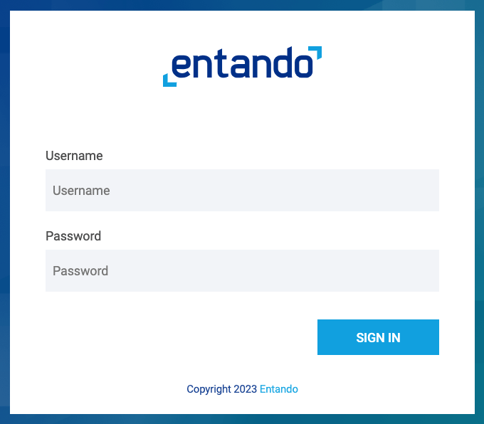
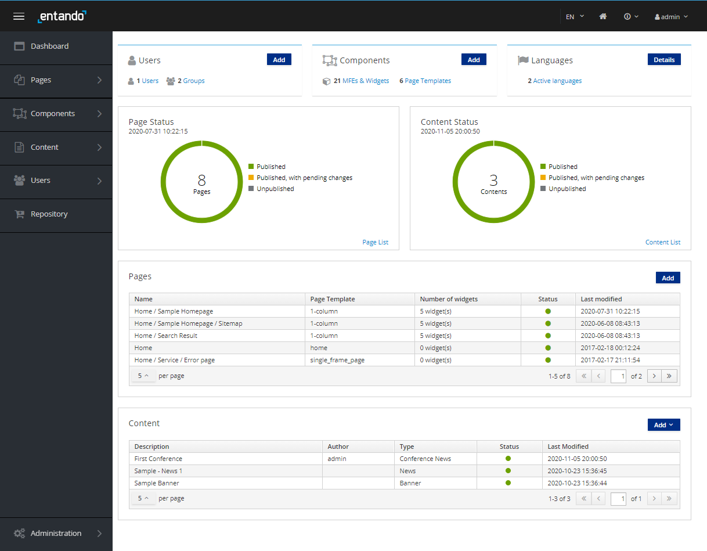

# Getting Started with Entando

You have two options for getting started with Entando.
1. [Automatically install Entando via the Entando command-line interface (CLI)](#automatic-install). This is the fastest way to start up an Entando application in Kubernetes.
2. [Manually install Entando step by step](#manual-install). This is useful if you're preparing a shared cluster rather than a local developer environment, the CLI defaults don't meet your specific needs, or if you want to customize the deploy itself.


## Automatic Install
The following steps will launch an Ubuntu VM via Multipass, install Kubernetes, and then deploy Entando to it.

1. Install [Multipass](https://multipass.run/#install)
``` http request
https://multipass.run/#install
```
2. Install Entando into Kubernetes on Ubuntu using the [Entando CLI](../reference/entando-cli.md)

```sh
curl -sfL https://get.entando.org | bash
```

3. The progress of the install will be displayed on the console and can take 10 minutes or so depending on the time needed to download the Docker images. The sequence of steps matches the manual steps below. It can be useful to review those steps to help understand what the CLI is doing.
4. Once complete, the installer will give you the URL to access the `Entando App Builder`.
5. Login with username:`admin` and password: `adminadmin`. See the [Log in to Entando](#log-in-to-entando) section for more information and next steps.

## Manual Install

This in-depth guide takes a learn-as-you-go approach, and will give you a working knowledge of Kubernetes as you get Entando up and running in a local environment.

1. [Install Kubernetes](#install-kubernetes)
2. [Prepare Kubernetes Environment](#prepare-kubernetes)
3. [Deploy Entando](#deploy-entando)

Note: For advanced or long-time Entando users, check out our [Quick Reference](quick-reference) install guide with just the steps.

Since Entando is designed to run on Kubernetes, let's get started by installing our own instance of Kubernetes locally.

We've tested a variety of Kubernetes implementations including Minikube, Minishift, CodeReady Containers, K3s, and Microk8s to find the best combination of low cpu/memory usage, fast startup times, and minimal configuration so we can get started quickly. After downloading the necessary files, we'll have our own instance of Kubernetes up and running in < 60 seconds.

::: tip What's Needed to Run Kubernetes?
Kubernetes is a container orchestrator designed to manage a server cluster. It requires at least one master node running a Linux OS. We'll be using Multipass to create a lightweight Ubuntu VM in seconds that runs on a bare metal hypervisor for speed and performance.
:::

### Install Kubernetes

#### Enable Hypervisor
::: tip Why a Hypervisor?
Hypervisors allow you to create and run virtual machines. Virtualization software that run on top of your operating system like VirtualBox or VMWare Workstation are Type 2 hypervisors. Type 1 hypervisors run on bare metal.
:::

Let's install a bare metal hypervisor for optimal performance.

**Mac:** Install `hyperkit`.

``` bash
brew install hyperkit
```

**Windows:** [Install Hyper-V](https://docs.microsoft.com/en-us/virtualization/hyper-v-on-windows/quick-start/enable-hyper-v?redirectedfrom=MSDN)

---

<details><summary>What if my machine doesn't support hyperkit or Hyper-V?</summary>

Use a Type 2 hypervisor that runs on top of your operating system:

- Install Virtual Box:
[Mac](https://multipass.run/docs/installing-on-macos)
[Windows](https://multipass.run/docs/installing-on-windows)

</details>

---

<br>

#### Launch Ubuntu VM

::: tip Why Multipass?
Multipass is a cross-platform tool developed by the publishers of Ubuntu to create lightweight Ubuntu VMs in seconds.
:::

1. Install [Multipass](https://multipass.run/#install)

2. Launch VM

``` bash
multipass launch --name ubuntu-lts --cpus 4 --mem 8G --disk 20G
```

3. Open a shell

``` bash
multipass shell ubuntu-lts
```

#### Run Kubernetes

::: tip Why K3s?
K3s is a certified Kubernetes distribution designed for production workloads in resource-constrained environments.

It's packaged as a single <40MB binary that reduces the dependencies and steps needed to install, run and auto-update a production Kubernetes cluster.
:::

1. Install `k3s`

``` bash
curl -sfL https://get.k3s.io | sh -
```

2. Check for `Ready` `STATUS`.

``` bash
sudo kubectl get node
```

---

<details><summary>What's running out of the box?</summary>

``` bash
sudo kubectl get pods -A
```

</details>

---

::: tip Congratulations!
You now have a local instance of Kubernetes up and running.
:::

Now that Kubernetes is running, you can setup kubectl to send commands directly to k3s from the host machine rather than from within the VM. See the instructions [here](https://rancher.com/docs/k3s/latest/en/cluster-access/).

### Prepare Kubernetes

To install Entando, we'll add `Custom Resources`, create a `Namespace`, download a `Helm` chart, and configure external access to our cluster.

#### Create Namespace

::: tip What are Namespaces?
Kubernetes supports multiple virtual clusters backed by the same physical cluster. These virtual clusters are called [namespaces.](https://kubernetes.io/docs/concepts/overview/working-with-objects/namespaces/)

You can use namespaces to allocate resources and set cpu/memory limits for individual projects or teams. They can also encapsulate projects from one another.
:::

``` bash
sudo kubectl create namespace entando
```

#### Add Custom Resources

::: tip Why Custom Resources?
Standard resources in Kubernetes include things like `Pods`, which are groups of one or more containers, `Services`, the way to call or access your pods, and `Ingresses`, for managing external access to your cluster.

[Custom resources](https://kubernetes.io/docs/concepts/extend-kubernetes/api-extension/custom-resources/) let you store and retrieve structured data. Combining a custom resource with a custom controller allows you to define a desired state to automate the running of your applications or services in a Kubernetes cluster.
:::

Examples of custom resources in Entando are:

- `Entando App Engine`
- `Entando Identity Management System`

From your Ubuntu shell:

1. Download and install custom resource definitions.

``` bash
sudo kubectl apply -f https://raw.githubusercontent.com/entando/entando-releases/v6.3.2/dist/ge-1-1-6/namespace-scoped-deployment/cluster-resources.yaml
```

2. Install namespace scoped resources

``` bash
sudo kubectl apply -n entando -f https://raw.githubusercontent.com/entando/entando-releases/v6.3.2/dist/ge-1-1-6/namespace-scoped-deployment/orig/namespace-resources.yaml
```

#### Download Helm Chart

::: tip What is Helm?
Helm is a package manager for Kubernetes that helps you define, install, and upgrade Kubernetes applications.
This _Getting Started_ guide uses a Helm-generated file with a number of default values to help get you started faster,
e.g. use embedded databases, exclude OpenShift support, etc. If you want to change any of those defaults please see <https://github.com/entando-k8s/entando-helm-quickstart>.
:::

1. Install Helm

``` bash
sudo snap install helm --classic
```

2. Download the Entando helm template

``` bash
curl -sfL https://github.com/entando-k8s/entando-helm-quickstart/archive/v6.3.2.tar.gz | tar xvz
```

#### Configure Access to Your Cluster

::: tip What about Networking?
Entando sets up [`Ingresses`](https://kubernetes.io/docs/concepts/services-networking/ingress/) in Kubernetes to expose HTTP routes from outside the cluster to services within the cluster. We'll use this to access Entando from a local browser.

If you run into network issues during startup or if you are using Windows for your local development instance, please see [the tips](../reference/local-tips-and-tricks.md#network-issues). Symptoms can include having Entando fail to completely start the first time or a working Entando installation may fail to restart later.
:::

To set up external access to your cluster, you'll need to replace the value of
`entando.default.routing.suffix` with your Ubuntu IP.

1. Get the IP address of your Ubuntu VM

``` bash
hostname -I | awk '{print $1}'
```

2. Save that value for the deployment steps below

### Deploy Entando

To speed up the _Getting Started_ environment, embedded databases are used by default for these components.
See [this tutorial](../../tutorials/devops/default-database.md) for more information on how to change your
database connection.


1. Enter the helm quickstart directory

``` bash
cd entando-helm-quickstart-6.3.2
```

2. Edit the file in `sample-configmaps/entando-operator-config.yaml` and uncomment the value for `entando.default.routing.suffix:` and set the value to the IP address of your Ubuntu VM plus `.nip.io`. For example, `entando.default.routing.suffix: 192.168.64.21.nip.io`. Pay attention to yaml spacing.

3. Deploy your config map

``` bash
sudo kubectl apply -f sample-configmaps/entando-operator-config.yaml  -n entando
```

4. Run helm and deploy your Entando application

``` bash
sudo helm template quickstart ./ | sudo kubectl apply -n entando -f -
```

---

5. Use the `get pods --watch` command to observe Entando starting up.

``` bash
sudo kubectl -n entando get pods --watch
```

<details><summary>What does a successful startup look like?</summary>

- First, you'll see the Entando operator: `ContainerCreating` > `Running`
- Next, the Entando composite app deployer: `Pending` > `ContainerCreating` > `Running`
- Then, Keycloak: `kc-deployer` > `kc-db-deployment`

**Jobs / Deployments**
- Jobs, like `kc-db-preparation-job` run once, and are `Completed`: `0/1`
- Database deployments, like `kc-db-deployment`, should end up as `Running`: `1/1`
- The Keycloak server deployment `kc-server-deployment`, should end up as `Running`: `1/1`
- The deployment is done when the `quickstart-composite-app-deployer` pod has a status of completed  

**Lifecycle Events**
- Each line represents an event: `Pending`, `ContainerCreating`, `Running` or `Completed`
- Restarts should ideally be `0`; otherwise, there was a problem with your cluster, and Kubernetes is trying to self-heal

``` shell-session
ubuntu@test-vm:~$ sudo kubectl get pods -n entando --watch
NAME                                   READY   STATUS              RESTARTS   AGE
NAME                                     READY   STATUS              RESTARTS   AGE
entando-operator-5cdf787869-t5xrg        1/1     Running             0          65s
quickstart-composite-app-deployer-0547   1/1     Running             0          8s
quickstart-kc-deployer-7879              0/1     ContainerCreating   0          2s
quickstart-kc-deployer-7879              1/1     Running             0          2s
quickstart-kc-server-deployment-5f9d7897c6-7jnq5   0/1     Pending             0          0s
quickstart-kc-server-deployment-5f9d7897c6-7jnq5   0/1     Pending             0          3s
quickstart-kc-server-deployment-5f9d7897c6-7jnq5   0/1     ContainerCreating   0          3s
quickstart-kc-server-deployment-5f9d7897c6-7jnq5   0/1     Running             0          5s
quickstart-kc-server-deployment-5f9d7897c6-7jnq5   0/1     Running             0          99s
quickstart-kc-server-deployment-5f9d7897c6-7jnq5   1/1     Running             0          107s
quickstart-kc-deployer-7879                        0/1     Completed           0          2m16s
quickstart-kc-deployer-7879                        0/1     Terminating         0          2m16s
quickstart-kc-deployer-7879                        0/1     Terminating         0          2m16s
quickstart-eci-deployer-7439                       0/1     Pending             0          0s
quickstart-eci-deployer-7439                       0/1     Pending             0          0s
quickstart-eci-deployer-7439                       0/1     ContainerCreating   0          0s
quickstart-eci-deployer-7439                       1/1     Running             0          2s
quickstart-eci-k8s-svc-deployment-699b47595d-wxmmb   0/1     Pending             0          0s
quickstart-eci-k8s-svc-deployment-699b47595d-wxmmb   0/1     Pending             0          0s
quickstart-eci-k8s-svc-deployment-699b47595d-wxmmb   0/1     ContainerCreating   0          0s
quickstart-eci-k8s-svc-deployment-699b47595d-wxmmb   0/1     Running             0          2s
quickstart-eci-k8s-svc-deployment-699b47595d-wxmmb   0/1     Running             0          35s
quickstart-eci-k8s-svc-deployment-699b47595d-wxmmb   1/1     Running             0          43s
quickstart-eci-deployer-7439                         0/1     Completed           0          51s
quickstart-eci-deployer-7439                         0/1     Terminating         0          52s
quickstart-eci-deployer-7439                         0/1     Terminating         0          52s
quickstart-deployer-2922                             0/1     Pending             0          0s
quickstart-deployer-2922                             0/1     Pending             0          0s
quickstart-deployer-2922                             0/1     ContainerCreating   0          0s
quickstart-deployer-2922                             1/1     Running             0          1s
quickstart-server-deployment-75bb794647-bt6xk        0/1     Pending             0          0s
quickstart-server-deployment-75bb794647-bt6xk        0/1     Pending             0          3s
quickstart-server-deployment-75bb794647-bt6xk        0/1     ContainerCreating   0          3s
quickstart-server-deployment-75bb794647-bt6xk        0/1     Running             0          4s
quickstart-server-deployment-75bb794647-bt6xk        0/1     Running             0          2m19s
quickstart-server-deployment-75bb794647-bt6xk        1/1     Running             0          2m21s
quickstart-ab-deployment-7d78b79c-q7r6z              0/1     Pending             0          0s
quickstart-ab-deployment-7d78b79c-q7r6z              0/1     Pending             0          0s
quickstart-ab-deployment-7d78b79c-q7r6z              0/1     ContainerCreating   0          0s
quickstart-ab-deployment-7d78b79c-q7r6z              0/1     Running             0          1s
quickstart-ab-deployment-7d78b79c-q7r6z              0/1     Running             0          12s
quickstart-ab-deployment-7d78b79c-q7r6z              1/1     Running             0          15s
quickstart-cm-deployment-86bc545b6f-vtg2c            0/1     Pending             0          0s
quickstart-cm-deployment-86bc545b6f-vtg2c            0/1     Pending             0          3s
quickstart-cm-deployment-86bc545b6f-vtg2c            0/1     ContainerCreating   0          3s
quickstart-cm-deployment-86bc545b6f-vtg2c            0/1     Running             0          5s
quickstart-cm-deployment-86bc545b6f-vtg2c            0/1     Running             0          98s
quickstart-cm-deployment-86bc545b6f-vtg2c            1/1     Running             0          99s
quickstart-deployer-2922                             0/1     Completed           0          4m28s
quickstart-deployer-2922                             0/1     Terminating         0          4m29s
quickstart-deployer-2922                             0/1     Terminating         0          4m29s
quickstart-composite-app-deployer-0547               0/1     Completed           0          7m44s
quickstart-composite-app-deployer-0547               0/1     Terminating         0          8m13s
quickstart-composite-app-deployer-0547               0/1     Terminating         0          8m13s
```

</details>

---

Press `Ctrl-C` to exit the watch command once everything is up and running.

---

<details><summary>What pods come out of the box?</summary>

``` bash
sudo kubectl get pods -n entando
```

``` shell-session
NAME                                                 READY   STATUS    RESTARTS   AGE
entando-operator-5cdf787869-t5xrg                    1/1     Running   0          10m
quickstart-kc-server-deployment-5f9d7897c6-7jnq5     1/1     Running   0          9m20s
quickstart-eci-k8s-svc-deployment-699b47595d-wxmmb   1/1     Running   0          7m2s
quickstart-server-deployment-75bb794647-bt6xk        1/1     Running   0          6m10s
quickstart-ab-deployment-7d78b79c-q7r6z              1/1     Running   0          3m48s
quickstart-cm-deployment-86bc545b6f-vtg2c            1/1     Running   0          3m30s

```

</details>

---

Get the URL to access Entando from your local browser.

``` bash
sudo kubectl get ingress -n entando -o jsonpath='{.items[2].spec.rules[*].host}{.items[2].spec.rules[*].http.paths[1].path}{"\n"}'
```

- Example URL:

``` bash
quickstart-entando.192.168.64.33.nip.io/app-builder/
```

---

## Log in to Entando

Now that we've installed Entando, let's log in to the `Entando App Builder`.



- Username: `admin`
- Password: `adminadmin`

After login, change your password to activate your account.

- Note: If the login process hangs for more than 5 seconds, refresh the browser.



The App Builder is where we'll compose our micro frontends alongside CMS pages and content.

::: tip Congratulations!
We now have Entando up and running on Kubernetes in our local environment.
:::

---
## Next Steps
Choose one of the following actions to continue your journey with Entando!

* **Build Your First Application:** Use the [Welcome Wizard](./welcome-wizard.md) to build your first application via guided prompts.

* **Try a Tutorial:** Take advantage of the [Learning Paths](../../tutorials/#learning-paths) which organize a few of the most popular tutorials by user type.

* **Dig Deeper into Entando Concepts:** Review the [Docs](../) sections to more deeply understand the Entando building blocks.

* **Learn about the Quickstart Environment:** See the [Quickstart Tips](../reference/local-tips-and-tricks.md) for more information on how to manage your Getting Started or quickstart environment.  

---
