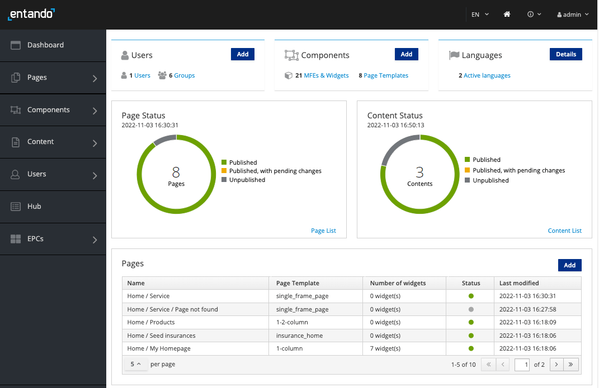

# Getting Started with Entando


::: warning
**Mac:** Entando 7 is not currently compatible with the Apple M1 ARM64 architecture found in some newer Macs.
:::

## Try Entando

Set up Entando using two simple steps or install manually for your specific needs. Then try the platform with a simple widget or walk through the **Welcome Wizard** in our App Builder. For a more in-depth experience, check out our **Standard Banking Demo**.

* [Automatic Install](#automatic-install): The fastest way to locally install and start up Entando in Kubernetes.
* [Manual Install](#manual-install): Useful if you want a shared cluster or a custom local instance.
   
Once you're setup, check out:
- [Build a simple Bundle and create an App](../../tutorials/create/pb/publish-simple-bundle.md)
- [Welcome Wizard](../compose/welcome-wizard.md)
- [Install our Standard Banking Demo](../../tutorials/solution/install-standard-demo.md)

## Learn about Entando

Learn about what Entando can do top down or explore the elements that make developing applications on Kubernetes faster and easier.

* [Introduction to Entando ](../)	
* [Learning Paths](../../tutorials/#learning-paths)
* [Concepts Overview](../getting-started/concepts-overview.md)

## Automatic Install
Automatically install Entando via the Entando command-line interface (CLI) and prepare a local developer environment with default settings.
The following steps launch an Ubuntu VM via Multipass, install Kubernetes, then deploy Entando to it.

1. Install [Multipass](https://multipass.run/#install)
``` http request
https://multipass.run/#install
```
2. Install Entando into Kubernetes on Ubuntu using the [Entando CLI](../reference/entando-cli.md)

```sh
curl -sfL https://get.entando.org | bash
```

3. The progress of the install will be displayed on the console. Installation can take 10+ minutes depending on how long the Docker images take to download. The sequence of steps performed by the CLI is identical to the manual steps below; to understand what the CLI does, review the manual steps.
4. The URL to access the `Entando App Builder` will print to the console once the install completes.
5. Login with username:`admin` and password: `adminadmin`. Refer to [Log in to Entando](#log-in-to-entando) for more information and next steps.

## Manual Install

Manual installation allows you to configure a shared cluster or customize a local developer environment. The following learn-as-you-go approach gives you a working knowledge of Kubernetes as you get Entando up and running in a local environment. This is a three stage process:

1. [Install Kubernetes](#install-kubernetes)
2. [Prepare the Kubernetes Environment](#prepare-kubernetes)
3. [Deploy Entando](#deploy-entando)


We've tested a variety of Kubernetes implementations, including Minikube, Minishift, CodeReady Containers, K3s, and Microk8s, to find the optimal combination of low CPU/memory usage, fast startup times, and minimal configuration. After downloading the necessary files, we'll have our own instance of Kubernetes up and running in <60 seconds.

::: tip What's Needed to Run Kubernetes?
Kubernetes is a container orchestrator designed to manage a server cluster. It requires at least one master node running a Linux OS. A lightweight Ubuntu virtual machine can be created in seconds with Multipass. Choosing a Type 1 hypervisor eliminates a guest OS, maximizing speed and performance.
:::

### Install Kubernetes

#### Enable Hypervisor
::: tip Why a Hypervisor?
Hypervisors allow you to create and run virtual machines. Virtualization software that run on top of your operating system like VirtualBox or VMWare Workstation are Type 2 hypervisors. Type 1 hypervisors run on bare metal.
:::

Install a Type 1 hypervisor for optimal performance.

**Mac:** Install `hyperkit`

``` bash
brew install hyperkit
```

**Windows:** [Install Hyper-V](https://docs.microsoft.com/en-us/virtualization/hyper-v-on-windows/quick-start/enable-hyper-v?redirectedfrom=MSDN)

---

<details><summary>What if my machine doesn't support hyperkit or Hyper-V?</summary>

Install a Type 2 hypervisor that runs on top of your operating system.

- Install Virtual Box:
[Mac](https://multipass.run/docs/installing-on-macos)
[Windows](https://multipass.run/docs/installing-on-windows)

</details>

---

<br>

#### Launch an Ubuntu VM

::: tip Why Multipass?
Multipass is a cross-platform tool developed by the publishers of Ubuntu to create lightweight Ubuntu VMs in seconds.
:::

1. Install [Multipass](https://multipass.run/#install)

2. Launch a VM

``` bash
multipass launch --name ubuntu-lts --cpus 4 --mem 8G --disk 20G
```

3. Open a VM shell

``` bash
multipass shell ubuntu-lts
```

#### Run Kubernetes

::: tip Why K3s?
K3s is a certified Kubernetes distribution designed for production workloads in resource-constrained environments.

It's packaged as a single <50MB binary that reduces the dependencies and steps required to install, run and auto-update a production Kubernetes cluster.
:::

1. Install the version of `K3s` supported by Entando 7.0. Note that this is not the latest version of K3s.

``` bash
curl -sfL https://get.k3s.io | INSTALL_K3S_CHANNEL="v1.21.10+k3s1" sh -
```

2. Check that the cluster `STATUS` is `Ready`.

``` bash
sudo kubectl get node
```

---

<details><summary>What's running out of the box?</summary>

``` bash
sudo kubectl get pods -A
```

</details>

---

::: tip Congratulations!
You now have a local instance of Kubernetes up and running.
:::

Now that Kubernetes is running, you can set up kubectl to send commands directly to K3s from the host machine, rather than from within the VM. See the instructions [here](https://rancher.com/docs/k3s/latest/en/cluster-access/).

### Prepare Kubernetes

To install Entando, we'll add `Custom Resources`, create a `Namespace` and configure external access to our cluster.

#### Create a Namespace

::: tip What are Namespaces?
Kubernetes supports multiple virtual clusters backed by the same physical cluster. These virtual clusters are called [namespaces](https://kubernetes.io/docs/concepts/overview/working-with-objects/namespaces/).

You can use namespaces to allocate resources and set CPU/memory limits for individual projects or teams. Namespaces can also encapsulate projects from one another.
:::

``` bash
sudo kubectl create namespace entando
```

#### Add Custom Resources

::: tip Why Custom Resources?
Standard resources in Kubernetes include `Pods`, which are groups of one or more containers, `Services` to call or access pods, and `Ingresses` sto enable external access to services.

[Custom resources](https://kubernetes.io/docs/concepts/extend-kubernetes/api-extension/custom-resources/) let you store and retrieve structured data. Combining a custom resource with a custom controller allows you to define a desired state to automate how your applications or services run in a Kubernetes cluster.
:::

Examples of custom resources in Entando are:

- the `Entando App Engine`
- the `Entando Identity Management System`

From your Ubuntu shell

1. Download and install custom resource definitions.

```
curl -sLO "https://raw.githubusercontent.com/entando-k8s/entando-k8s-operator-bundle/v7.0.0-pre4/manifests/k8s-116-and-later/namespace-scoped-deployment/cluster-resources.yaml"

sudo kubectl apply -f "cluster-resources.yaml"
```

2. Install namespace scoped resources.

``` bash
sudo kubectl apply -n entando -f https://raw.githubusercontent.com/entando-k8s/entando-k8s-operator-bundle/v7.0.0-pre4/manifests/k8s-116-and-later/namespace-scoped-deployment/namespace-resources.yaml
```
#### Configure Access to Your Cluster

::: tip What about Networking?
Entando sets up [`Ingresses`](https://kubernetes.io/docs/concepts/services-networking/ingress/) in Kubernetes to expose HTTP routes from outside the cluster to services within the cluster. This is used to access Entando from a local browser.

If you run into network issues during startup, or if you are using Windows for your local development instance, please refer to [network issues](../reference/local-tips-and-tricks.md#network-issues). Symptoms can include Entando failing to completely start for the first time or a working Entando instance failing to restart later.
:::

To set up external access to your cluster, you need to specify your Ubuntu IP.

1. Return the IP address of your Ubuntu VM.

``` bash
hostname -I | awk '{print $1}'
```

2. Create a file named `entandoapp.yaml`.

``` bash
touch entandoapp.yaml
```

2. Add the following content to `entandoapp.yaml`. Replace YOUR-IP-ADDRESS with the domain of your VM.

```
apiVersion: entando.org/v1
kind: EntandoApp
metadata:
  namespace: entando
  name: quickstart
spec:
  environmentVariables: []
  entandoAppVersion: '6.4'
  dbms: embedded
  ingressHostName: quickstart.YOUR-IP-ADDRESS.nip.io
  standardServerImage: wildfly
  replicas: 1
```

::: tip Embedded Databases
To speed up the _Getting Started_ environment, embedded databases are used by default for these components.
See [this tutorial](../../tutorials/devops/default-database.md) for more information on how to change your
database connection.
:::
### Deploy Entando


Deploy Entando by applying `entandoapp.yaml` to your namespace.

```
sudo kubectl apply -f "entandoapp.yaml" -n entando
```

---

Use the `get pods --watch` command to observe Entando starting up.

``` bash
sudo kubectl -n entando get pods --watch
```

<details><summary>What does a successful startup look like?</summary>

- First, you'll see the Entando operator: `ContainerCreating` > `Running`
- Next, the Entando composite app deployer: `Pending` > `ContainerCreating` > `Running`
- Then, Keycloak: `kc-deployer` > `kc-db-deployment`

**Jobs / Deployments**
- Jobs, like `kc-db-preparation-job`, run once and are `Completed`: `0/1`
- Database deployments, like `kc-db-deployment`, should end up as `Running`: `1/1`
- The Keycloak server deployment, `kc-server-deployment`, should end up as `Running`: `1/1`
- The deployment is done when the `quickstart-composite-app-deployer` pod has a status of `Completed`  

**Lifecycle Events**
- Each line represents an event: `Pending`, `ContainerCreating`, `Running` or `Completed`
- Restarts should ideally be `0`; otherwise, there was a problem with your cluster, and Kubernetes is trying to self-heal

``` shell-session
ubuntu@test-vm:~$ sudo kubectl get pods -n entando --watch
NAME                                   READY   STATUS              RESTARTS   AGE
NAME                                     READY   STATUS              RESTARTS   AGE
entando-operator-5cdf787869-t5xrg        1/1     Running             0          65s
quickstart-composite-app-deployer-0547   1/1     Running             0          8s
quickstart-kc-deployer-7879              0/1     ContainerCreating   0          2s
quickstart-kc-deployer-7879              1/1     Running             0          2s
quickstart-kc-server-deployment-5f9d7897c6-7jnq5   0/1     Pending             0          0s
quickstart-kc-server-deployment-5f9d7897c6-7jnq5   0/1     Pending             0          3s
quickstart-kc-server-deployment-5f9d7897c6-7jnq5   0/1     ContainerCreating   0          3s
quickstart-kc-server-deployment-5f9d7897c6-7jnq5   0/1     Running             0          5s
quickstart-kc-server-deployment-5f9d7897c6-7jnq5   0/1     Running             0          99s
quickstart-kc-server-deployment-5f9d7897c6-7jnq5   1/1     Running             0          107s
quickstart-kc-deployer-7879                        0/1     Completed           0          2m16s
quickstart-kc-deployer-7879                        0/1     Terminating         0          2m16s
quickstart-kc-deployer-7879                        0/1     Terminating         0          2m16s
quickstart-eci-deployer-7439                       0/1     Pending             0          0s
quickstart-eci-deployer-7439                       0/1     Pending             0          0s
quickstart-eci-deployer-7439                       0/1     ContainerCreating   0          0s
quickstart-eci-deployer-7439                       1/1     Running             0          2s
quickstart-eci-k8s-svc-deployment-699b47595d-wxmmb   0/1     Pending             0          0s
quickstart-eci-k8s-svc-deployment-699b47595d-wxmmb   0/1     Pending             0          0s
quickstart-eci-k8s-svc-deployment-699b47595d-wxmmb   0/1     ContainerCreating   0          0s
quickstart-eci-k8s-svc-deployment-699b47595d-wxmmb   0/1     Running             0          2s
quickstart-eci-k8s-svc-deployment-699b47595d-wxmmb   0/1     Running             0          35s
quickstart-eci-k8s-svc-deployment-699b47595d-wxmmb   1/1     Running             0          43s
quickstart-eci-deployer-7439                         0/1     Completed           0          51s
quickstart-eci-deployer-7439                         0/1     Terminating         0          52s
quickstart-eci-deployer-7439                         0/1     Terminating         0          52s
quickstart-deployer-2922                             0/1     Pending             0          0s
quickstart-deployer-2922                             0/1     Pending             0          0s
quickstart-deployer-2922                             0/1     ContainerCreating   0          0s
quickstart-deployer-2922                             1/1     Running             0          1s
quickstart-server-deployment-75bb794647-bt6xk        0/1     Pending             0          0s
quickstart-server-deployment-75bb794647-bt6xk        0/1     Pending             0          3s
quickstart-server-deployment-75bb794647-bt6xk        0/1     ContainerCreating   0          3s
quickstart-server-deployment-75bb794647-bt6xk        0/1     Running             0          4s
quickstart-server-deployment-75bb794647-bt6xk        0/1     Running             0          2m19s
quickstart-server-deployment-75bb794647-bt6xk        1/1     Running             0          2m21s
quickstart-ab-deployment-7d78b79c-q7r6z              0/1     Pending             0          0s
quickstart-ab-deployment-7d78b79c-q7r6z              0/1     Pending             0          0s
quickstart-ab-deployment-7d78b79c-q7r6z              0/1     ContainerCreating   0          0s
quickstart-ab-deployment-7d78b79c-q7r6z              0/1     Running             0          1s
quickstart-ab-deployment-7d78b79c-q7r6z              0/1     Running             0          12s
quickstart-ab-deployment-7d78b79c-q7r6z              1/1     Running             0          15s
quickstart-cm-deployment-86bc545b6f-vtg2c            0/1     Pending             0          0s
quickstart-cm-deployment-86bc545b6f-vtg2c            0/1     Pending             0          3s
quickstart-cm-deployment-86bc545b6f-vtg2c            0/1     ContainerCreating   0          3s
quickstart-cm-deployment-86bc545b6f-vtg2c            0/1     Running             0          5s
quickstart-cm-deployment-86bc545b6f-vtg2c            0/1     Running             0          98s
quickstart-cm-deployment-86bc545b6f-vtg2c            1/1     Running             0          99s
quickstart-deployer-2922                             0/1     Completed           0          4m28s
quickstart-deployer-2922                             0/1     Terminating         0          4m29s
quickstart-deployer-2922                             0/1     Terminating         0          4m29s
quickstart-composite-app-deployer-0547               0/1     Completed           0          7m44s
quickstart-composite-app-deployer-0547               0/1     Terminating         0          8m13s
quickstart-composite-app-deployer-0547               0/1     Terminating         0          8m13s
```

</details>

---

Press `Ctrl-C` to exit the watch command once everything is up and running.

---

<details><summary>What pods come out of the box?</summary>

``` bash
sudo kubectl get pods -n entando
```

``` shell-session
NAME                                                 READY   STATUS    RESTARTS   AGE
entando-operator-5cdf787869-t5xrg                    1/1     Running   0          10m
quickstart-kc-server-deployment-5f9d7897c6-7jnq5     1/1     Running   0          9m20s
quickstart-eci-k8s-svc-deployment-699b47595d-wxmmb   1/1     Running   0          7m2s
quickstart-server-deployment-75bb794647-bt6xk        1/1     Running   0          6m10s
quickstart-ab-deployment-7d78b79c-q7r6z              1/1     Running   0          3m48s
quickstart-cm-deployment-86bc545b6f-vtg2c            1/1     Running   0          3m30s

```

</details>

---

Get the URL to access Entando from your local browser.

``` bash
sudo kubectl get ingress -n entando -o jsonpath='{.items[2].spec.rules[*].host}{.items[2].spec.rules[*].http.paths[1].path}{"\n"}'
```

- Example URL

``` bash
quickstart-entando.192.168.64.33.nip.io/app-builder/
```

---

## Log in to Entando

Now that you've installed Entando, login to the `Entando App Builder`.


- Username: `admin`
- Password: `adminadmin`

After login, change your password to activate your account.

- Note: If the login process hangs for more than 5 seconds, refresh the browser.



The App Builder is where micro frontends are composed alongside CMS pages and content.

::: tip Congratulations!
You now have Entando up and running on Kubernetes in your local environment.
:::

---
## Next Steps
Choose one of the following actions to continue your journey with Entando!

* **Build Your First Application:** Use the [Welcome Wizard](../compose/welcome-wizard.md) to build your first application via guided prompts.

* **Try a Tutorial:** Take advantage of the [Learning Paths](../../tutorials/#learning-paths), which organize a few of the most popular tutorials by user type.

* **Dig Deeper into Entando Concepts:** Review the [Docs](../) sections to more deeply understand the Entando building blocks.

* **Learn about the Quickstart Environment:** See the [Quickstart Tips](../reference/local-tips-and-tricks.md) for more information on how to manage your Getting Started or quickstart environment.  

---
