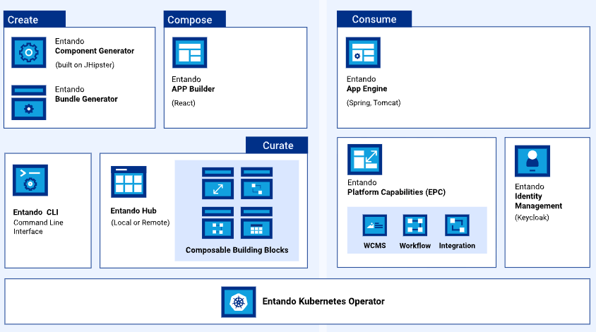
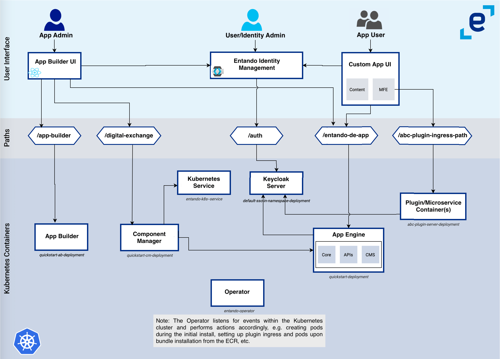

# Entando Architecture Concepts

Entando is an application composition platform (ACP) that simplifies and accelerates enterprise modernization across on-prem and cloud infrastructures. It offers native support for Javascript app development, a micro frontend and microservice architecture, scalable deployments, and automated container orchestration via Kubernetes. 

This document explores the conceptual architecture of the Platform and its runtime characteristics.

- [Key Concepts](#key-concepts)
- [Entando Cluster Elements](#entando-cluster-elements)
- [Entando Ingresses](#entando-ingresses)

## Key Concepts

### Entando Application
A portal, website, web app, or mobile app built with Entando is called an Entando Application.
An Entando Application is an assembly of out-of-the-box and/or custom-built components, called bundles, running on the
Platform. Applications also consist of page templates, WCMS content, content types, and other assets.

### Entando Bundle
An Entando Bundle is a packaged set of components and resources created for the Platform. They are the building blocks of any application built on Entando, consisting of micro frontends, microservices, services and other resources. The Entando Component Manager identifies and installs the bundles to the Local Hub. 

See also: [Bundle Details](../curate/bundle-details.md)

### Entando App Builder
The [Entando App Builder](../compose/app-builder.md) is the application composer of the Platform. It hosts the WCMS and provides a feature-rich, low-code user interface to find and configure components, design and create pages, manage content, and build composable applications.

See also: [Widget Tutorial](../../tutorials/compose/widgets-fragments.md)

### Entando App Engine
The Entando App Engine is the core runtime engine responsible for the primary out-of-the-box services required to develop applications. It exposes the backend APIs used to deliver the page and content management interface of an Entando Application, assembles and coordinates components within the App Builder, and provides the data access layer to persist pages and application design.

See also: [APIs tutorial](../consume/entando-apis.md)

### Entando Component Generator
The Entando Component Generator implements a [JHipster](https://www.jhipster.tech/) blueprint to quickly generate the skeleton of an Entando bundle with automation and templating. The Generator provides advanced data modeling capabilities, including object relational mapping and dynamic creation of micro frontends and microservices. 

See also: [Generate Microservices & Micro Frontends](../../tutorials/create/ms/generate-microservices-and-micro-frontends.md)

### Entando Identity Management System
[Entando Identity Management System](../consume/identity-management.md) is the Platform's [Keycloak](https://www.keycloak.org/)-based user management and authentication system. It applies Single Sign On capabilities across multiple domains to connect service providers with identity providers.

See also: [Entando Authentication](../../tutorials/create/mfe/authentication.md)

### Entando Local Hub 
The [Local Hub](../compose/local-hub-overview.md) is the component repository of the App Builder. Bundles--the basic building block for composing applications on Entando--are catalogued and organized here. The Local Hub also provides direct access to bundles in the Entando Marketplace and the Enterprise Hub, if one exists for the organization, and can be deployed and installed from here.

### Entando WCMS
The Entando Web Content Management System (WCMS) is a lightweight content and digital asset management system. It manages widgets, HTML fragments, and other content types for an Entando Application.

See also: [Content Types](../../tutorials/compose/content-types-tutorial), [Content Templates](../../tutorials/compose/content-templates-tutorial) and [Digital Assets](../../tutorials/compose/digital-assets-tutorial.md)

## Entando Cluster Elements

The following is an overview of the elements comprising an Entando cluster.

### Architecture - Members of the Cluster

This is a diagram of an Entando cluster, depicting how the various elements interact with one another. Entando deploys this infrastructure on Kubernetes using the Entando Operator and controllers. Each element is associated with a custom resource definition (CRD) where applicable.

#### EntandoApp
The EntandoApp is comprised of the App Builder, App Engine and Component Manager. Keycloak-based authorization and authentication enable these to interact with each other and other cluster elements.

#### Entando Component Manager
The purpose of the [Entando Component Manager](../compose/ecm-overview.md) (ECM) is to:
- Provide the functionality to deploy and install micro frontends and widgets
- Manage the connections between an application and the installed microservices

The ECM integrates the Local Hub into the App Builder, listing the bundles accessible from the EntandoApp, and managing their install, uninstall, upgrade, downgrade and tracking processes. The Entando Kubernetes integration service communicates with the cluster to supply these bundle services and is the only service, other than the Entando Operator, that can interact with the cluster and custom resources. 

#### Entando Kubernetes Service
The Entando Kubernetes integration service (`entando-k8s-service`) is a function of the Entando cluster infrastructure custom resource, providing an abstraction layer between Entando microservices and the APIs exposed by Kubernetes. It supplies access points to several custom resources defined by Entando, in particular Entando Applications, plugins, bundles and links. 

The `entando-k8s-service` is used to:
-   Provide a list of the available Entando Bundles to the Entando Component Manager
-   Deploy a microservice, or expose an already available microservice, during the installation of a bundle
-   Create a link between an EntandoApp and an EntandoPlugin to expose microservice APIs to the EntandoApp and micro frontends

#### Entando Plugin
An Entando Plugin is a microservice that exposes APIs reusable by one or more Entando Applications. Plugin services are commonly accessible from micro frontends and can be quickly generated with the [Entando Blueprint](../../tutorials/create/ms/generate-microservices-and-micro-frontends.md). This blueprint-generated project is customizable and provides Keycloak integration, a set of default micro frontends, and microservices exposing APIs.

#### Keycloak
Keycloak is responsible for authorization and authentication. All members of an Entando cluster interact with Keycloak to verify users and service authorizations.

## Entando Ingresses

An ingress is a Kubernetes resource that exposes HTTP and HTTPS paths from outside a cluster to services within it. Traffic routing is controlled by rules defined in the ingress resource.

When deploying a cluster, ingresses are generated for the resources that must be exposed to external services. The Entando Operator and custom resource controllers create the ingresses and set the correct paths and certificates. Entando implements Keycloak and EntandoApp ingresses.
#### Keycloak Ingress
A dedicated ingress is created for Keycloak to expose authentication and authorization functionalities. This is required to guarantee that both token issuing and validation work correctly, even when the services using the Keycloak instance are in different namespaces.

#### EntandoApp Ingress
The EntandoApp ingress is automatically created to expose the App Builder, App Engine and Component Manager. The three containers are served under the same domain, which allows them to interact without cross-origin issues. 

The EntandoApp ingress is also used to link a microservice with an EntandoApp when a bundle containing the microservice is installed via the Local Hub. 

### Default Ingress HTTP Paths

The table below lists the default paths exposed for each ingress.
<table>
<colgroup>
<col width="30%" />
<col width="30%" />
</colgroup>
<thead>
<tr class="header">
<th align="left">Ingress</th>
<th align="left">Ingress Http route</th>
<th align="left">Application</th>
</tr>
</thead>
<tbody>
<tr class="odd">
<td align="left">
Keycloak ingress
</td>
<td align="left">
<code>/auth</code>
</td>
<td align="left">
Keycloak
</td>
</tr>
<tr class="odd">
<td align="left" rowspan="4">
EntandoApp ingress
</td>
<td align="left">
<code>/entando-de-app</code>
</td>
<td align="left">
App Engine
</td>
</tr>
<tr class="even">
<td align="left">
<code>/app-builder/</code>
</td>
<td align="left">
App Builder
</td>
</tr>
<tr class="odd">
<td align="left">
<code>/digital-exchange</code>
</td>
<td align="left">
Entando Component Manager
</td>
</tr>
<tr class="even">
<td align="left">
<code>/plugin-ingressPath</code>
</td>
<td align="left">
Entando Plugin linked to the application
</td>
</tr>
</tbody>
</table>

>Note: The Entando Plugin variable `ingressPath` is defined in the plugin custom resource under the `spec` element and used to expose the plugin within the EntandoApp domain. See also: [Microservice Specifications](../curate/bundle-details.md#microservices-specifications).

### Exposing Microservices in the EntandoApp Domain
A microservice under the same domain (ingress) as the EntandoApp is exposed using the `EntandoAppPluginLink` custom resource and the corresponding controller.

Once the link between the EntandoApp and the microservice is created, the controller reads the link specification. It then automatically creates HTTP paths in the EntandoApp to expose the microservice in the same domain as the App Builder, App Engine and Component Manager. This allows micro frontend developers to reference the microservice using relative URLs.

See also: 
* [Entando Deployment Structure](../reference/deployment-structure.md) 
* [Check Ingresses](../reference/check-ingress.md)
* [Entando Glossary](../reference/glossary.md)

