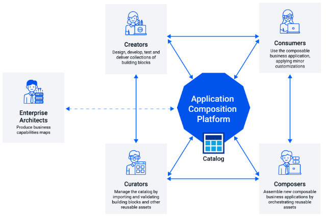

# Development Concepts on Entando
 
On Entando Composition Platform, the development of an application is broken down into modular steps of create, curate, compose, and consume. In the simplest terms, you start by **creating** functional building blocks, **curate** and organize the blocks in a catalogue, **compose** them on a page or website, which is then **consumed** in an app where it can be scaled and improved upon. 

Entando provides a composable environment where these building blocks can be built independently, enabling parallel teams to accelerate development and innovation on a cloud and Kubernetes-native stack.

## Create Components 
The first step in building a modern application on Entando is to design and create each independant component or functional block for your application. Developers can use Entando Component Generator or Blueprint to automate the building and packaging of project files, with the flexibility to customize. In this way, new business capabilities are integrated into your application without overhauling existing systems. 

For more information on how to Create Components on Entando, see the docs below or follow a tutorial:

| Documentation | Tutorials        |
| :------------ | :--------- |
| [Entando Component Generator](../create/component-gen-overview.md) | [Micro Frontends](../../tutorials/create/mfe/) |
| [Entando Blueprint Feature](../create/blueprint-features.md) | [Microservices](../../tutorials/create/ms/generate-microservices-and-micro-frontends.md) |
| [Component Generation Technologies](../create/component-gen-tech.md) | [Build and Publish Project Bundles](../../tutorials/create/pb/publish-project-bundle.md) |

	
## Curate and Share Components 
On the Entando Platform, Curate and Share means developers manage a central catalog of components and share it across an organization. Entando's distributed and composable development process allows you to quickly edit, test, analyze, and publish a singlular component or packaged business capability (PBC) repeatedly, without touching other parts of your application. This includes the ability to guide content, versioning, and metadata through the use of bundles. 

To Curate and Share on Entando, see the docs below or follow a tutorial:
| Documentation | Tutorials        |
| :------------ | :-------- |
| [Bundle and Component Descriptors](../curate/ecr-bundle-details.md) | [Install Bundles from a Private Git Repository](../../tutorials/curate/ecr-private-git-repo.md) |
| [Filtering Bundles](../curate/ecr-bundle-filters.md) | [Install Bundle Plugins from a Private Image Repo](../../tutorials/curate/ecr-private-images.md) |
| [Customize Bundle Info in App Builder](../curate/ecr-bundle-presentation-config.md) |   |
| [Bundle Version and Updates FAQ](../curate/ecr-bundle-versions-faq.md) |  |
| [Bundle Uninstall](../curate/ecr-uninstall-flow.md) |  |

## Compose an Application 
Business IT groups and developers Compose an Application with the Entando App Builder, a low-code composition UI. Assemble or update an application from the components already built in step one, adding templates, widgets, or full PBCs for functionality. The Entando Component Manager and Repository are built in to the App Builder, making the composable process flexible and agile by managing all your components there. 

For more information on Composing an App, see the docs and tutorials below:
| Documentation | Tutorials        |
| :------------ | :-------- |
| [Welcome Wizard](../compose/welcome-wizard.md) | [Page Management](../../tutorials/compose/page-management.md) |
| [Entando Component Repository](../compose/ecr-overview.md) | [Widgets and Fragments](../../tutorials/compose/widgets-fragments.md) |
| [Entando App Builder]<!--(../compose/app-builder.md)--> | [Content Creation](../../tutorials/compose/content-tutorial.md) |
| [Entando Component Manager]<!--(../compose/ecm-overview.md)--> | [Content Templates](../../tutorials/compose/content-templates-tutorial.md)  |
|  | [Digital Assets](../../tutorials/compose/digital-assets-tutorial.md) |

## Consume an Application 
When the end-user interacts with an application, the Consume step provides an opportunity to monitor, analyze and enhance each building block. On Entando, the modular capability allows organizations to scale the app accordingly. This is the last step in the continuous process of composable apps, where feedback to creators and composers is built in. This means adding or editing web content, changing engine rules, or managing processes and useage are done independently and upgrades are responsive. 

| Documentation | Tutorials        |
| :------------ | :-------- |
| [Accessibility](../consume/accessibility.md) | [External Identity Management System](../../tutorials/devops/external-id-management.md) |
| [Entando Operator](../consume/operator-intro.md) | [Add REST API](../../tutorials/devops/add-rest-api.md) |
| [Entando APIs](../consume/entando-apis.md) | [Invoke Entando core APIs](../../tutorials/devops/build-core-image.md) |
| [Custom Resources](../consume/custom-resources.md) | [Change Default Datasource](../../tutorials/devops/change-default-datasource.md) |
| [Entando Identity Management System](../consume/identity-management.md) |  |

