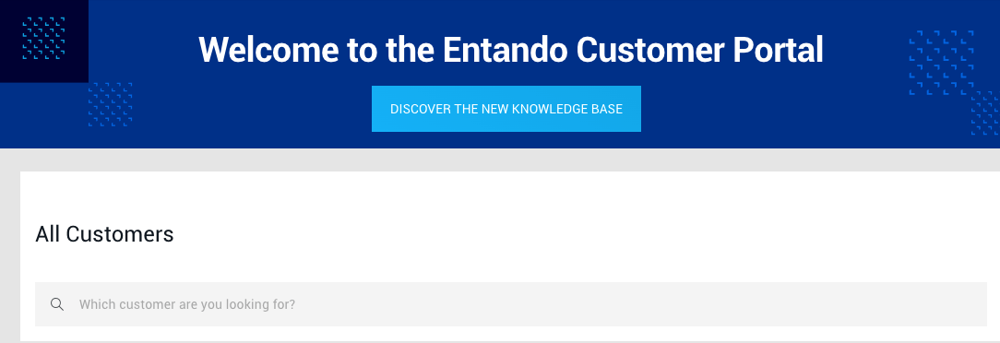
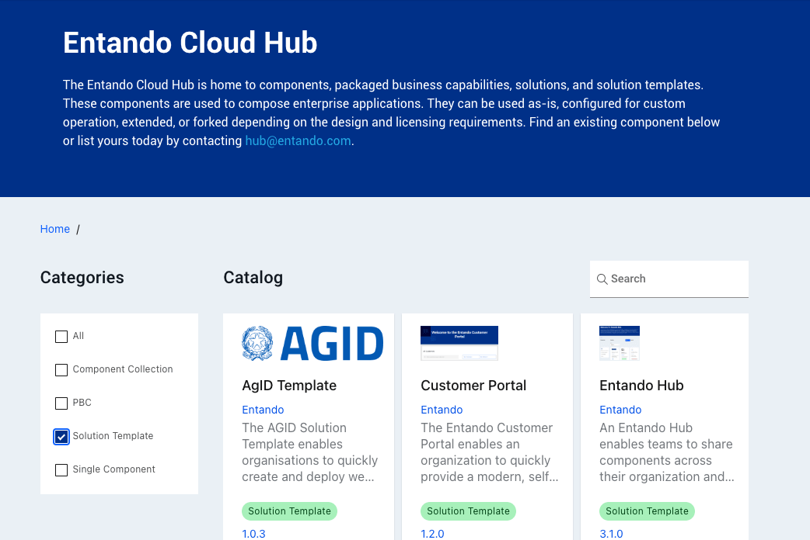

# Entando Solution Templates 

The Entando Application Composition Platform offers several Solution Templates to demonstrate various business capabilities and integrations:

- [**Entando Customer Portal**](../../tutorials/solution/customer-portal.md)
- [**Entando Hub**](../../tutorials/solution/entando-hub.md)
- [**Entando Process Driven Applications Plugin**](../../tutorials/solution/pda-tutorial.md)
- [**Entando Standard Banking Demo**](../../tutorials/solution/install-standard-demo.md)

Each open source Solution Template was built with Entando and can be used as-is, reviewed for common development practices, or leveraged as a useful starting point for a related application. 

The following Solution Templates and other sets of components are available in the [public Entando Hub](https://hub.entando.com) for installation in a user environment, where turnkey functionality can be customized and extended.

## Entando Customer Portal

The [Entando Customer Portal](../../tutorials/solution/customer-portal.md) streamlines development of a customer-facing, self-service subscription management application. The Platform integrates Keycloak role based access control and Jira Service Management as a ticket tracking system.

## Entando Hub

The [Entando Hub](../../tutorials/solution/entando-hub.md) empowers a team to share and collaborate on proprietary or Entando open source components. Capabilities, versions and metadata can be transparently analyzed, managed and published.

[Entando Hub Details](../../docs/curate/hub-details.md)  
[Entando Hub Installation and User Guide](../../tutorials/solution/entando-hub.md)

## Entando Process Driven Applications Plugin

The [Entando Process Driven Applications Plugin](../../tutorials/solution/pda-tutorial.md) provides a comprehensive and versatile automation scheme for Business Process Management. It comprises a custom UX layer, a Spring Boot Backend for Frontend microservice interface, and integration with the [Red Hat Process Automation Manager](https://www.redhat.com/en/technologies/jboss-middleware/process-automation-manager).

## Entando Standard Banking Demo

The [Entando Standard Banking Demo](../../tutorials/solution/install-standard-demo.md) showcases the benefits and possibilities of a composable application built from modular components. The example banking environment integrates a transaction table, sign up form, alert icon, and summary cards to demonstrate MFE communication and capabilities. Prominent features include Keycloak role based access control, coexistence of React and Angular MFEs, and pluggable Spring Boot microservices.

