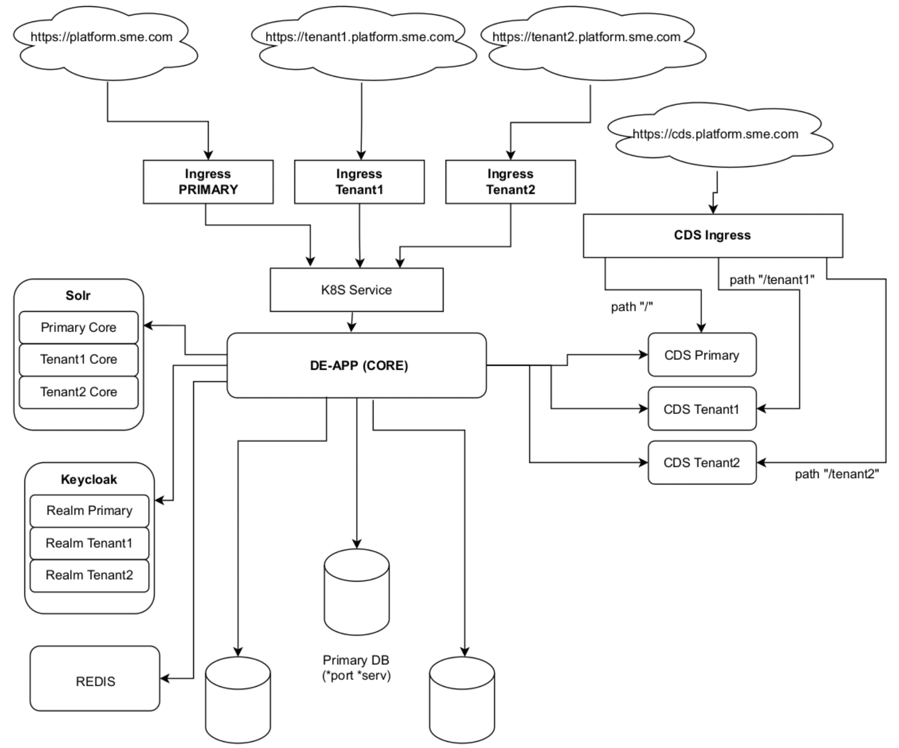

# Entando Multitenancy

## Overview

Starting with Entando 7.2, the Entando Platform includes support for multitenancy. An Entando Application can be customized to enable a multitenant architecture where tenants share an infrastructure but are informationally isolated. This document provides an overview of multitenancy and Entando's implementation.

## Core Concepts

Multitenancy describes an architecture in which a single software instance serves multiple tenants. Each tenant, identified by a unique domain name, comprises a user group with specific access privileges to the instance. A multitenant software application is designed to provide a common architecture while ensuring the segregation of information.

Entando Multitenancy imposes a shared architecture (e.g. the versions of Entando, K8s and Keycloak) while distributing resources (e.g. CPU, memory) across the primary and secondary tenants. The primary tenant refers to the user group with full access to the default features and functionalities of an Entando instance. Secondary tenants comprise user groups who share certain privileges and capabilities of the primary tenant. 

>Note: In the initial implementation of Entando Multitenancy, the [Local Hub](../compose/local-hub-overview.md) is not available to secondary tenants.

Each tenant is informationally isolated from the others with its own data, configuration settings, and user management. Kubernetes Secrets are used to protect the confidential parameters of tenant configurations.
## Architecture

All tenants rely on a single instance of an Entando Application for core functionality such as the App Builder, App Engine, and Keycloak. 

Redis is necessary for cache management and high availability, which Entando strongly recommends for a multitenant configuration. See **TODO - add tutorial link** to add Redis to your Entando Application.

Tenants are differentiated by unique domain names. To isolate its information and configurations, a tenant is allocated one each of the following:

- A database or schema for independent data storage
- An Entando Content Delivery Server (CDS) instance to manage static resources external to the Entando App Engine
- A Solr core to implement an external search engine
- A Keycloak client realm to manage user access

Entando Multitenancy requires that Solr, Entando CDS, and Keycloak are configured per the linked tutorials **TODO - Solr/CDS/Keycloak in this sentence will link to those**. 

## Implementation

A single installation of Entando can manage more than one independent and isolated site. While secondary tenant sites are dynamic and content-driven, their composability is limited. The following are key features of Entando Multitenancy:

- The domain name in the URL of the Entando instance identifies the current tenant
- Separate databases (or schema) and filesystems physically isolate each tenant's data
- Different security domains (users, keys) hosted on different Keycloak realms ensures that each tenant's activity is independent
- Each multitenant configuration relies on a single Kubernetes namespace, Entando App Engine, and Entando App Builder
- The App Builder UX of the primary tenant is indistinguishable from that of a standalone Entando installation
- The Local Hub is currently available to the primary tenant only, which prohibits secondary tenants from managing bundles 
- Aside from use of the Local Hub, the App Builder UX of a secondary tenant is indistinguishable from that of a standalone Entando installation

## Next Steps

To install and configure a multitenant Entando instance, see **TODO**

