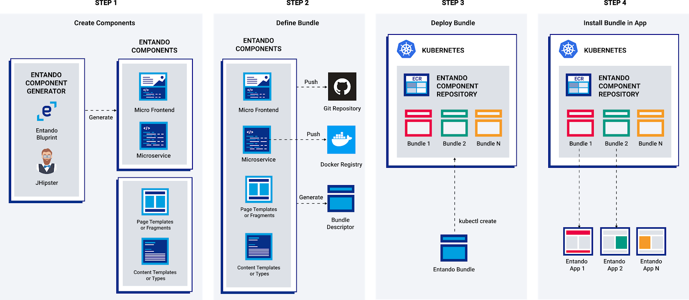

# Generate Microservices and Micro Frontends

## Overview

This tutorial shows you how to use the Entando Component Generator powered by [JHipster](https://www.jhipster.tech/) to create microservices and micro frontends for eventual deployment to the [Entando Component Repository](../../docs/ecr/ecr-overview.md) and Entando applications.



The general flow of the component generation is:

1. Run the Entando Blueprint to create your components (Spring Boot microservice and optionally React micro frontends)
2. Customize and enhance your generated code
3. Build an Entando bundle from your components
4. Deploy a custom resource for your bundle into Kubernetes
5. Install your Entando bundle into your Entando Application(s)

## Prerequisites
Use the [Entando CLI](../../docs/reference/entando-cli.md#check-environment) to verify you have the prerequisites in place for this tutorial (e.g. Java, npm, git, JHipster, Entando Blueprint).
``` sh
ent check-env develop
```  

### Manual Setup
The `ent jhipster` command is the recommended way to generate microservices and micro frontends but you can also setup JHipster and the Entando Blueprint yourself. You should then use the `jhipster` command instead of `ent jhipster` for the tutorial.   
1. Install JHipster
``` sh
npm install -g generator-jhipster@6.10.5
```

2. Install the Entando Blueprint
```sh
npm install -g generator-jhipster-entando@6.3.2
```

## Generate the Project
1. Setup a new project directory
``` sh
mkdir testProject && cd testProject
```

2. Use `ent jhipster` to generate the project skeleton using the Entando Blueprint
``` sh
ent jhipster --blueprints entando
```

3. You'll be presented with a series of prompts to configure your project. The list below provides a set of choices. **You can select the defaults in every step of the tutorial. Just hit Enter at each step.**

 - If you want to go through the choices follow this guide. Except where noted below in bold you can choose what works best for you. Base values for the tutorial are in parentheses.
     - `What is the base name of your application?` (Up to you)
     - `As you are running in a microservice architecture, on which port would like your server to run? It should be unique to avoid port conflicts.` (8081)
     - `What is your default Java package name? `(Up to you)
     - `Which *type* of database would you like to use?` (SQL)
         - If you pick no database here you'll be building a stateless microservice which is a valid choice but the rest of this tutorial won't work)
     - `Which  *production* database would you like to use?` (PostgreSQL or MySQL)
     - `Which *development* database would you like to use?` (H2 with disk-based persistence )
     - `Do you want to use the Spring cache abstraction?` (Yes, with the Caffeine implementation)
     - ` Do you want to use Hibernate 2nd level cache?` (Yes)
     - `Would you like to use Maven or Gradle for building the backend?` **Maven** <-- this is required for Entando and is the default
     - `Which other technologies would you like to use?` (Don't select any other technologies)
     - `What name would you give to the bundle to share on an Entando digital-exchange?` Enter a name for your Entando bundle or accept the default
     - `Which is the organization name to use when publishing the docker image?` **At this point enter the name of the organization where you are going to push your docker image. If you're using your own docker hub account you should enter your username here.** (this can be changed later as needed)
     - `Would you like to generate micro frontends when creating entities?` (Always)
     - `Would you like to enable internationalization support` (Up to you)
     - `Please choose the native language of the application` (Up to you)
     - `Please choose additional languages to install` (if you picked internationalization)
     - `Besides JUnit and Jest, which testing frameworks would you like to use?` (Up to you)
     - `Would you like to install other generators from the JHipster Marketplace?` (No)

 4. Next, add an Entity to your microservice and create the corresponding Micro Frontends. For the tutorial, `Conference` is the name of the entity that will be added to the application.
 ``` sh
ent jhipster entity Conference
```
   - **Add Fields**
     - `Do you want to add a field to your entity?` (Yes)
     - `What is the name of your field?` (Enter `name`)
     - `What is the type of your field?` (Select `String`)
     - `Do you want to add validation rules to your field?` (No)
     - `Do you want to add a field to your entity?` (Yes)
     - `What is the name of your field?` (Enter `location`)
     - `What is the type of your field?` (Select `String`)
     - `Do you want to add validation rules to your field?` (No)
     - `Do you want to add a field to your entity?` (No)
     - `Do you want to add a relationship to another entity?` (No)
     - `Do you want to use separate service class for your business logic?` (Up to you)
        - If yes:
        - `Do you want to use a Data Transfer Object (DTO)?` (Up to you)
        - `Do you want to add filtering?` (Up to you)
     - `Is this entity read-only?` (Up to you)
     - `Do you want pagination on your entity?` (Yes, with infinite scroll)
     - If you asked to be prompted about micro frontends when generating the project:
       - `Do you want to generate micro frontends?` (Up to you)
   - At this point the blueprint will generate controllers, repositories, services, and micro frontends for your entity.
     - `Overwrite src/main/resources/config/liquibase/master.xml?` When prompted with a conflict at this stage enter `a` for All. This will override existing files with the configuration changes needed for your new entity.

You now have a Entando project including a Spring Boot microservice with database integration and React-based micro frontends.      

### Project Structure
   * ```/src/main/docker``` contains Docker files to help with local development environments
   * ```/src/main/java``` and ```src/main/resources``` contain the microservice codebase and configuration
   * ```/ui``` holds the React-based micro frontends. By default each entity gets an MFE for details, form, and table.
   * ```/bundle``` is used to assemble the project code into an Entando bundle.
   * `/bundle/plugins/conference-plugin.yaml` includes the plugin configuration and `healthCheckPath` provided by and pre-configured in Spring Boot. [See the plugin definition](../../docs/ecr/ecr-bundle-details.md#plugin) for more information.

## Next Steps
You now have a choice:
   - [Build your Entando bundle and deploy your microservice and micro frontends to the Entando Component Repository.](../ecr/publish-project-bundle.md)
   - [Go to the Running Locally tutorial to run your micro frontends and microservice in your local dev environment.](./run-local.md)
   - [Learn about the key elements included in the Blueprint generated widgets](../../docs/component-generator/blueprint-features.md)
   - [Iterate on your data model using the JHipster Domain Language (JDL)](./update-data-model.md)
