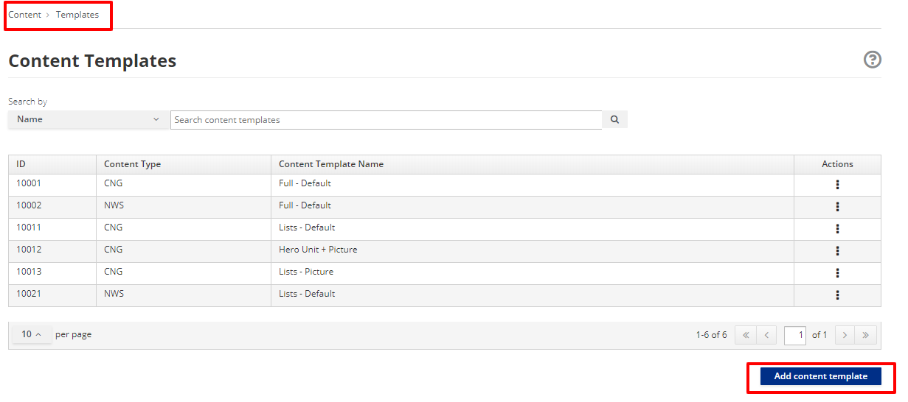
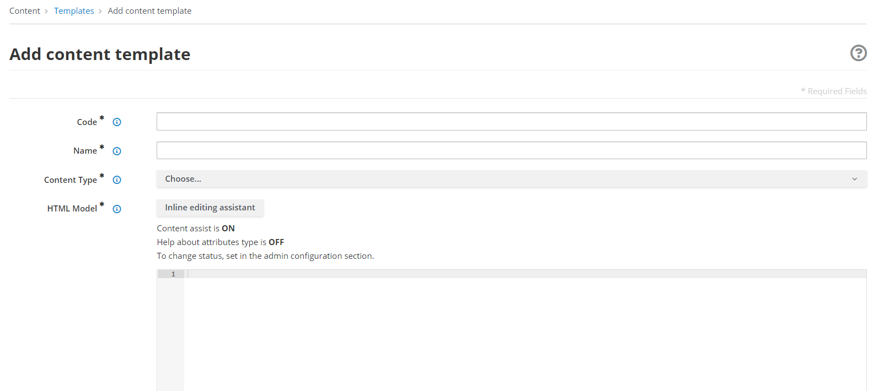

--- 
redirectFrom: /next/tutorials/cms/content-models-tutorial.md
---

# Content Templates

## Objective

This document provides a description of Content Templates and how they
are defined and used.

## Overview

The purpose of Content Templates is to define how the information,
enclosed in the Content, displayed to the end user, after the content is
published within the pages. Simplifying the concept, Content Templates
provide styling and layout for the Contents Types; consequently they
allow to show the same content in different ways.

The Content Templates can be managed using the App Builder’s user
interface, in which the Web CMS has been integrated. The interface:

-   displays the list of the content templates already existing, for each
    Content Types to which they refer.

-   provides the tools to create a new content template; the template is
    written using the Velocity language.

## How to define a Content Templates

Creating a Content Template is fairly simple. From the App Builder
application

-   Select `Content > Templates`

-   Click on the **Add content template** to create a new Content
    Template.

-   Access the **Add Content Template** page, where you can

    -   Edit the `Code`. It is the unique identifier of the content template.
        You can insert up to 10 numbers. It’s mandatory.

    -   Edit the `Name`. It is the name or description of the content
        template.

    -   Choose the `Content Type` in the dropdown list.

    -   Edit the `HTML Model` based on Velocity language

    -   (Optional) Define the CSS `Style Sheet` to be applied to the `HTML Model`

    -   Press the Save button

