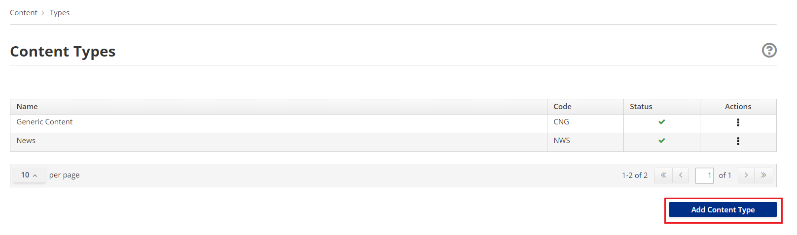
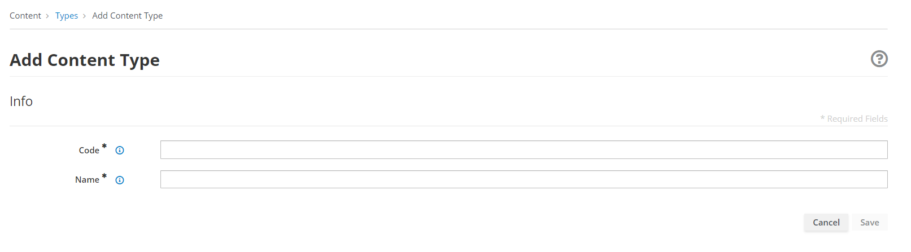
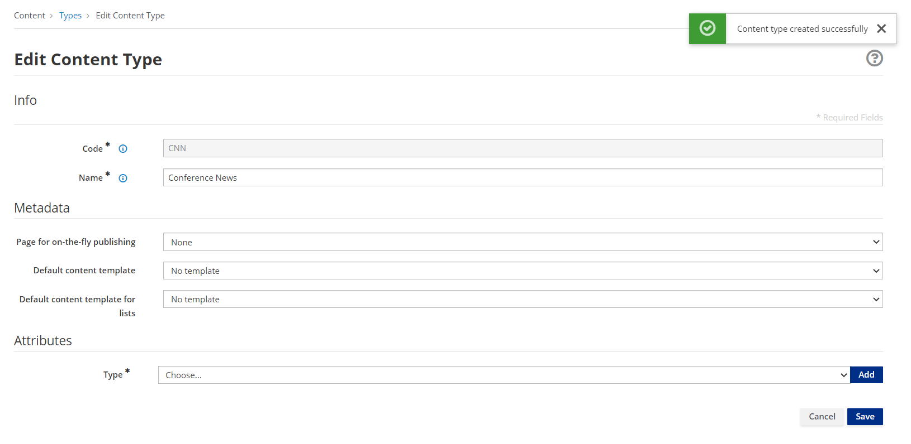
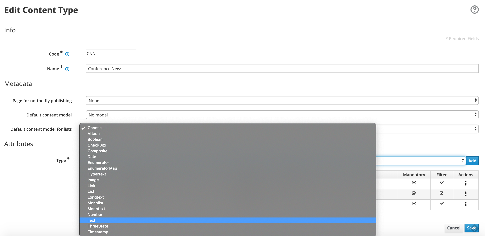
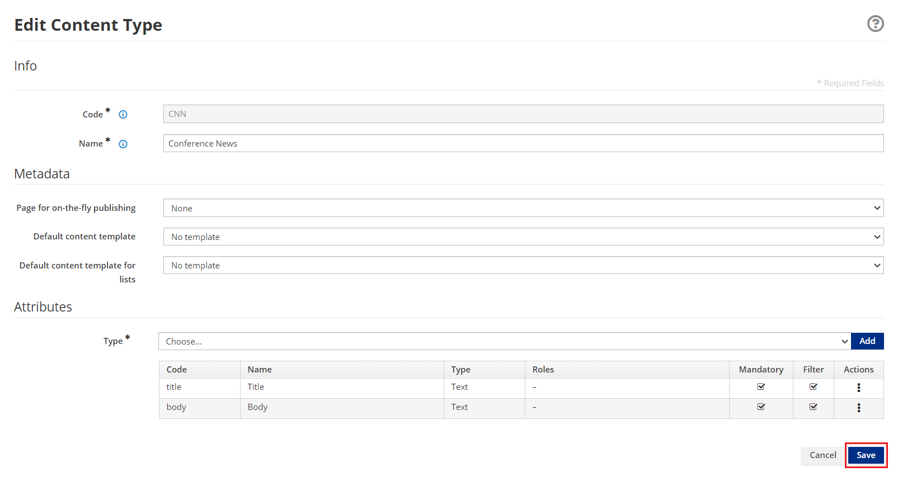

# Content Types

A Content Type is used to represent or to model a Content.
It is characterized by a set of [Attribute Types](docs/next/tutorials/cms/list-of-content-attributes.md), each of which defines the value of their properties, called Attributes. A Content is
an instance or specialization of the Content Type.

## How to create a Content Type

Creating Contents Types is fairly simple. The Content Types are managed
through the Web CMS, its user interface is made available in the App
Builder application.

-   Go to `Content → Types`

-   Click on the **Add Content Type** button to create a new Content
    Type.

-   You be asked to provide

    -   **Code**. The code is the unique identifier of the content type,
        that must be 3 uppercase letters, (e.g. CNN). It’s mandatory.

    -   **Name.** The name must be max 50 characters uppercase and
        lowercase letters, including numbers and special characters,
        (e.g. Conference\_News). It’s mandatory.

-   Select the **Save** button, then you’ll see

    -   **Content Type Information**:

        -   **Code**. The value is pre-filled.

        -   **Name**. The name is pre-filled.

    -   **Metadata**

        -   **Page for on-the-fly publishing**

        -   **Default content template**

        -   **Default content template for lists**

*Default content template* and *Default content template for lists* are used
respectively to show the detailed view of the Content and its
representation as an element in a list.

-   **Attributes**

In the Attributes section, select the **Type** from the drop-down list.
The list contains all the available attributes types that define which
properties/attributes will characterize the Content.

The Add button will start the configuration of the single attribute
type. Every attribute type has its own configuration.

For example, to configure the **Text** Attribute Type, choose Text from
the Types drop-down menu and then press the Add button.

-   You should specify the following fields

-   **Type:** the value is pre-filled. It represents the selected
    attribute type.

-   **Code**: You should insert the name of the attribute. (You
    can insert max 10 characters uppercase and lowercase letters,
    numbers, and special characters \_ ). (e.g. title)

-   **Name**: You should insert the description of the attribute.
    (You can insert max 50 characters uppercase and lowercase letters,
    including numbers and special characters). (e.g. Title).

-   You should declare if the attribute is **mandatory**,
    **searchable**, and **to be used as a filter in the list.**

-   The **Roles** section it is possible to assign the *jacms:title
    Attribute Role* to this attribute; in this way other plugins or
    services will know that within the CNG entity this attribute is a
    title, whatever the key is; however, for sake of clarity, the Code
    of the attribute is Title.

-   The remaining fields related to **Sections** and **Validation -
    OGNL** sections are not mandatory and can be left empty.

-   Press the **Continue** button. The Text attribute type requires no
    additional configuration step.

You can add other Attributes Types.

-   Press the **Save** button. The Content type will be saved and displayed
    in the table list

