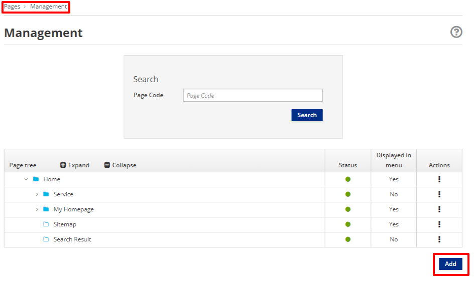

# Publish Content

## Objective

The App Builder application provides the capabilities to publish
content in your application page to a user.

## How to Publish Content

To publish a Content, through the App Builder application, in your page

- Go to `Pages > Management`
- Click **Add**

A page must have a title, a code, a placement in the page tree, an owner
group, a join group and a page template. When you create a new page, you
must to

-   Provide a title and a code in the Info section.

-   Provide, selecting them from the dropdown menus, an Owner Group and
    a Join Group in the Page Groups section,

-   Select a Page Template from the available templates.

-   Click the green **Save and Configure** button. This brings you to
    the configuration section, which lists all the frames defined in the
    page template you associated with that page.

-   Add widgets by dragging them from the right column on to the desired frame. 
-   If you select the **Content** widget, its corresponding settings page will be shown.

-   Click **Change content** to bring up the Content selection view.

-   In the Search field, you can type the name of the content that you
    would like to publish. Remember
    that in order to publish the content on your page, it must first be saved
    and approved.

-   Select the appropriate content item from the list. 

-   Press the **Save** button.

-   The title of the selected content item will now be displayed in the widget settings.

-   Press the **Save** button.

-   Click on the **Preview** button to show the page preview with the updated settings.

-   Finally, click on the **Publish** button to publish the page.

