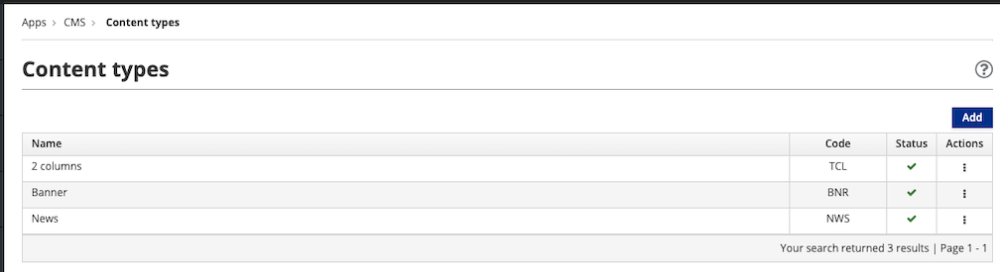
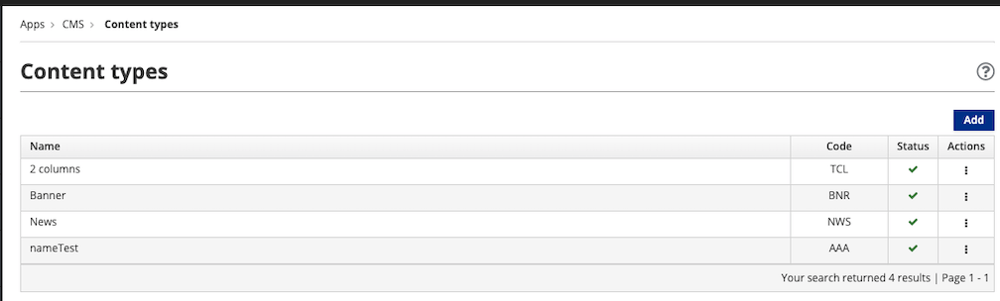

# Content Types

A Content Type represents or models a Content. Alternatively, a Content is an instance or specialization of a Content Type. 

Content Types are characterized by [Attribute Types](./content-attributes.md). Each Attribute Type consists of one or more properties, known as Attributes, which are defined by their Attribute Type.

## Create a Content Type

Content Types are managed via the Web CMS, through a user interface provided by the [Entando App Builder](../../docs/getting-started/concepts-overview.md#entando-app-builder). Follow the steps below to create and configure a Content Type.

**1. From the left menu of the App Builder, go to `Content` → `Types`.**

**2. Click the `Add` button in the upper right corner.**

**3. Configure the Content Type.**

When adding a Content Type it is mandatory to enter `Code` and `Name` values consistent with the following:

- `Code`: A unique identifier of the Content Type that must be 3 uppercase letters.

- `Name`: A string value of 50 characters or less consisting of one or more of the following: uppercase letters, lowercase letters, numbers and/or special characters.

Other field entries are not mandatory, but to specify a meaningful Content Type you must choose the appropriate `Type` from the drop-down in the Attributes section. The available options define Attributes to characterize the Content.

**4. Click the `Add` button.**

This launches the configuration of the selected Attribute Type. Each Attribute Type requires its own configuration. 

## Attribute Configuration

Clicking `Add` loads a form to configure the Attribute. The `Type` field is pre-filled with your Attribute Type selection.

**1. Define the characteristics of the Attribute:**

 

- `Code`: It is mandatory to enter a unique name for the Attribute key of an Attribute Type. This field supports a string value of 10 characters or less and should consist of one or more of the following: uppercase letters, lowercase letters, numbers and/or special characters.

- `Name`: Enter a description of the Attribute. This field supports a string value of 50 characters or less and should consist of one or more of the following: uppercase letters, lowercase letters, numbers and/or special characters.

- Certain Attribute Types support the option to declare that the Attribute is `Mandatory`, `Searchable` and/or `Can be used as a filter in lists` via toggle buttons.

- Certain Attribute Types support the option to choose an Attribute `Role`. Be sure to click the `Add` button after making your selection.  

- The remaining fields are not mandatory and may be left empty.

:::tip
Certain Attribute Types allow you to assign the `Role` of `jacms:title - The main title of a Content`. This informs plugins or services that the Attribute is a title, regardless of its key, or `Code`. Entering "title" for the `Code` avoids confusion when this `Role` is selected.
:::

**2. Click the `Continue` button.**

This adds the configured Attribute to the Attribute Type.

- Complete the additional configuration steps required by your Attribute Type, if applicable. 

- (Optional) Add other Attribute Types to your Content Type, subject to the configuration process above.

**3. Click the `Save` button.**

The Content Type you created is now displayed in the table.

