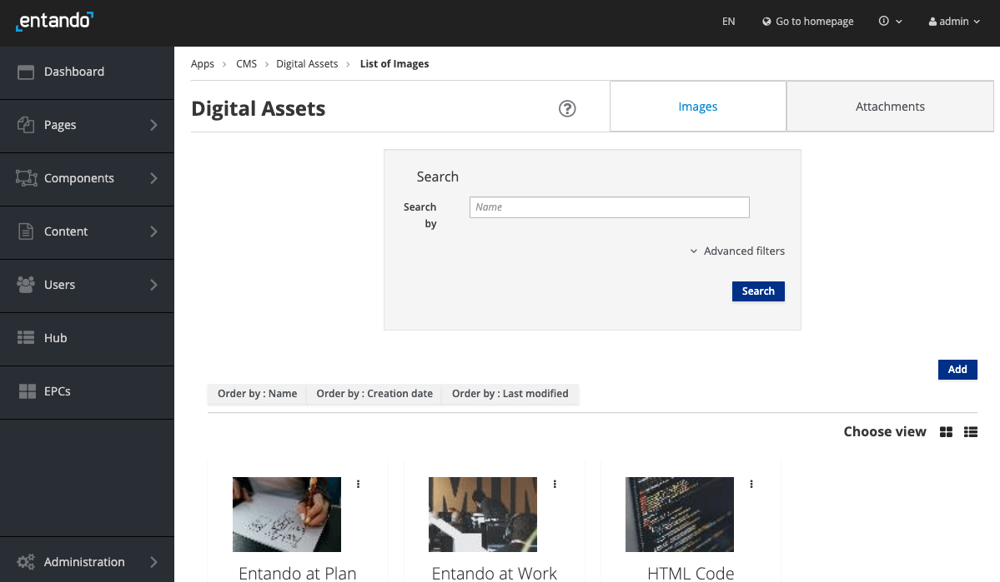
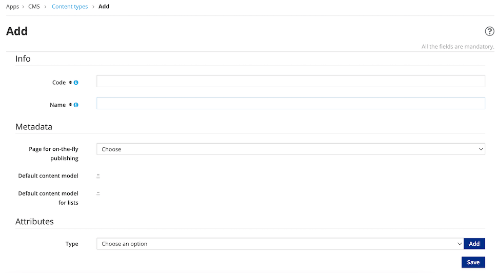
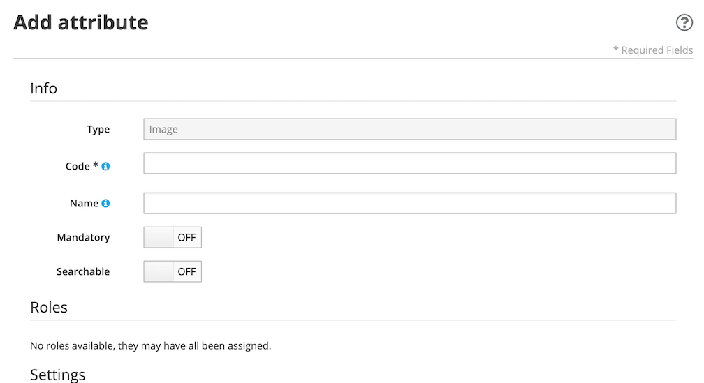
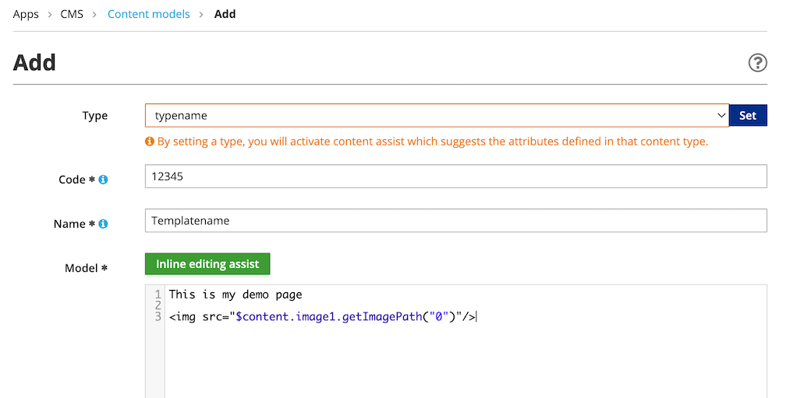

# Digital Assets

The Entando Web Content Management System (WCMS) includes capabilities that let you manage contents and digital assets. Digital Assets are images, documents, and other media files in specific formats.

**Default Supported Document Formats:** `pdf`, `xls`, `doc`, `ppt`, `txt`, `rtf`, `sxw`, `sxc`, `odt`, `ods`, `odp`, `tar`, `gz`, `zip`, `rar`, `flv`, `swf`, `avi`, `wmv`, `ogg`, `mp3`, `wav`, `ogm`, `mov`, `iso`, `nrg`, `docx`, `docm`, `xlsx`, `xlsm`, `xlsb`, `pptx`, `pptm`, `ppsx`, `ppsm`, `sldx`, `sldm`
The Entando WCMS can be configured to allow or exclude any type of file extension
to your site. For the App Builder, you should also include the MIME type for the assets you want to allow. 

**Default Supported Image Formats**: `jpg`, `jpeg`, `png`, `svg`, `svg+xml`

## Manage Assets:

1. Login to the App Builder.
2. From the left sidebar, go to `Content` → `Assets`.

 

* View `Images` or `Attachments` with the tabs at the top of the page.
* Search by name or use the `Advanced filters` function to search by `Group`, `Filename` and/or `Category`. 
* Assets are displayed and ordered by Name. `Choose View` to toggle between a list or grid format. The order can also be changed. 
* For each resource, click on the action menu (indicated by three vertical dots) to the right to Edit, Delete and preview sizes.

### Add a New Asset
1. From the Content Assets page in the App Builder, click `Add` on the right to add a new image or document file. 

2. Group: choose from the drop-down menu. This is a required field and defaults to `Free Access`. Additional groups can be defined in the Users section.  
3. Categories: add your asset to the appropriate category with the `+` symbol under `Join`. This will be used in searching and sorting. This field is not mandatory. New Categories can be created in `Content` → `Categories`.
4. Drag and Drop your files into the window or click `Browse`. The file you choose will appear in the Name field. You can choose multiple files at one time. You can also use the `Add Another Resource` button and `Choose file` individually.
5. After all files have been chosen, click the `Add` button to upload the files. This takes you back to the main assets page where your uploaded files will be displayed in the table. If you have an image file, see Edit Assets below. 
6. If a Name field is left blank, you will receive an error message. Simply go to the actions (indicated by three vertical dots) menu next to the empty file and select Delete. This action menu also provides an edit option for each resource.

## Edit Assets 
Changes to the Asset name and categories can be made in the Edit mode.  
1. From `Content` → `Assets` page, in the list of assets, click on the Asset's `Actions` button and select `Edit`. 
2. Edit the Name field. For Categories, use the `+` button under `Join` to add the asset to a category. 
3. Once all changes are done, click the `Add` button to finish. 
  
To organize or download assets, go to `Administration` → `File browser` and navigate to `/public/cms` to find your documents and images.

## Edit Images
You can flip, rotate and crop newly uploaded images.

1. Go to `Content` → `Assets` → `Add` 
2. After uploading an image, click on the actions button to the right of the image. From the drop-down menu, Select Edit.

3. Use the arrows to flip, rotate or recenter your image. When done, click the `Crop` check button. Multiple resized images can be created at this time. Click `Free` to remove resizing ratio restrictions.
4. Click `Done`.
5. Click Add to save all versions.

## Embed an Asset on a Page
The uploaded asset can be embedded on a page by using `<@wp.resourceUrl>your-path/your-asset.jpg`. The path can be found in the App Builder at `Administration` → `File Browser`. (e.g. 
` cms/images/butterfly.jpg">`

## Include an Asset in a Content
The asset can be included in a Content Type that has an `Attach` or `Image` attributes. Follow the [Content Type tutorial](./content-types-tutorial.md) for detailed steps or follow the briefly outlined steps here.

Create a Content Type with an image attribute. 
1. From the left sidebar select `Content` → `Types` → `Add`

2. Fill out `Code`, `Name` and click `Add`.  
3. This will take you to the Add Attribute page. In this example, we are using the Attribute Type of image. Enter the `Code` and `Name` as required.  All other fields are optional. Click `Continue` at bottom of page. Note the Attribute Code field is used below to reference the image in the Template.

4. Next create the Template or Model where the content type is added. Go to `Content` → `Template` → `Add`

5. From the drop-down menu for `Type`, select the one you just created.
6. Enter the `Code` and `Name` fields as required. 
7. Complete the Model HTML layout in Velocity. The Inline Editing Assist tool is available by using the Ctl-Space buttons on your keyboard. Your image tag should look something like this: 
` `
8. Click `Save`. The new Content Model is complete and should appear in the list to be used anywhere in your application.  

## Configure File Extensions for Upload

The types of files that can be uploaded to an Entando Application are controlled by the
configuration of the server side of the App Builder. If you're using the quickstart version, this is the`entando-de-app`.

There are two properties that control these settings and they are set in `src/main/conf/systemParams.properties` and are a comma delimitted list of values. The property keys are:

* `jacms.imageResource.allowedExtensions=`
* `jacms.attachResource.allowedExtensions=`

To configure the uploads for the App Builder and Admin Console, include both the MIME type and file extension of the asset. The APIs that support resources will check the MIME type of the uploaded asset.

An example configuration for images:
- `jacms.imageResource.allowedExtensions=jpg,jpeg,png,svg,svg+xml`

Where `svg+xml` is the MIME type for an svg image.

The `systemParams.properties` file is bundled into the WAR and the image for the application, so you will need to create and deploy an image to reflect changes for these properties in your application.
