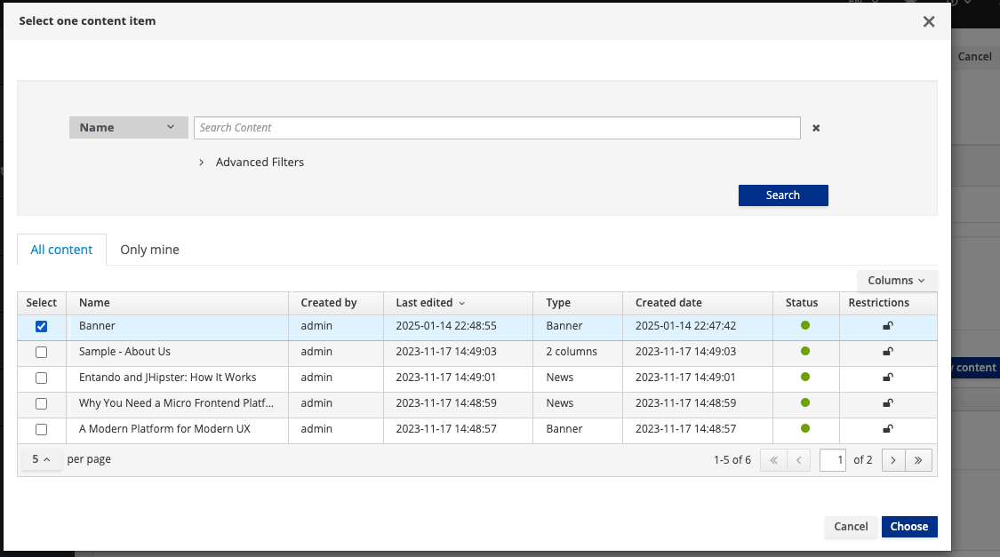
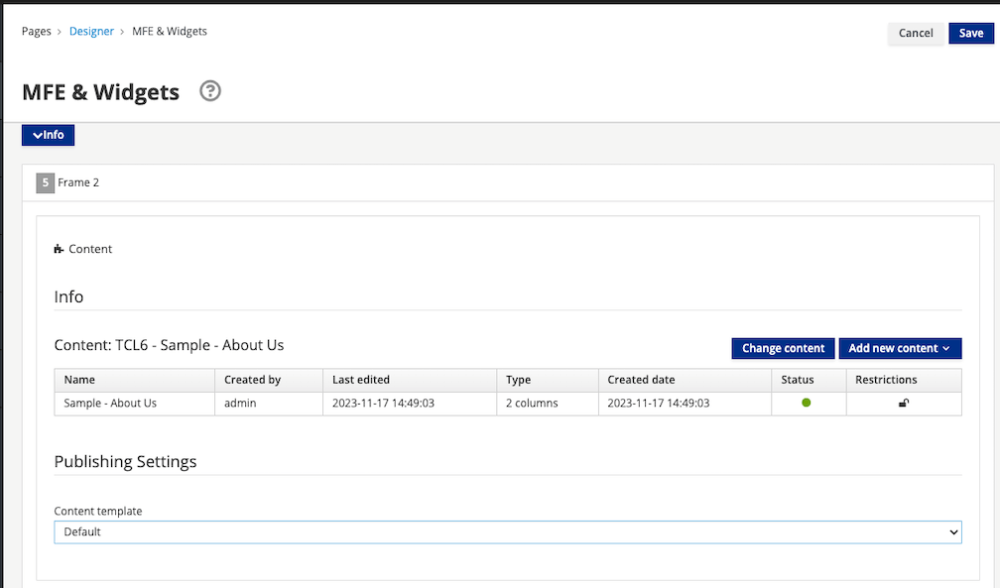

# Page Management

The [Entando App Builder](../../docs/compose/app-builder.md) provides the capability to publish application pages containing content as well as other Entando components. Page Templates are used to define the layout of available frames on a page.

## Create a Page

Follow the steps below to create a Page with a Content widget.

**1. Go to `Pages` → `Management`.**


**2. Click the `Add` button.**

This generates a form where the following fields are mandatory:
- `Title`: used for SEO
- `Code`: must be unique
- `Page placement`: the location of the Page in the Page Tree
- `Owner Group`: the Group that has access to the Page
- `Page Template`: the structure and presentation of the Page


**3. Click the `Save and Design` button.**

This loads the Designer UI, which lets you place widgets into the Page Template frames.


**4. Add a widget.**

This is done by dragging a widget from the right panel into the desired frame. Adding the Content widget will load the configuration page shown below.


**5. Click `Add existing content`.**

This generates the content selection pop-up.



You can search for the name of the content that you would like to publish. Remember that content must be saved and approved before it can be published to a page.

**6. Select the desired content item(s) from the list.** 

**7. Click the `Continue` button.**

The selected content item will now be displayed.



**8. Click the **Save** button.**

The following actions are now available:

-   Click on the `Preview` button to show the page preview with the updated settings.
-   Click on the `Publish` button to publish the page.
-   Click on the `View published page` button to view the published page in your application.

## Page Templates

Page Templates provide the scaffolding of a Page and are constructed using two main elements:

- A `JSON configuration` field which lists the set of frames that can be used on a page. 
- A `Template` field which uses Freemarker code to setup the HTML page itself.

### JSON Configuration

Each item in the `frames` array of the JSON configuration represents a frame or slot in the page, characterized by the following values:
- `pos`: A zero-based position index (starts from zero). This value is used by APIs to address a specific widget on the page.
- `descr`: The frame description displayed in the Page Design view.
- `mainFrame`: This designates the primary frame in the Page Template.
- `defaultWidget`: The code for a default widget to use in this frame. Page Template developers can use this field to provide suggestions for common widgets, e.g. header and footer widgets.
- `sketch`: An object with 4 coordinates (x1,x2,y1,y2) to allow the developer to place the widgets in the Page preview. The x and y values go from 0 to 11 (similar to columns in Bootstrap), so if you want to place a 2x2 frame at the top left corner of the page, the values would be `x1: 0`, `x2: 1`, `y1: 0` and `y2: 1`.

### Template

To add a frame in a specific place of the page, input `<@wp.show frame=0 />`, where `frame` is the `pos` variable from the `JSON configuration`. To setup the `wp` variable, `<#assign wp=JspTaglibs["/aps-core"]>` is required at the top of the template.

Common code can be shared across Pages by using [UX Fragments](./widgets-fragments.md#create-a-ux-fragment) and ```<@wp.fragment code="\<FRAGMENT\_CODE\>" escapeXml=false /\>```.


### Create a Page Template

Follow the steps below to prepare a Page Template with two frames on it.

**1. Go to `Pages` → `Templates` → `Add`**


**2. Enter the field information below:**

- `Code`: double_frame (Note: Dashes are not allowed)
- `Name`: Double Frame
- `JSON Configuration:`

``` json
{
  "frames": [
    {
      "pos": 0,
      "descr": "Frame 1",
      "mainFrame": false,
      "defaultWidget": null,
      "sketch": {"x1": 0, "y1": 0, "x2": 11, "y2": 1}
    },
    {
      "pos": 1,
      "descr": "Frame 2",
      "mainFrame": false,
      "defaultWidget": null,
      "sketch": {"x1": 0, "y1": 2, "x2": 11, "y2": 3}
    }
  ]
}
```

- `Template:`

``` ftl
<#assign wp=JspTaglibs["/aps-core"]>
<!DOCTYPE HTML PUBLIC "-//W3C//DTD HTML 4.0 Transitional//EN">
<html>
  <head>
      <title><@wp.currentPage param="title" /></title>
  </head>
  <body>
    <h1><@wp.currentPage param="title" /></h1>
    <div><@wp.show frame=0 /></div>
    <div><@wp.show frame=1 /></div>
  </body>
</html>
```
Include the following fragment in the `head` section to make use of the user's Keycloak identity information.
```ftl
<@wp.fragment code="keycloak_auth" escapeXml=false />
``` 

**3. Verify the `Template preview` is reflecting the desired two frame layout.**

**4. Click the `Save` button.** 