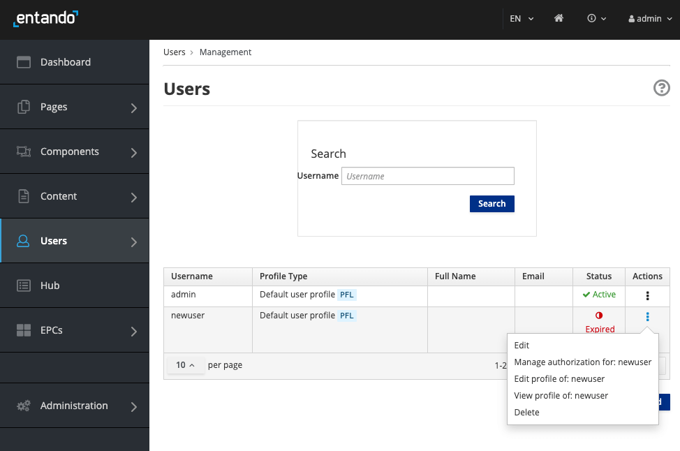

# Manage Roles, Users and Groups  

## Role-based Page Management
Entando provides distributed editorial controls for building composable applications. With editing privileges based on roles and groups, a user only sees the application pages they're given access to when they log in. Users are assigned roles and groups based on group ownership so teams can manage portions of the application that belong to them.

This tutorial demonstrates how to grant editorial access to a particular page in an application.

To add controls to micro frontends and/or microservices, see the [Role Based Access Controls for Micro Frontends & Microservices](../create/ms/add-access-controls.md) tutorial.

### 1. Create a Role
This role will have access to edit, delete, and create pages. Users are assigned roles and then added to groups who own the pages of an application. 
1. Log in to your Entando App Builder.
2. Go to `Users`→ `Roles` in the left navigation menu.
3. Click `Add` to create a new role.
4. Enter a name and code. 
5. Turn `ON` the following selections under `Permissions`: `Content Editing`, `Access to Administration Area` and `Operations on Pages`. 
6.  Click `Save`.

### 2. Create a Group
1. Go to `Users`→ `Group` from the left navigation menu.
2. Click `Add` to create a new group who will manage a subsection of the application.
3. Enter a name and code. Click `Save`

### 3. Add a New User, assign role and group
1. From the left navigation menu, go to `Users`→ `Management`. 
1. Click `Add` to create a new user.
1. Enter a `Username` and `Password`. Select the default `Profile Type` and `Status`: `ON`. 
1. Click `Save`. The user account will appear with `Status`: `Expired Password` until the first time they log in and reset their password. To change this status or add an email, go to `Edit` from the `Actions` menu of the User account.

1. For the new user, select `Manage Authorization for: USERNAME` under the `Actions` column.
1. Select `Add new Authorization` and choose the `User Group` and `User Role` created in the previous steps. Click `Add`.
1. Click `Save`. 

### 4. Create a New Page and Assign Owner Group
1. Go to `Pages`→ `Management` from the left navigation menu.
2. Click `Add` to create a new page. 
3. Add `Title`, `Code` and other fields as appropriate. See [Page Management](page-management.md) for more details.
4. Under the `Page groups` heading, choose the `Owner group` who should have editing privileges to this page. If `Free Access` is chosen, everyone can view this page and users with access to the App Builder can edit the page. 
5. Click `Save`.

When the new user logs in, they will only have access to the pages for which they are part of the authorized Owner Group.

#### Existing Page Assignment
If you need to assign editorial access to existing pages, add the user to the current Owner Group for the page in the `User Management` section. If a new group was added, go to `Pages` → `Management`, and select `Edit` under the `Actions` drop-down menu to reassign `Owner group` for each page.
