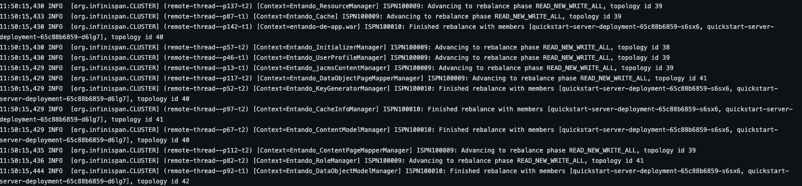

# High Availability on Entando

To build applications on Entando for high availability (HA), it is best practice to examine your goals, hardware, networking, and application-specific setup as well as optimize the App Engine deployment for that environment. The configurations and tests below can be used as building blocks to create a deployment architecture that promotes HA for your application in most situations. They include steps to set up and validate a clustered instance of the Entando App Engine, along with the configuration for Redis to support that instance.

::: tip
To scale an Entando Application without the use of clustered storage assumes all instances are scheduled to a single node and requires a ReadWriteOnce (RWO) policy in conjunction with taints on other nodes. Be aware of the pros and cons of scheduling instances to the same node so you can maximize utilization of node resources and recover from an unreachable application instance. If the node terminates or is shutdown, your application will be down while Kubernetes reschedules the pods to a different node.
:::

## Clustering
This section describes how to set up a clustered Entando App Engine in the `entando-de-app` image. The goal is to deploy a clustered instance of the App Engine and verify the scalable deployment and HA of the application.

### Prerequisites
- An existing deployment of an Entando App or the ability to create one.
    - If you haven't created a deployment or don't have a YAML file for an Entando deployment, follow the [Quickstart instructions](../../../docs/getting-started/).
- The Entando deployment must use a Relational Database Management System (RDBMS) to organize data in a table structure. Clustered instances will not work correctly with in-memory databases.
- Sticky sessions are recommended when enabling a clustered Entando Application. For example, see [Manage NGINX](../devops/manage-nginx.md) for related affinity settings.

### Creating a Clustered App Instance
1. Create an Entando deployment via the operator config file or edit an existing deployment YAML file.
2. Scale your Entando server application:

``` bash
kubectl scale deployment quickstart-deployment -n entando --replicas=2
```

3. To view the pods in your deployment:
```
`kubectl get pods -n YOUR-NAMESPACE`
```
4. You should have two `quickstart-deployment` pods in your namespace.

5. Look in the logs of the `quickstart-deployment` in either pod to see logging information related to different instances joining the cluster and balancing the data between the instances. See the screenshot for an example. Your actual logs will vary.




### Validating Clustered Instances
This is an advanced exercise and not required or recommended for most deployment scenarios. The steps below validate that the clustered instances are working in your environment and that you have created a high availability deployment.

1. Complete the [creating a clustered instance tutorial](#creating-a-clustered-app-instance) above or have an existing clustered Entando App instance available for testing.
2. Retrieve the URL for your `entando-de-app`:
```
kubectl get ingress -n YOUR-NAMESPACE
```
3. Open the URL in a browser and ensure that the application is working.
4. Open a new browser window in incognito or private browsing mode to ensure that no data is cached and you're receiving a copy of the running application. **Do not navigate to the app.**
5. Delete one of the server deployment pods in your clustered instance:
```
kubectl delete YOUR-POD-NAME -n YOUR-NAMESPACE
```
    - There are other ways to do this. You could also shell into the server-container and manually kill the running app process with `kill -9 357`.
    - If you want to test at the hardware level, you could manually terminate a node in your cluster (ensuring that the pods are scheduled to different nodes).
6. In your private/incognito browser window, open the URL to your `entando-de-app`.
7. Check that the application continues to render while the pod you deleted is no longer present.
8. Wait for Kubernetes to restore your deleted pod.
9. Check that the application continues to render after the pod is restored.

### Caching Validation
Validating the shared cache can be done in a process similar to the clustered instance validation. The high-level steps are:

1. Deploy a clustered instance (see [creating a clustered instance tutorial](#creating-a-clustered-app-instance)).
2. Create data with the App Builder (pages, page templates, content etc.), using the external route for the application.
3. Refer to the logs to note which instance processed the request.
4. Terminate that instance.
5. Fetch the recently created data and verify that the data are returned.


## Configuring and Deploying with Redis

In this section, an Entando App Engine instance is deployed using Redis as a cache for data served by the App Engine. For more information on the cache configuration for the App Engine, see [high availability in an Entando Application](../../docs/consume/high-avail-application.md).

### Deploy Redis to Kubernetes

1. Create the Redis deployment and expose the endpoints:

```sh
kubectl create deployment redis --image=redis:6
```
```sh
kubectl expose deployment redis --port=6379 --target-port=6379 -n YOUR-NAMESPACE
```
2. Install the Redis CLI for your environment per <https://redis.io/topics/rediscli>.
3. Get the IP for your Redis deployment:
```sh
kubectl get service -n YOUR-NAMESPACE
```
4. Validate your deployment:

```sh
redis-cli -h 10.43.99.198 -p 6379 ping
```
   * Should respond PONG.


```sh
redis-cli -h 10.43.99.198 -p 6379 incr mycounter
```
   * Should increment each time. 


## Configure the Implementation

1. Download the `entando-app.yaml` template:

<EntandoCode>curl -sLO "https://raw.githubusercontent.com/entando/entando-releases/{{$site.themeConfig.entando.fixpack.v71}}/dist/ge-1-1-6/samples/entando-app.yaml"</EntandoCode>

2. Add these environment variables to the `EntandoApp` YAML to match your Redis instance. The variables to create are `REDIS_ACTIVE`, `REDIS_SESSION_ACTIVE`, `REDIS_ADDRESS` (e.g. _redis://localhost:6379_), and `REDIS_PASSWORD`.
```yaml
data:
  environmentVariables:
    - name: REDIS_ACTIVE
      value: "true"
    - name: REDIS_ADDRESS
      value: YOUR-REDIS-URL 
    - name: REDIS_SESSION_ACTIVE 
      value: "true"
    - name: REDIS_PASSWORD
      valueFrom:
        secretKeyRef:
          key: password
          name: YOUR-REDIS-SECRET-NAME
          optional: false 
```
Both REDIS_ACTIVE and REDIS_SESSION_ACTIVE need to be set to "true" to enable the storage of HTTP sessions. If only REDIS_ACTIVE is set to "true", Redis is used just for the cache.

>NOTE: This example uses a Secret for the `REDIS_PASSWORD`, which is recommended. You can also hardcode the password in the YAML for testing purposes, but the use of clear text passwords in deployment files is not recommended. **Create and use a Secret for the password as a best practice.**

3. Deploy your file
```sh
kubectl apply -f entando-app.yaml
```
You now have a high availability cluster of Entando with Redis implementation.