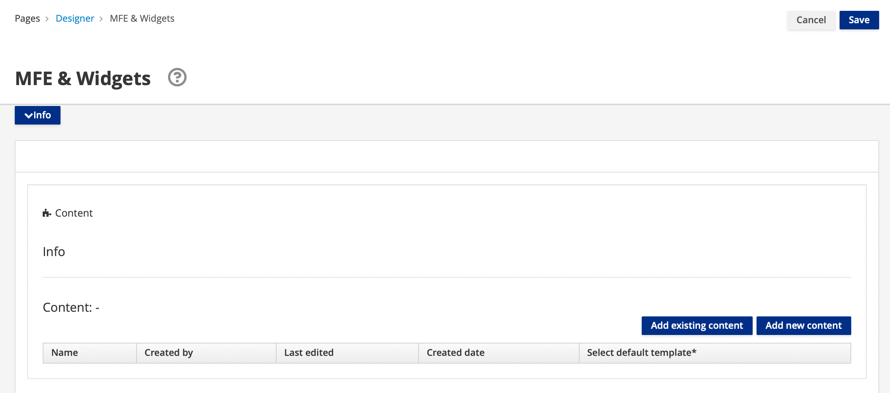
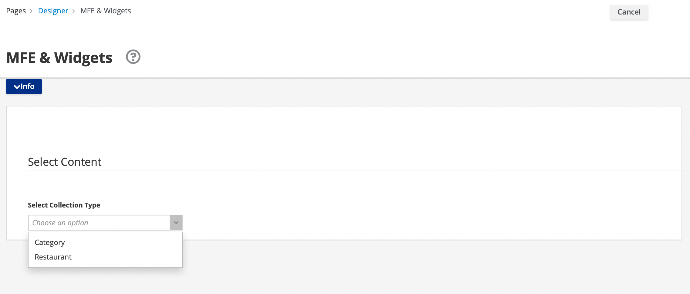
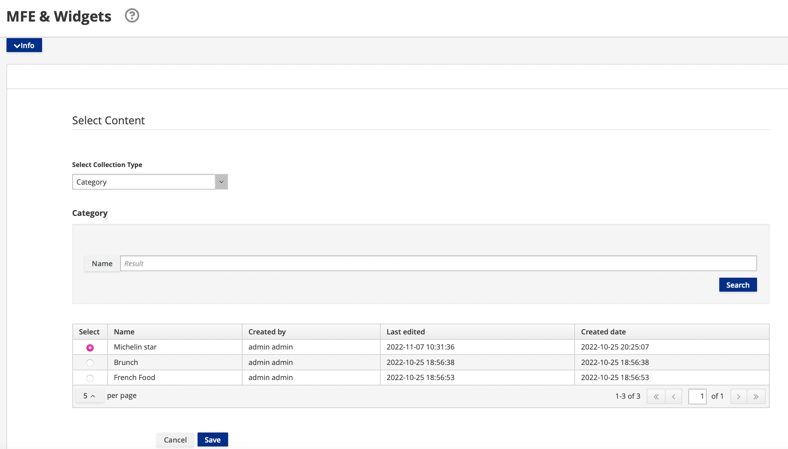
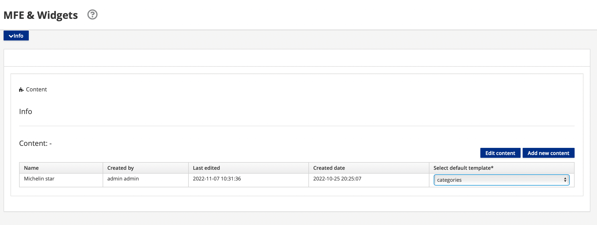
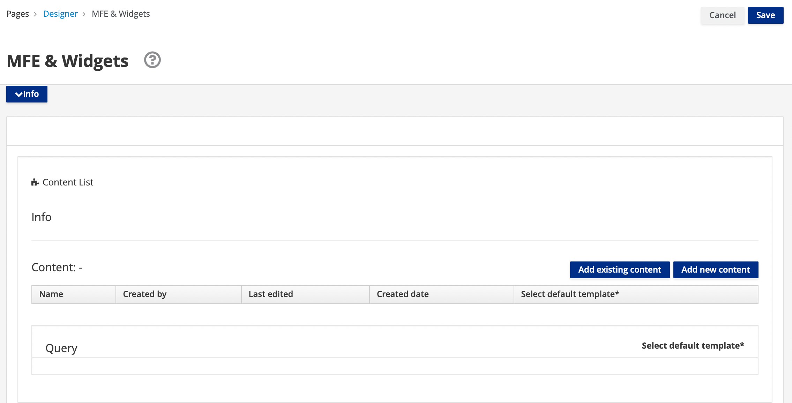
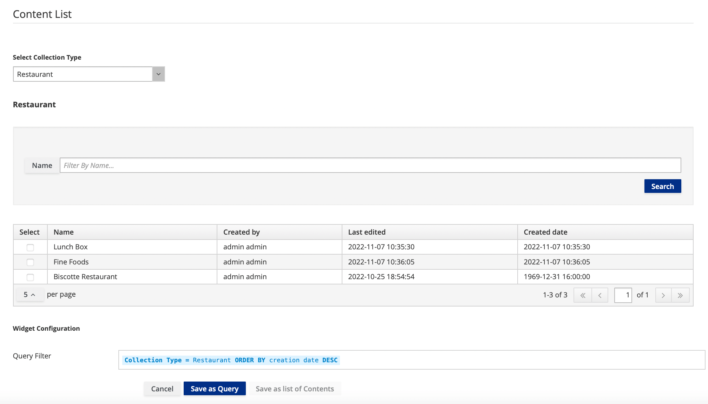
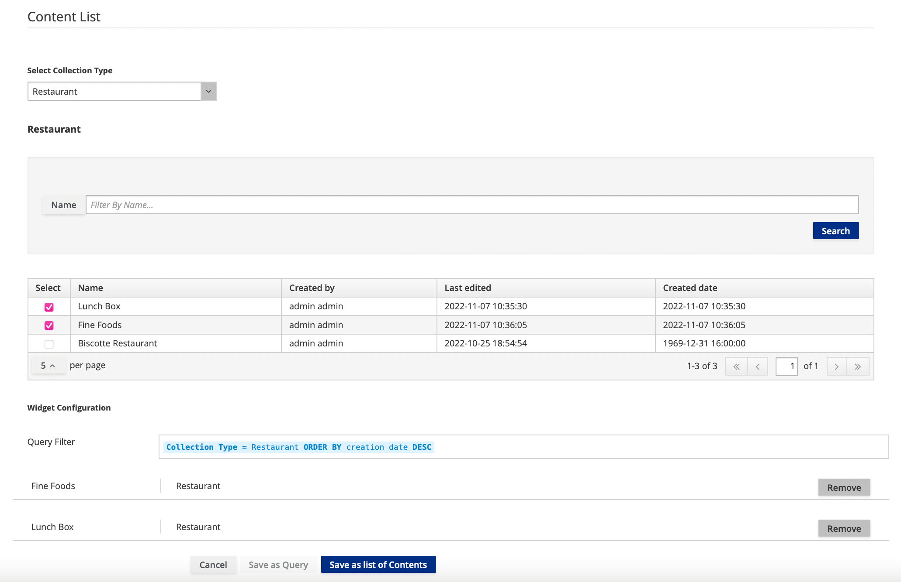
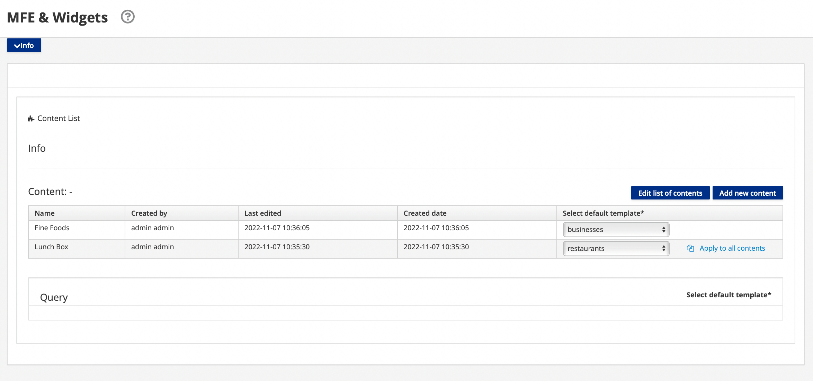

# Strapi Content Management

## Overview

This tutorial demonstrates how to create and manage the content in your Strapi instance from the App Builder user interface.

The Strapi Content Widget and Strapi Content List Widget enable the user to add or edit content and content lists, respectively, where it is mandatory to assign templates to selected content. The Strapi Content List Widget also allows content to be saved as a search. The following table compares widget capabilities.

| Strapi Content Widget |  Strapi Content List Widget
|:--|:--
| User can select only one content | User can select more than one content |
| User can select only one template per selected content | User can select different templates for different content |
| There is no `Save as Query` feature | The `Save as Query` feature allows the user to save multiple contents |

## Prerequisites

- [A working instance of Entando](../../../docs/getting-started/)
- Verify dependencies with the [Entando CLI](../../docs/getting-started/entando-cli.md#check-the-environment): `ent check-env develop`
- [A configured Strapi instance running on Entando](../../tutorials/solution/strapi.md)

## Strapi Content Widget

1. Select a page or [create a page](../compose/page-management.md#create-a-page) in your Entando Application on which to place the Strapi Content Widget
2. Go to  `App Builder` → `Pages` → `Management`
3. Find the Strapi content page in the page tree and click on the three dots representing the `Actions` icon
4. Select `Design` from the drop-down
5. Click on the `Widgets` tab in the right panel and expand the `User` section
6. Drag and drop the Strapi Content Widget into an empty frame in the Page Designer to load the configuration page
7. From the configuration page that loads from the Page Designer, click `Add existing content`

>Note: If you have not yet created the content you wish to place in your Entando Application, click `Add new content` to be directed to the login for your Strapi dashboard. After creating the desired content, click `Add existing content` to resume content management.
8. On the resultant page, select a collection type from the drop-down menu. These are returned by the Strapi API. Only one collection type can be selected. 

9. Select from the content related to this collection type, which can be filtered by keyword using the `Search` field. Only one content can be selected.

10. Click `Save`, which will redirect you back to the configuration page
11. Select a template from the drop-down menu, which calls the Strapi API to display only templates associated with the current content type. Template selection is mandatory.

12. Click `Save`, which will redirect you back to the Page Designer for the content page
13. Click `Publish`
14. Click `View Published Page` to see the data rendered on the content page

## Strapi Content List Widget

1. Select a page or [create a page](../compose/page-management.md#create-a-page) in your Entando Application on which to place the Strapi Content List Widget
2. Go to  `App Builder` → `Pages` → `Management`
3. Find the Strapi content list page in the page tree and click on the three dots representing the `Actions` icon
4. Select `Design` from the drop-down
5. Click on the `Widgets` tab in the right panel and expand the `User` section
6. Drag and drop the Strapi Content List Widget into an empty frame in the Page Designer
7. From the configuration page that loads from the Page Designer, click `Add existing content`

>Note: If you have not yet created the content you wish to place in your Entando Application, click `Add new content` to be directed to the login for your Strapi dashboard. After creating the desired content, click `Add existing content` to resume content management.
8. On the resultant page, select a collection type from the drop-down menu. These are returned by the Strapi API. Only one collection type can be selected. 
- To save all content related to this collection type as a query:
   1. Leaving the checkboxes unchecked, click `Save as Query`

   

- To save a list of one or more contents:
   1. Select from the content related to this collection type, which can be filtered by keyword using the `Search` field. Multiple content can be selected via the checkboxes.

   

   2. Click `Save as list of Contents`, which will redirect you back to the configuration page
   3. For each content type, select a template from the drop-down menu. Expanding the drop-down menu calls the Strapi API and displays only templates associated with the current content type. Different templates can be selected for different content types. Template selection is mandatory.

   

9. Click `Save`, which will redirect you back to the Page Designer for the content list page
12. Click `Publish`
13. Click `View Published Page` to see the data rendered on the content list page

