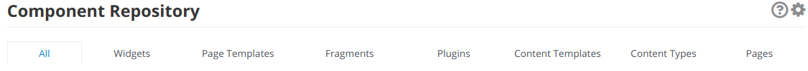

# Filtering bundles

ECR bundles are filterable by component from App Builder user interface. 



Behind the scenes, filtering is done using the label-based filtering provided out of the box from Kubernetes.

To enable filtering of a bundle, the custom-resource representing the bundle on the Entando Cluster needs to contain the correct labels. An important note on the values to add the `labels` field, even if to correctly define a label in a k8s resource both the key and the value are required, from an Entando point of view only the key part of the label is used for filtering. The value could be set to anything, but our reccomendation is to use `"true"` for clarity and simplicity.

### Supported labels keys are:

<table>
<colgroup>
<col width="50%" />
<col width="50%" />
</colgroup>
<thead>
<tr class="header">
<th align="left">Label entry</th>
<th align="left">Description</th>
</tr>
</thead>
<tbody>
<tr class="odd">
<td align="left"><p><code>widget: "true"</code></p></td>
<td align="left"><p>The bundle contains one or more microfrontends (widgets) </p></td>
</tr>
<tr class="even">
<td align="left"><p><code>plugin: "true"</code></p></td>
<td align="left"><p>The bundle contains one or more microservices (plugins)</p></td>
</tr>
<tr class="odd">
<td align="left"><p><code>fragment: "true"</code></p></td>
<td align="left"><p>The bundle contains one or more fragments</p></td>
</tr>
<tr class="odd">
<td align="left"><p><code>pageTemplate: "true"</code></p></td>
<td align="left"><p>The bundle contains one or more page templates</p></td>
</tr>
<tr class="even">
<td align="left"><p><code>contentType: "true"</code></p></td>
<td align="left"><p>The bundle contains one or more content types</p></td>
</tr>
<tr class="odd">
<td align="left"><p><code>contentTemplate: "true"</code></p></td>
<td align="left"><p>The bundle contains one or more content templates</p></td>
</tr>
</tbody>
</table>

### Example
Here an example of the metadata for a ecr bundle containg micro-frontends, some microservices and page templates

```
apiVersion: entando.org/v1
kind: EntandoDeBundle
metadata:
  name: demo-bundle
  labels:
    widget: "true"
    plugin: "true"
    pageTemplate: "true"
spec:
  details:
  ...
```
