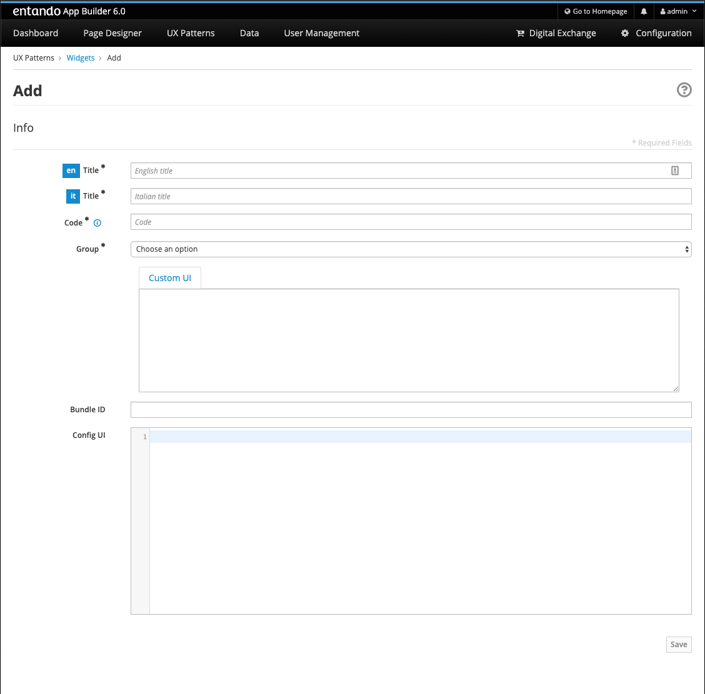

# Tutorial: create an angular microfrontend widget

## Pre-requisites

Use last stable node version (at the time of writing **v13.8.0**). We
suggest using [nvm](https://github.com/nvm-sh/nvm) to handle node
installations.

## Bootstrap an angular app

Install Angular CLI globally, then generate a new angular application.
When the CLI will ask you about routing and styling, go with no routing
and with CSS.

`npm install -g @angular/cli`

`ng new my-widget`

This is the expected output:

    my-widget
    ├── e2e
    │   └── src
    │       ├── app.e2e-spec.ts
    │       └── app.po.ts
    │
    ├── node_modules
    ├── src
    │   ├── app
    │   │   ├── app.component.css
    │   │   ├── app.component.html
    │   │   ├── app.component.spec.ts
    │   │   ├── app.component.ts
    │   │   └── app.module.ts
    │   │
    │   ├── assets
    │   │   └── .gitkeep
    │   │
    │   ├── environment
    │   │   ├── environment.prod.ts
    │   │   └── environment.ts
    │   │
    │   ├── favicon.ico
    │   ├── index.html
    │   ├── main.ts
    │   ├── polyfills.ts
    │   ├── styles.css
    │   └── test.ts
    │
    ├── .editorconfig
    ├── .gitignore
    ├── angular.json
    ├── browserlist
    ├── karma.conf.js
    ├── package.json
    ├── README.md
    ├── tsconfig.app.json
    ├── tsconfig.json
    ├── tsconfig.spec.json
    └── tslint.json

## Wrap the angular app in custom element

Easiest way is using **angular elements**, the official angular custom
element solution.

`ng add @angular/elements`

> **Note**
>
> install the angular elements package through CLI (`ng add`) and not
> through `npm install`, as it does something more under the hood, like
> adding `document-register-element` polyfill.

Now, edit the `AppModule` class, from

    import { BrowserModule } from '@angular/platform-browser';
    import { NgModule } from '@angular/core';

    import { AppComponent } from './app.component';

    @NgModule({
      declarations: [
        AppComponent
      ],
      imports: [
        BrowserModule
      ],
      providers: [],
      bootstrap: [AppComponent]
    })
    export class AppModule { }

to

    import { BrowserModule } from '@angular/platform-browser';
    import { NgModule, Injector } from '@angular/core';
    import { createCustomElement } from '@angular/elements';
    import { AppComponent } from './app.component';

    @NgModule({
      declarations: [
        AppComponent
      ],
      imports: [
        BrowserModule
      ],
      providers: [],
      entryComponents: [AppComponent]
    })
    export class AppModule {
      constructor(private injector: Injector) {}

      ngDoBootstrap() {
        const el = createCustomElement(AppComponent, { injector: this.injector });
        customElements.define('my-widget', el);
      }
    }

Please pay attention to `AppComponent` in the module declaration: it’s
no more in the `bootstrap` property but in the `entryComponents` one.

Now, to ensure our custom element is working fine we have to edit
`index.html`. In the `body`, replace `<app-root></app-root>` with
`<my-widget />`.

    <!doctype html>
    <html lang="en">
    <head>
      <meta charset="utf-8">
      <title>MyWidget</title>
      <base href="/">
      <meta name="viewport" content="width=device-width, initial-scale=1">
      <link rel="icon" type="image/x-icon" href="favicon.ico">
    </head>
    <body>
      <my-widget />
    </body>
    </html>

> **Note**
>
> -   the custom element name (`my-widget` in this tutorial) *must*
>     match the first parameter of `customElements.define` method
>
> -   custom element names [require a dash to be used in
>     them](https://stackoverflow.com/questions/22545621/do-custom-elements-require-a-dash-in-their-name)
>     (kebab-case) - they can’t be single words
>
Page should auto reload and…​ congrats! You’re running a barebones
Entando 6 widget in isolation.

## Build the widget

From the angular project root, type

`ng build --prod --output-hashing none`

and a `dist/my-widget` dir will be generated. Assuming ES2015 is enough
as minimum JS version, we can ignore ES5 stuff and pay only attention
to:

-   `main-es2015.js`

-   `polyfills-es2015.js`

-   `runtime-es2015.js`

-   `styles.css`

> **Note**
>
> omitting the `--output-hashing none` options you could keep the
> original names in order to avoid potential caching issues, but then
> you will have to update the *Custom UI* field in the App Builder
> widget screen every time a new version of the widget is deployed. DE
> bundles can help with this and are covered in another lab.

## Create the Entando 6 widget in App Builder

For the purposes of this tutorial we are going to load the widget to the
App builder manually. In a live system you would include this in an
Entando app, load via API, or via a Digital Exchange bundle.

Open the Entando App Builder.

1.  Go to Configuration → File Browser

2.  Click public

3.  Click Create Folder

4.  Enter `my-widget`

5.  Click save

6.  Click `my-widget` folder

7.  Click upload and load the js (main, polyfills and runtime) and css
    for your widget

> **Note**
>
> You can also embed the widget directly in a local copy of an Entando
> app. Copy it into the Entando 6 instance under
> `src\main\webapp\resources\my-widget`

Now create the widget in the App Builder. go to UX Patterns → Widgets
and click on the *New* button.

You’ll see a screen like this one

Fill the form, e.g.:

-   *my\_widget* as widget code (dashes are not allowed in a widget
    code)

-   *My Widget* as title for all the languages

-   *Free access* as group

-   the following code as *Custom UI*

<!-- -->

    <#assign wp=JspTaglibs[ "/aps-core"]>
    <link rel="stylesheet" type="text/css" href="<@wp.resourceURL />my-widget/styles.css">
    
    
    

    <my-widget />

> **Note**
>
> let’s assume we don’t need ES5 polyfills that angular generated with
> the build.

Update the paths to match what you loaded to the app builder in the
steps above. And save the widget.

> **Note**
>
> `<#assign wp=JspTaglibs[ "/aps-core"]>` is needed for your widget code
> to have access to `@wp` object which provides access to a environment
> variables.

Then, configure a page (let’s assume it’s called *mypage*) and drag the
widget *mywidget* in the page model. Publish, load the page (its url
should be ``) and *voilà*, here’s our angular app embedded as a widget.
Done!

