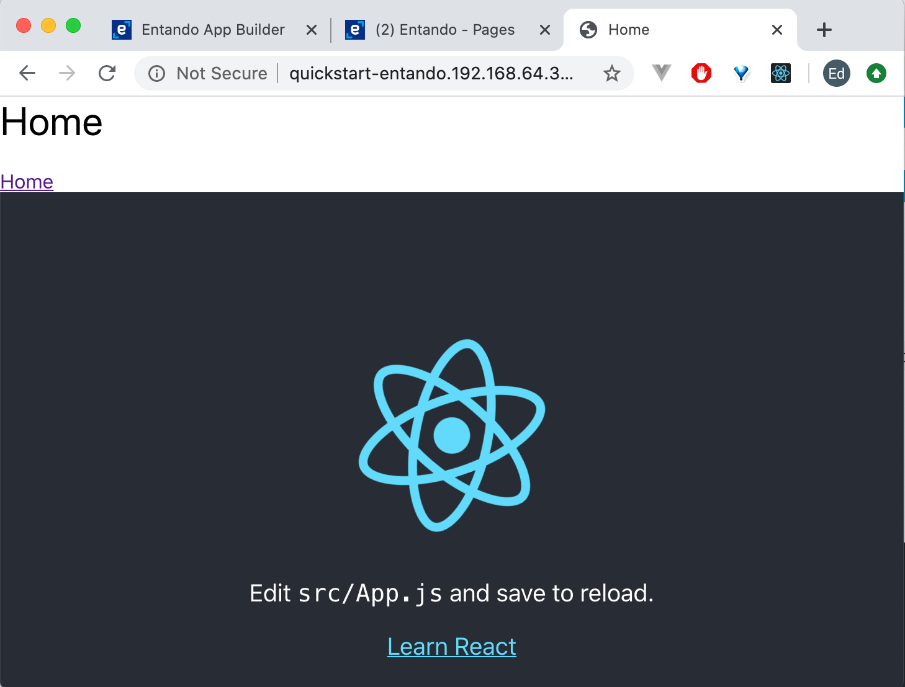

# Create a React Micro Frontend


## Prerequisites
- [A working instance of Entando.](../../docs/getting-started)
- Use the Entando CLI to verify all dependencies are installed with the command `ent check-env develop`.

## Create React App
We'll use [Create React App](https://create-react-app.dev/) to make a simple app in seconds.
1. Create 'my-widget' directory structure with the following: 

``` bash
npx create-react-app my-widget --use-npm
```

This is the expected output:

    my-widget
    ├── README.md
    ├── node_modules
    ├── package.json
    ├── .gitignore
    ├── public
    │   ├── favicon.ico
    │   ├── index.html
    │   ├── logo192.png
    │   ├── logo512.png
    │   ├── manifest.json
    │   └── robots.txt
    └── src
        ├── App.css
        ├── App.js
        ├── App.test.js
        ├── index.css
        ├── index.js
        ├── logo.svg
        ├── serviceWorker.js
        └── setupTests.js

2. Start the app

``` bash
cd my-widget
npm start
```

### Wrap with Custom Element

1. Add a new file `src/WidgetElement.js` with the following custom element that will wrap the entire React app

``` js
import React from 'react';
import ReactDOM from 'react-dom';
import App from './App';

class WidgetElement extends HTMLElement {
    connectedCallback() {
        this.mountPoint = document.createElement('div');
        this.appendChild(this.mountPoint);
        ReactDOM.render(<App />, this.mountPoint);
    }
}

customElements.define('my-widget', WidgetElement);

export default WidgetElement;
```
The React `root` node is programatically generated in the `connectedCallback` method when the custom element is added to the DOM.

::: tip
`connectedCallback` is a lifecycle hook that [runs each time the element is added to the DOM.](https://developer.mozilla.org/en-US/docs/Web/Web_Components/Using_custom_elements#Using_the_lifecycle_callbacks)
:::

::: tip Custom Elements
- [Must contain a hyphen `-` in the name.](https://stackoverflow.com/questions/22545621/do-custom-elements-require-a-dash-in-their-name)
- Cannot be a single word.
- Should follow `kebab-case` for naming convention.
:::

### Import Custom Element

1. Open `src/index.js`. Here's what the initial file looks like:

``` js
import React from 'react';
import ReactDOM from 'react-dom';
import './index.css';
import App from './App';
import * as serviceWorker from './serviceWorker';

ReactDOM.render(<App />, document.getElementById('root'));

// If you want your app to work offline and load faster, you can change
// unregister() to register() below. Note this comes with some pitfalls.
// Learn more about service workers: https://bit.ly/CRA-PWA
serviceWorker.unregister();
```

2. Replace the entire file with these two lines

``` js
import './index.css';
import './WidgetElement';
```

### Test Micro Frontend

1. Open `public/index.html`

2. Replace `<div id="root"></div>` with the custom element `<my-widget />`

``` html
  <body>
    <noscript>You need to enable JavaScript to run this app.</noscript>
    <my-widget />
    ...
  </body>
```

::: tip Congratulations!
You’re now running `React` in a containerized micro frontend.
:::

## Build the Resource URL

Add your micro frontend to Entando by uploading the JavaScript and CSS files to the `public` folder. This is the way Entando makes files available to the public.

### Add Widget

First, add a widget to get the resource URL for the `public` folder. Then, we'll use the same widget to add our micro frontend to Entando.

1. Go to `Components > Micro frontends & Widgets` in the App Builder

2. Click `Add` at the lower right corner


3. Enter the following:
- `Title: My Widget` → enter for both English and Italian languages
- `Code: my_widget` → dashes are not allowed
- `Group: Free Access`
- `Icon`:  → upload an icon of your choice
- In the center panel under `Custom UI`, enter the following:

``` ftl
<#assign wp=JspTaglibs[ "/aps-core"]>
<@wp.resourceURL />
```
4. Click `Save`

::: tip
`<#assign wp=JspTaglibs[ "/aps-core"]>` gives you access to the `@wp` object where you can use environment variables like `resourceURL`.
:::


### Add Page

Next, add the widget to a page so you can view the `Resource URL`.
If you're getting started with a new install of Entando, add the widget to the `Home` page.

---

> For Experienced Entando users: Add a new page → Add your widget to the page

---

1. Go to `Pages` → `Management`

2. Next to the `Home` folder, under `Actions`, → `Edit`

3. In the `Title` field, choose `My Widget`

4. In the Code field, choose `my_widget`

5. Under Page groups, in the Owner group field, choose `Free Access`

4. Scroll down to `Page Template` and select `Single Frame Page`. Leave all other fields blank or in the default setting.

5. Click `Save and Design`. You are now in the page Designer. 

6. In the Search field of the right sidebar, type `My Widget`. It will show as an option.

7. Drag and drop `My Widget` into the `Sample Frame` in the body of the page

8. Click `Publish`

9. At the upper right, click `View Published Page`. This will take you to a blank home page with your widget.

10. Copy the `Resource URL` at the top. For example, this is the URL in a quickstart environment set up via the Getting Started guide:

```
/entando-de-app/cmsresources/
```

### Build It

With the Resource URL where the new React App will be hosted, you are ready to build.

1. Create an `.env.production` file in the root of `my-widget` project 

2. Add the `PUBLIC_URL` into the file. 

```
PUBLIC_URL=/entando-de-app/cmsresources/my-widget
```
::: warning Notes
- `/entando-de-app/cmsresources/` is the Resource URL for your Entando application
- `/my-widget` is the public folder that's created to host the files.
:::

### npm build

1. Open a command line and navigate to the project root of your `my-widget`

2. Run the command:

``` bash
npm run build
```

3. Rename the following generated files in the `build` directory

| Example of Generated Build File           | Rename to                 | Function
| :---                                      | :---                      | :---
| build/static/js/2.f14073bd.chunk.js       | `static/js/vendor.js`     | Third-party libraries
| build/static/js/runtime-main.8a835b7b.js  | `static/js/runtime.js`    | Bootstrapping logic
| build/static/js/main.4a514a6d.chunk.js    | `static/js/main.js`       | App
| build/static/css/main.5f361e03.chunk.css  | `static/css/main.css`     | Stylesheet

::: warning Generated Build Files
The JavaScript and CSS files are renamed so it can deploy the new versions of the micro frontend without having to update the `Custom UI` field of the widget.
:::

If you want to use the original [file names with the content hashes to avoid potential caching issues in your browser](https://create-react-app.dev/docs/using-the-public-folder/#adding-assets-outside-of-the-module-system), update the `Custom UI` field of your widget when deploying new versions of your micro frontend. The `Custom UI` settings will be covered in the next section.

::: warning Additional Deployment Options
1. Install the micro frontend from a bundle in the `Entando Component Repository`.
2. Add the micro frontend to `Entando App Builder`.
3. Load the micro frontend from an API.
:::
## Host Micro Frontend
Now you are ready to host the micro frontend in Entando.

### Create Public Folder

1. Navigate to `Entando App Builder` in your browser

2. Click `Administration` at the lower left hand side of the screen

3. Click the `File browser` tab

4. Choose the `public` folder

5. Click `Create folder`

6. Enter `my-widget`

7. Click `Save`

8. Click `my-widget`

9. Create the same folder structure as your generated build directory

- `my-widget/static/css`
- `my-widget/static/js`
- `my-widget/static/media`

10. Upload the renamed files in the corresponding `js` and `css` folders

- `my-widget/static/css/main.css`
- `my-widget/static/js/main.js`
- `my-widget/static/js/runtime.js`
- `my-widget/static/js/vendor.js`

Note: You can drag and drop the files in your browser

11. Upload the `React` logo

- `my-widget/static/media/logo.5d5d9eef.svg` → You don't need to rename this file

### Update Custom UI Field

1. Go to `Components` → `Micro frontends & Widgets`

2. Under the `My Widgets` category → next to `My Widget` → under `Action` → select `Edit`

3. Update `Custom UI` field:

``` ftl
<#assign wp=JspTaglibs[ "/aps-core"]>
<link rel="stylesheet" type="text/css" href="<@wp.resourceURL />my-widget/static/css/main.css">
<script async src="<@wp.resourceURL />my-widget/static/js/runtime.js"></script>
<script async src="<@wp.resourceURL />my-widget/static/js/vendor.js"></script>
<script async src="<@wp.resourceURL />my-widget/static/js/main.js"></script>
<my-widget />
```

4. Click `Save`

### View the Widget

Let's see the React micro frontend in action on your page.

1. In the `Entando App Builder` go back to `Pages` → `Management` 

2. Next to the page you created, under `Actions`→ `Design`. This takes you back to the page Designer. 

3. Click on `View Published Page` on the top right side



::: tip Congratulations!
You now have a React micro frontend running in Entando.
:::
