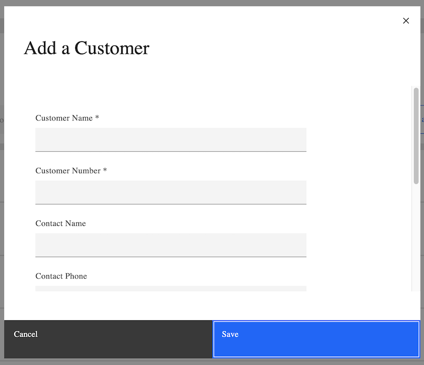

# Introduction
Entando Customer Portal is a self-service application for customers to interact within your organization to administer your Entando platform and its users. You can manage users, projects and customers. You can track projects and service tickets for your application. It is a Kubernetes-native solution built on Entando’s Application Composition Platform.

Key Features:

* Customizable service ticketing and tracking system with Jira Service management
* Role-Based Access Control (RBAC)  Entando Identity Management System
* Integrated User, customer, project and subscription management 

This tutorial covers 
1. [Installation](#installaton)
2. [Configuration for Administrators](#configuration)
3. [A brief User Reference](#user-refernce)

# Prerequisites
* A working instance of Entando running on Kubernetes. See [Getting Started](../../docs/getting-started/)for more information.
* Use the Entando CLI to verify that all dependencies are installed:
ent check-env develop
* Docker installed and running

# Installation
## Quick Install from Entando Hub

1. From the Entando Hub, click on the Customer Portal bundle from the Catalog
2. Click Install to see a popup page with two commands. These need to be implemented in the order shown. Copy the first command and paste into your CLI. 
3. Copy the second command and do the same. The content bundle will now be deployed.
4. Go to the Entando App Builder and navigate to the Repository.  Here you will see the two bundles for the Portal. Install both bundles in the version you desire. You will be able to update the version at any time.
5. To navigate to your Customer Portal:  
from the left menu →  `Page` → `Mangement`  
find `Customer Portal` under `Page Tree` list 
from the `Actions` pull-down menu →  `View Published Page`

## Manual Install 
Top install the Entando Customer Portal manually to your specific environment, go to the [Entando Github Repository](https://github.com/entando-samples/customer-portal/tree/main/application) and refer to the README.MD there for more details.

# Configuration
## Administrators
In order to configure the Customer Portal and its users, the administrator will need Jira Service Manager and Entando Identity Management credentials. As the administrator, you can create and configure users and groups, assign roles, projects and track service tickets.  You can also customize the ticketing system. 

### JIRA Service Manager 

The administrator begins here to create users and projects, define the organization, and configure the service ticket system.

Go to Customers to add organizations and projects. Once added, click on the name of the organization to get the ID from the URL which is needed later, e.g example.com/jira/servicedesk/projects/ECS/organization/3, where the organization ID is “3”.

For more information or help with the Jira Service Management System, contact ??????

### Entando Identity Management System 
Logging into the Entando Identity Management System, you will see the landing page below. The left navigation bar is your guide for managing users, groups, and most importantly, roles for your application. Using the RBAC model, you define what users have access to by the roles and groups they are assigned to. Some important guidelines are noted below. 

A. **Define the Realm Setting**. The Realm is a set of users, credentials, roles, and groups. A user belongs to and logs into a Realm. 

B. **Create Roles**\
You must select the roles available to users and/or groups. Create new roles with varying degrees of access for the needs of your application. You can also use the default roles by clicking on Client Roles and choosing entandodemo-customerportal-server. The following define their parameters for access:
* cp-customer -  assigned directly to specific projects for a single customer
* cp-partner - assigned directly to specific projects for multiple customers
* cp-support -  read only view of all customer projects 
* cp-admin - admin access for Customer Portal.

C. **Create New Users**:
1. The user must be created in Jira first, then configured here for access to the Portal.
2. From the navigation bar, go to Users. Click `Add User` at right.
3. Enter the fields as needed but note the requirements for the following:\
       `Username`: A unique name\
       `Email`: must use the same address used in Jira\
       `User Enabled` → On\
       `Email Verified` → Off\
    Save

4. From the headings, go to `Credentials`. \
Under `Credential Reset`, in the `Reset Actions` → Update Password. \
For external users, you can extend the `Expires In` setting to a minimum of 2 days. \
Click `Send Email`. \
This will send an email to the user to activate their account and set a new password.
5. Role Mappings 
For each user, select the appropriate `Realm Roles` from the `Available Roles` and click `Add Selected` to assign. If you want to use the Customer Portal default roles, choose `entandodemo-customerportal-server` from the `Client Roles` pull-down menu. This will give you additional roles that you can add. Check the Effective Roles column to make sure the correct roles have been assigned.

7. Under Groups, assign to appropriate groups. Roles are additive as in RBAC models.

### Customer Portal Administrator

As administrator for the Customer Portal, you can create and manage customers, projects and subscriptions. You will also be able to assign projects to users who have activated their account on Jira  and have been assigned roles in the Entando Identity Management System. 

The administrator also needs a Jira account and the correct role assignment in the Entando ID management system.

**A. Create a Customer or Partner**\
Creating a Customer or Partner is a similar process. Here we have laid out the details for adding a Customer. Please follow the same procedure for adding a Partner.
1. Click Add a Customer
2. Enter the details:
     * The Customer Number must be unique. 
     * The notes field is visible only to Support and Admin users.
     * Click Save 

**B. Create & Assign Projects**
1. From the landing page, click on any customer to see their associated Project list.
2. To create a new project, click on the header → Add a Project.
    * Enter the Project details
    * Provide the Organization ID from Jira. Only one project in the portal can be used with that ID.
    * Click Save
3. To assign projects
	* Use the drop-down menu under Action on the right side and choose → 
    Manage Users
    * Find the user and click Submit
Use the drop-down menu under Action to manage Partners, and request and manage subscriptions. 

### User Reference

All Customer Portal users need Jira Service Management credentials and Access provided by your organization administrator. You can request and track subscriptions and create and track service tickets.

Once you login to your Customer Portal, you will see your list of customers. Click on any customer to see the details and to track their projects.

1. To create a Service Ticket for a project, use the Action pull-down menu  → Open Ticket

2. To Request a Subscription or track all Tickets, use the same Action pull-down menu and choose the corresponding option.

