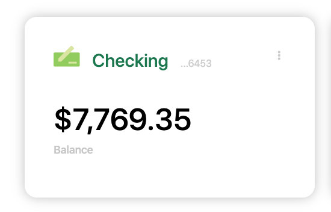
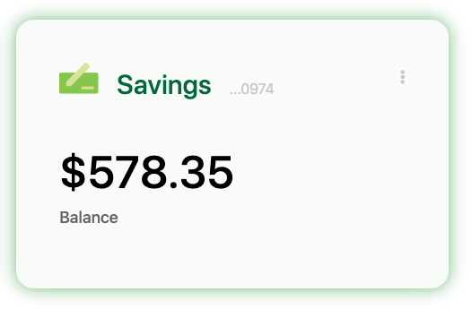

# Objective

[[toc]]


## Installation in OpenShift


1. Prepare OpenShift

Create a namespace
```bash
oc create namespace entando
```

Deploy the Entando custom resources
```bash
curl -L -C - https://github.com/entando-k8s/entando-k8s-custom-model/archive/v6.2.4.tar.gz | tar -xz
```

```bash
oc create -f entando-k8s-custom-model-6.2.4/src/main/resources/crd/
```

2. Deploy the sample application

```bash
curl -L -C - -O https://raw.githubusercontent.com/entando-samples/standard-demo/master/deployment/sd-demo-openshift.yaml
```

Get the base URL of your OpenShift instance (if running in CRC or minishift this will be the IP of your local cluster). If you are using an IP based public URL add `.nip.io` to the end. In the command below replace `<YOUR_CLUSTER_URL>` with the value of the ingress for your cluster.

```bash
sed -i "s/apps.rd.entando.org/<YOUR_CLUSTER_URL>/" sd-demo-openshift.yaml
```

```bash
oc create -f sd-demo-openshift.yaml
```

3. Watch the application start

```bash
watch oc get pods -n entando
```

Watch the installation until the cluster is ready for use, indicated by a pod named quickstart-server-* with 3/3 in the READY column and RUNNING in the STATUS column. Use CTRL-C to stop watching the deployment

4. Get the ingress path to your application

```bash
oc get ingress -n entando
```

Copy the value that starts with `quickstart-entando` under hosts. Then in your browser open the app-builder by appending `/app-builder/` (trailing slash is important) and the end user application at `/entando-de-app`.

For example:

```bash
quickstart-entando.<YOUR_IP_HERE>.nip.io/entando-de-app/
quickstart-entando.<YOUR_IP_HERE>.nip.io/app-builder/
```

## Installation in Public Cloud (AKS, EKS, GKE)

Follow the cluster setup instructions for your public cloud instance for [Azure AKS](../devops/installation/azure-kubernetes-service/azure-install.md), [Amazon EKS](../devops/installation/elastic-kubernetes-service/eks-install.md) or [Google GKE](../devops/installation/google-cloud-platform/README.md). Then follow the deployment instructions below instead of deploying the default Entando application.

1. Prepare Kubernetes

Create a namespace
```bash
kubectl create namespace entando
```

Deploy the Entando custom resources
```bash
curl -L -C - https://github.com/entando-k8s/entando-k8s-custom-model/archive/v6.2.4.tar.gz | tar -xz
```

```bash
kubectl create -f entando-k8s-custom-model-6.2.4/src/main/resources/crd/
```

2. Deploy the sample application

```bash
curl -L -C - -O https://raw.githubusercontent.com/entando-samples/standard-demo/master/deployment/sd-demo-cloud.yaml
```

In the command below replace `<YOUR_NGINX_INGRESS_IP>` with the value of the IP you retrieved for nginx in setting up your public cloud cluster.


```bash
sed -i "s/apps.rd.entando.org/<YOUR_NGINX_INGRESS_IP>.nip.io/" sd-demo-cloud.yaml
```

```bash
kubectl create -f sd-demo-cloud.yaml
```

3. Watch the application start

```bash
watch kubectl get pods -n entando
```

Watch the installation until the cluster is ready for use, indicated by a pod named quickstart-server-* with 3/3 in the READY column and RUNNING in the STATUS column. Use CTRL-C to stop watching the deployment

4. Get the ingress path to your application

```bash
kubectl get ingress -n entando
```

Copy the value that starts with `quickstart-entando` under hosts. Then in your browser open the app-builder by appending `/app-builder/` (trailing slash is important) and the end user application at `/entando-de-app`.

For example:

```bash
quickstart-entando.<YOUR_IP_HERE>.nip.io/entando-de-app/
quickstart-entando.<YOUR_IP_HERE>.nip.io/app-builder/
```

## Installation in Local Environment

The instructions below include setting up a local Kubernetes instance using multipass and K3s.

1. Install Kubernetes
Install [Multipass](https://multipass.run/#install)

Launch VM

``` bash
multipass launch --name ubuntu-lts --cpus 4 --mem 8G --disk 20G
```

Open Ubuntu shell

``` bash
multipass shell ubuntu-lts
```

Install k3s

``` bash
curl -sfL https://get.k3s.io | sh -
```

2. Prepare Kubernetes

Create a namespace
```bash
sudo kubectl create namespace entando
```

Deploy the Entando custom resources
```bash
curl -L -C - https://github.com/entando-k8s/entando-k8s-custom-model/archive/v6.2.4.tar.gz | tar -xz
```

```bash
sudo kubectl create -f entando-k8s-custom-model-6.2.4/src/main/resources/crd/
```

3. Deploy the sample application

```bash
curl -L -C - -O https://raw.githubusercontent.com/entando-samples/standard-demo/master/deployment/sd-demo-kubernetes.yaml
```

```bash
ROUTING_SUFFIX=$(hostname -I | awk '{print $1}').nip.io
sed -i "s/apps.rd.entando.org/$ROUTING_SUFFIX/" sd-demo-kubernetes.yaml
```

```bash
sudo kubectl create -f sd-demo-kubernetes.yaml
```

4. Watch the application start

```bash
sudo watch kubectl get pods -n entando
```

Watch the installation until the cluster is ready for use, indicated by a pod named quickstart-server-* with 3/3 in the READY column and RUNNING in the STATUS column. Use CTRL-C to stop watching the deployment

5. Get the ingress path to your application

```bash
sudo kubectl get ingress -n entando
```

Copy the value that starts with `quickstart-entando` under hosts. Then in your browser open the app-builder by appending `/app-builder/` (trailing slash is important) and the end user application at `/entando-de-app`.

For example:

```bash
quickstart-entando.<YOUR_IP_HERE>.nip.io/entando-de-app/
quickstart-entando.<YOUR_IP_HERE>.nip.io/app-builder/
```

## Application Details

### Micro Frontends (MFE)

The example application includes six default micro frontends that demonstrate micro frontend communication, invoking microservices, calling Entando Identity Management, multiple frontend technologies, and role based access controls. The example micro frontends included in the application are described below.

#### Seeds Card




  - The Seeds Card MFE is a React micro frontend that is visible on the My Dashboard page. The MFE makes an API to the banking microservice to fetch a numeric result depending on the configured card type. The value displayed will change as the configuration is changed.
  - The MFE is authorization aware and will pass the bearer token to the microservice for authorization and authentication. If you render the dashboard page and you aren't authenticated the widget shows an error message.
  - This widget emits events that are consumed by the Seedscard Transaction widget

#### Seeds Card NG



  - The Seeds Card NG MFE is an Angular widget that is identical to the Seeds Card widget above except for the choice of front end technology.
  - This MFE communicates with Seedscard Transaction widget which is implemented in React.

#### Manage Users

Authorized View


Not Authorized View


  - The Manage Users MFE makes an API call to Entando Identity Management to fetch user information. The MFE is visible under the dropdown under the username when the user is logged into the app.
  - By default the users provisioned in the example application do not include the authorization required to access users in Entando Identity Management. This is used to demonstrate role based access control for an MFE using Keycloak. To enable the Mange Users widget login to Keycloak and assign the `view-users` and `manage-users` roles from the realm-management client to the desired user.

#### Seedscard Transaction Table


  - This MFE is a React micro frontend that consumes events from the Card MFEs detailed above.
  - The transaction table widget makes an API call to the banking microservice to fetch transaction data for the logged in user.

#### Signup


  - The Sign Up MFE is a form widget that makes an API call to the customer microservice to create a new user. The Signup MFE is visible on the sign up page and can be accessed from any page in the header when not authenticated.

#### Alert Icons


  - The Alert Icon MFE displays an icon on the dashboard page and exposes configuration to allow the user to select the appropriate icon and datatype to display.
  - The Alert Icon MFE makes an API call to the banking microservice to fetch data in the default deployment.  

### Configuration Micro Frontends

Many of the MFEs detailed above include configuration screens visible in the App Builder when the MFE is dropped on a page. In the App Builder navigate to `Components -> Micro frontends & Widgets` to see the configured MFEs. To see the rendered config screen drop the MFEs above on a new page.

### Micro Services

The example application includes two microservices to support the data visible in the MFEs detailed above. Both microservices demonstrate the automated deployment and linking of a microservice to an Entando application via the Entando operator.

The data for the microservices is created using liquibase and demonstrates using the operator and liquibase + Springboot to automatically provision data into an environment. The demo data is available in the source code for the microservices on GitHub.

### Static Widgets

The example application uses static html, freemarker, and javascript widgets to display content including headers, footers, images and other content in the application. To view the example static widgets log into the App builder and select `Components -> Micro frontends & Widgets`

### Static CMS Content

The example application makes extensive use of the Entando CMS. This includes the creation of content templates, content types, and content. If you want to learn more about the Entando CMS in the example application log into the App Builder and select `Content ->  Templates`, `Content -> Management`, or `Content -> Types` as good starting points to view the content and static asset.

## Source Code
The source the Entando sample application is open source and can be found with our other open source examples and tutorials on GitHub at:

https://github.com/entando-samples/standard-demo
