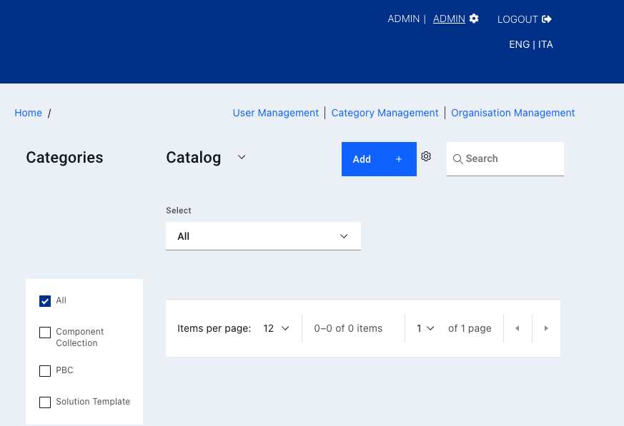

# Entando Hub

An Entando Hub enables teams to share components across their organization and between Entando Applications. It can be installed in Entando 6.3.2 or higher and includes API-level integration with the Entando 7 App Builder.

Hub Features:

- Centralize components and business capabilities for use across teams, groups, or clients
- Publish, manage and communicate component features, versions and metadata
- Perform business-level assessment of component readiness 

An Entando Application can make use of an Entando Hub in several ways:
* The **Local Hub**, included in the Entando App Builder, displays a collection of components ready to use. They can be used to compose an application or as a starting point to create new components.	

* **Entando Cloud Hub** is the public catalog containing packaged business capabilities and components provided by Entando and its partners throughout the world.

* An **enterprise Entando Hub**, developed and curated by Entando clients and partners, can be used to share components within their respective organizations or made available for public use.

This tutorial details the steps to create and utilize an enterprise Hub, including:

1. [Installation](#installation)
2. [Configuration](#configuration)
3. [Using an Enterprise Hub](#using-an-entando-enterprise-hub)
4. [Hub Concepts and Definitions](#hub-concepts-and-definitions)
5. [Application Details](#application-details)
6. [Resources](#resources)

## Installation

An Entando Enterprise Hub is installed using the Local Hub and two Entando Bundles. One bundle contains the micro frontends and microservices while the other sets up the initial content and pages for the hub UI.

### Prerequisites

- An Entando Application on any Kubernetes provider. Follow the [tutorials](../#operations) appropriate to your environment to install the Entando Platform.
- The [ent command line tool](../../docs/getting-started/entando-cli.md), installed and connected to your Kubernetes instance.

### Automatically Access the Entando Cloud Hub from the App Builder
1. Log in to your App Builder
2. Go to `Hub` → `Select Registry`  
3. Choose `New Registry`
4. In the pop-up window, enter `Entando Cloud Hub` and `https://entando.com/entando-hub-api/appbuilder/api` for the URL, then click `Save` 
5. Click on the Cloud Hub in the Registry and continue with the tutorial at Step 4 below

### Manual Installation Steps

1. Apply the custom resource definitions for the Hub component bundles:

```
ent ecr deploy --repo=docker://registry.hub.docker.com/entando/entando-hub-application
```
```
ent ecr deploy --repo=docker://registry.hub.docker.com/entando/entando-hub-content
```

2. Log into your App Builder instance.

3. Select `Hub` from the menu on the left. Your bundles will be visible in the Local Hub as shown in the screenshot below.


4. Click each bundle icon and `Install` the bundle, where order of installation is important. The `entando-hub-application-bundle` must be installed first because it provides the `entando-hub-content-bundle` with MFEs. It may take several minutes to download the Docker images for the microservices and install the related assets. 

## Configuration
1. Set up permissions to configure the service for the Hub administrator:
   - [Log in to your Keycloak instance](../../docs/consume/identity-management.md#logging-into-your-keycloak-instance) as an admin.
   - Give at least one user the ability to manage the hub by granting the `eh-admin` role. Assign the `eh-admin` role for the `pn-152edaba-0a2ba8fb-entando-entando-hub-catalog-ms-server` client. See [Role Assignment in ID Management](../../docs/consume/identity-management.md#authorization) for more details.
   - Give the generated plugin client permission to manage users. 
       1. From the left sidebar, go to `Clients` and select client ID `pn-152edaba-0a2ba8fb-entando-entando-hub-catalog-ms-server`. 
       2. Click the `Service Account` tab at the top of the page and select `realm-management` from the `Client Roles` field. 
       3. Choose `realm-admin` from `Available Roles` and click `Add selected`. It should now appear as an `Assigned Role`.
    
2. Access your enterprise hub from the App Builder by navigating to `Pages → Management`. Find `Entando Hub` in the page tree, and click `View Published Page` from its Actions.

## Using an Entando Enterprise Hub
### The Hub UI
The Entando enterprise Hub is equipped with a user interface where users, entries, and catalogs are managed. Private and public catalogs can also be configured here. 
* Administrator can create and manage users, categories, and organizations. 
* Authors and managers have varying [levels of access](#roles) to create and manage entries, otherwise called bundle groups.
* Each catalog can be [connected directly to an App Builder](#add-a-catalog-as-a-registry-in-your-app-builder) instance for easy access.



### User Management
Only a Hub administrator has the authorization to create and manage users. 
  1. Log into your Keycloak admin console 
  2. Go to the `Users` section from the left navigation bar and add a new user. Enter the relevant identity information. 
  3. Once saved, go to the `Role Mapping` tab and assign the correct role under `Client Role` `pn-152edaba-0a2ba8fb-entando-entando-hub-catalog-ms-server`
    * for an author, assign `eh-author`
    * for a manager, assign `eh-manager`
  4. Log in to the Hub UI as an admin 
  5. Go to `User Management` and click `Add User`
  6. Choose the desired user and select an organization from the drop-down list. If the organization is not available, go to Organization Management to add it.
  7. Note that an admin user needs to belong to an organization as well, especially for private catalogs that require an API key. 

### Create New Entries/Bundle Groups
Click the `Add +` button at the top of the Hub UI home page to create a new bundle group. In the pop-up window, enter the details for the entry.


1. Upload a file of the thumbnail for the bundle group. 
2. Add one or more bundles for the entry using the `Add +` button next to the `Add Bundle URI` field.  
3. Check `Display Contact Us button` and enter the URL under `Contact URL` to gather more information from the viewer/visitor and manage access to the entry. Typically, the contact URL points to a web form on the owner's web site with a request for access to the entry.

### Create a Private Catalog
A private catalog can be configured in the Hub UI when creating a new organization. There can be many organizations in a single Hub instance, with each organization allowed one private catalog. Only the Hub admin can create an organization and provide a private catalog for it. 
1. Go to Organization Management from the top menu
2. Click `Add Organization +`, enter the relevant information in the pop-up window, and click `Save`
3. The new organization will appear in the current list. Click on the kebab menu to the right of the organization and select `Create Private Catalog`. 
A key icon will appear next to the private catalog. To go directly to this catalog, there is a link under the same kebab menu. 

### Generate an API Key
API access to private catalogs requires the use of an API key instead of user credentials. When connecting the App Builder to a registry, the API key is required to configure a private catalog.
1. API Keys are attached to a specific user account so login as a user assigned to the organization with the private catalog.
2. From the Hub UI homepage, click on the gear icon right of the `Add +` button and select `API Key Management`.
3. Click `Generate API Key`, enter a name, and confirm with the blue generate button. Save the key for future reference.

### Add a Catalog as a Registry in your App Builder
Any enterprise Hub instance can be accessed from the Entando App Builder of another Entando Application. Configure the App Builder to access the desired catalog via the endpoint `BASEURL/entando-hub-api/appbuilder/api`, where the BASEURL is the address for the Entando Application. 

1. Go to the Hub from the left navigation bar in the App Builder and click `Select Registry` 
2. Choose `New Registry` from the drop-down menu
3. Enter a name and URL for the catalog.

     * The access URL for a private catalog follows the pattern noted above, but with an added ID number. Go to the publish catalog from the App Builder and find the address in the browser. The number after "/catalog/" is the catalog ID number.  
     * The URL to enter for the registry: BASEURL/entando-hub-api/appbuilder/api/?catalogId=YOUR-CATALOG-ID#  
Example: 
Hub address: http://quickstart.k8s-entando.org/entando-de-app/en/entando_hub.page#/catalog/1/ → `1` is the catalog ID number  
The URL to enter: `http://quickstart.k8s-entando.org/entando-hub-catalog-ms/appbuilder/api?catalogId=1` 

4. If an API key is required, ask your Hub administrator for the key or [generate one](#generate-an-api-key) if you have a Hub user account.  


## Hub Concepts and Definitions

### Entry/Bundle Group definitions
The key entities in an enterprise Hub are:

- `Bundle Group`: A bundle group is a group of one or more Entando Bundles. 
- `Bundle Group Version`: A bundle group can have one or more versions, each with a particular status.
- `Bundle`: An Entando Bundle is the deployment unit within an Entando Application. A bundle can contain one or more components such as micro frontends, microservices, or any of the [component types](../../docs/curate/bundle-details.md) available in Entando. 
- `Category`: Each bundle group belongs to a specific category. The initial possible categories are solution template, packaged business capability (PBC), and component collection. An admin of an enterprise hub can create and refine the categories as desired.
- `Organization`: Bundle groups belong to a single organization. Authors and managers can only update bundle groups for their own organization.  
- `User`: User identity is managed within Keycloak, where users are granted roles within a hub instance. Users must be assigned to a specific organization.

Note:
- A private repository can be used for a bundle, but this requires [an additional Kubernetes Secret](../curate/private-git-repo.md#overview) before deployment via the App Builder.

### Roles

Three roles are defined to provide access to the enterprise Hub features:

- `eh-author`: An author can create and edit bundle groups for their organization and submit them for publication. They can generate an API key.
- `eh-manager`: A manager has the permissions of an author, but can also approve a publication request for their organization. They can generate an API key.
- `eh-admin`: An admin has full access to create, update, and delete bundle groups and users for the entire hub instance. An admin can also create categories and organizations, assign users to an organization, and generate API keys. 
- `guest`: Any user without one of the preceding roles is considered a guest in the enterprise hub and is given a read-only view of the public catalog. This is also true for unauthenticated users.

### Bundle Group Status

The possible statuses for the versions of a bundle group are:

- `Draft`: This is the default status for the first version of a bundle group. 
- `Publication Request`: An `eh-author` sets a version to this status to request an `eh-manager` or `eh-admin` to review the version and mark it for publication. An `eh-manager` or `eh-admin` may edit versions with this status.
- `Published`: Versions with this status are visible in the home page list of available bundle groups and also available in the App Builder-facing API. An `eh-manager` or `eh-admin` may edit published versions.
- `Archived`: Previously published versions are assigned this status. No edits can be made to an archived version.
- `Deletion Request`: An `eh-manager` or `eh-admin` can delete versions once this status has been set.

Notes:
- An eh-author can change any field except organization while a version is in draft.
- There is no automated notification process when a publication request is made for a bundle group version.

### Bundle Group Versions
The list of bundle group versions can be seen by clicking `View Versions` on any entry in the catalog:


The following rules apply to bundle group versions:
- Once the first version of a group is published, the organization, name, and category can no longer be changed.
- A new version of a bundle group can be created (via the `New Version` option) after the first version has been published. 
- There can be at most two active versions: one draft or publication requested version and one published version. 
- When a new version is published, the previous version is set to archived. 
- Archived versions are only visible in the versions view and are not shown elsewhere in the user interface.


## Application Details

An Entando Hub includes the following key components:

### Micro Frontends / Widgets
- `Entando Hub App`: This is the main micro frontend which contains the management UI for the hub entities noted above.
- `Entando Hub Login`: This is an optional login component which can be used in a page’s top navigation.

### Microservices
A single Spring Boot microservice provides two REST endpoints:
- The first is a backend-for-a-frontend (BFF) service for the hub UI and contains the various entity APIs.
- The second provides methods that support the Entando App Builder integration (7.0+).

### Content
The content bundle (`entando-hub`) includes a custom template and a page preconfigured with the main hub micro frontends.

## Resources
### Source Code

Entando open source examples and tutorials are available on GitHub. Reference the Hub sample project for instructions to build the project from source code:

- <https://github.com/entando-samples/entando-hub>